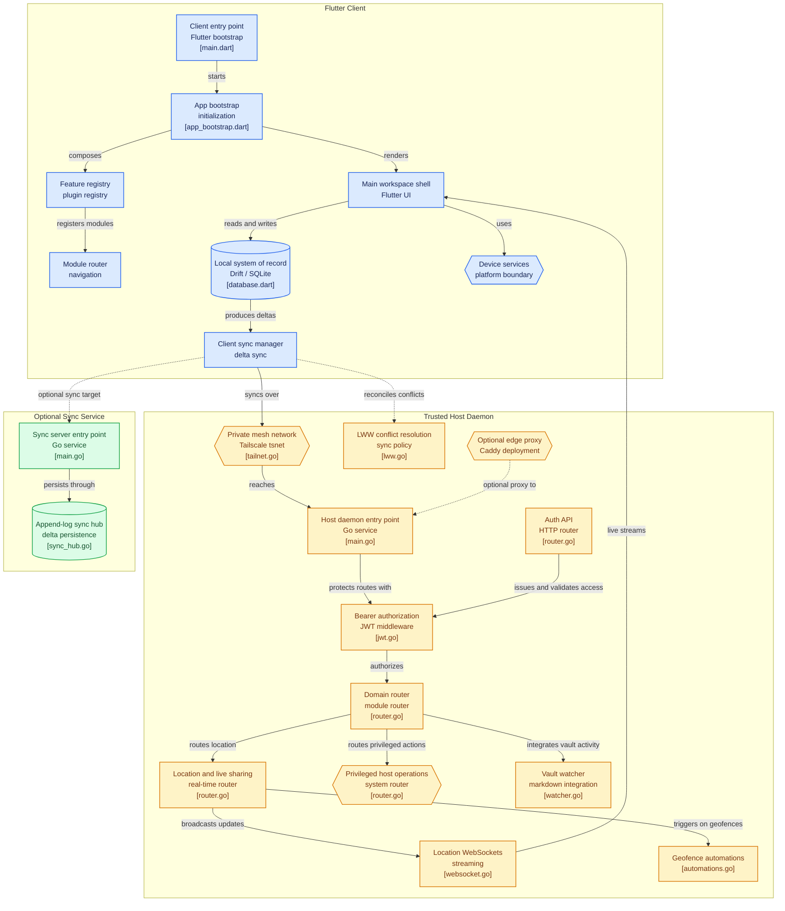

# System Architecture Specification

This document details the multi-platform system architecture, modular components, and core data flow paths for the local-first, cross-compatible LifeOS application.

---

## 1. Monorepo Structural Blueprint

The LifeOS application is laid out as a monorepo workspace to manage both client runtimes and backend container layers in isolation.

```
lifeos-monorepo/
├── .agent/                      # Autonomous agent runtime environment data
│   ├── current_sprint.json      # Dynamic, decomposed task manifests
│   └── system_architecture.md   # System design and data flow configurations
├── backend/                     # Containerized self-hosted infrastructure
│   ├── Dockerfile.sync          # Minimal sync service deployment blueprint
│   └── docker-compose.yml       # Infrastructure layout stack (Database, Proxy)
├── client/                      # Flutter multi-platform core engine
│   ├── android/                 # Android native runner configurations & AAR bindings
│   ├── windows/                 # Windows native C++ runner & Cgo DLL bindings
│   └── lib/                     # Spatial UI Matrix, FeatureRegistry Plugins, and application state
└── vault/                       # Obsidian Vault (Markdown Assets & System Truth)
    └── 04 - LifeOS DevDocs/     # Specifications (System Source of Truth)
        ├── DATA_SCHEMAS.md      # Database tables, caching, and frontmatter patterns
        ├── EMBEDDED_NETWORK.md  # tsnet lifecycle and authentication logic
        └── SYNC_PROTOCOL.md     # Transactional field-level delta sync engine
```

---

## 2. Visual Architecture Diagram



---

## 3. Platform Target System Integration

The application compiles into native code targets, binding underlying OS capabilities directly.

```
                  +-----------------------------------+
                  |        Flutter Core Engine        |
                  +-----------------------------------+
                                    |
                    +---------------+---------------+
                    |                               |
                    v                               v
       +-------------------------+     +-------------------------+
       |   Native Windows (x86)  |     |   Native Android (ARM)  |
       +-------------------------+     +-------------------------+
       | - C++ Runner compiled   |     | - Kotlin Host compiled  |
       |   via MSVC compiler.    |     |   via Gradle / NDK.     |
       | - Asynchronous Win32    |     | - inotify kernel events |
       |   ReadDirectoryChangesW |     |   listener for local    |
       |   for Obsidian Vault.   |     |   Obsidian folders.     |
       | - Go embedded via Cgo   |     | - Go Mobile .aar bindings|
       |   compiled C-Archive DLL|     |   for user-space tsnet. |
       +-------------------------+     +-------------------------+
```

---

## 4. Data Flow & Integration Lifecycle

The synchronization process bridges three major architectural nodes: the **Obsidian Vault Directory**, the **Local SQLite Database Cache**, and the **Self-Hosted Syncer Stack**.

### Local Sidecar Side vs. Remote Mesh Topology
The system enforces a localized split-plane topology:
1. **Local Go Daemon (Sidecar):** Runs as a background service on the desktop host to directly execute local OS shell routines (Hyper-V control, WOL) and handle local vault disk mutations (POST `/api/markdown/sync`) to bypass remote latency.
2. **Remote Docker Stack (Relay & PostgreSQL):** The central source of truth for relational state, running in isolated containers (behind Caddy and OAuth2 authentication) on the remote private Tailnet, reachable only through the embedded `tsnet` tunnel.

```
   [Obsidian Vault (.md)]  <==================== (File Watcher / Parser)
             |
             |  (Read/Write Frontmatter Blocks via Local Go Daemon on Port 8080)
             v
   [Local SQLite Cache (Drift)]  <==== (Delta Appender inside Transaction)
             |
             |  (Poll Pending state = 0 deltas)
             v
   [sync_queue Database Log]
             |
             |  (LWW State Vector & GZIP/Base64 Delta Chunk)
             v
    [Embedded tsnet Tunnel]
             |
             |  (WireGuard user-space tunnel to Port 80)
             v
   [Reverse Proxy (Caddy/Nginx)]
             |
             |  (Private Tailnet Route)
             v
   [Docker Sync Server Backend]
             |
             v
     [PostgreSQL Server]
```

### Path 1: Obsidian File Mutation Lifecycle
1.  The user edits an Obsidian note inside their local directory using a standard Markdown editor.
2.  The client's asynchronous **File Watcher** detects the file change. On Windows, this leverages native `ReadDirectoryChangesW`. On Android, due to Android 11+ Scoped Storage (SAF) restrictions, the client uses a hybrid **ContentObserver** coupled with a low-impact background periodic directory poll.
3.  The client parses the YAML frontmatter block using safe regular expressions (defined in `DATA_SCHEMAS.md`).
4.  If metadata changes are found, corresponding update routines run inside the local **SQLite Cache** to sync metadata metrics.
5.  Continuous auto-saves from the client's internal markdown editor (e.g., Zen Editor) are seamlessly flushed to the Go daemon's `/api/markdown/sync` endpoint.

### Path 2: Structured Data (Habit/Task) Mutation Lifecycle
1.  The user toggles a habit completion checkbox inside the native Flutter application UI.
2.  The reactive Drift framework fires a database transaction writing the change into `habits` (setting `synced_at = NULL`).
3.  Simultaneously, a delta payload transaction is written to the `sync_queue` table.
4.  The background networking scheduler fires and checks connection status over the **Embedded tsnet** node. If the connection is offline, deltas accumulate in SQLite. To prevent battery drain and db bloat:
    - **Payload Batching:** Transmits in batches of max 50 records per payload.
    - **Exponential Backoff:** Retries scale backoff dynamically on failure.
    - **Queue Compression/Eviction:** If pending deltas exceed 10,000, non-essential logs are compressed or pruned.
5.  Upon API acknowledgement, the client marks `sync_queue` states to `1` (Synced) and updates `synced_at` on the source records, avoiding infinite echo-loops.

### Path 3: Live Telemetry & Spatial UX Navigation
1.  **WebSocket Radar:** Location coordinate telemetry streams continuously via `tsnet` WebSockets to the mesh network, updating the UI heartbeat.
2.  **Spatial 3x3 Grid Engine:** Visual layouts run on a dynamic `FeatureRegistry` powered by an interactive Radial Dial, shifting layouts gracefully across the spatial grid.
3.  **Hybrid OTA Updates:** Silent checks ping the local Go daemon for rapid APK updates; failing that, fallback queries target GitHub releases to maintain client-backend binary parity.

---

## 5. Performance & Resource Constraints

*   **Thread Safety:** The SQLite instance runs exclusively on the main app background thread. Watchers and networking execute on isolated system threads to prevent frame drops in the client UI.
*   **Battery Management (Android):** Networking cycles utilize aggressive scheduling policies. The `tsnet` tunnel is shut down when the app is placed in a deep background state, releasing system resources.
*   **Offline Operation:** If network connections fail or the tailnet is unavailable, operations execute seamlessly against SQLite and local files, queuing updates for processing when the mesh is restored.
