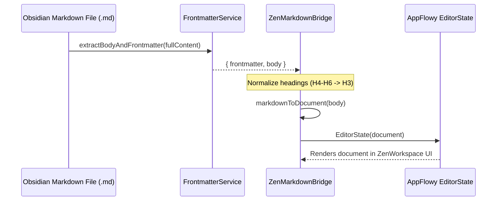

# Architectural Analysis: AppFlowy Monorepo vs. LifeOS ZenEditor

## Executive Summary

This document presents a complete comparative architectural breakdown of the official **AppFlowy Repository** (`appflowy_repo/`) and the **LifeOS ZenEditor** integration (`client/lib/appflowy/` & `client/lib/presentation/widgets/zen_workspace.dart`).

---

## 1. System Architecture Overview

```mermaid
graph TD
    subgraph AppFlowy Monorepo (appflowy_repo)
        AF_Flutter["AppFlowy Flutter App (frontend/appflowy_flutter)"]
        AF_Editor["AppFlowy Editor Engine (appflowy_editor)"]
        AF_Rust["Rust Core / Flowy Net (frontend/rust-lib)"]
        AF_Yrs["Yrs / Lib-Dispatch CRDT Core"]
        AF_Flutter --> AF_Editor
        AF_Flutter --> AF_Rust
        AF_Rust --> AF_Yrs
    end

    subgraph LifeOS ZenEditor Architecture
        Zen_UI["ZenWorkspace UI (client/lib/presentation/widgets/zen_workspace.dart)"]
        Zen_Bridge["ZenMarkdownBridge (client/lib/presentation/theme/zen_markdown_bridge.dart)"]
        Zen_AppFlowy["Custom AppFlowy Engine (client/lib/appflowy/)"]
        Zen_P2P["WebsocketSyncService / Native Yrs (native_yrs/)"]
        
        Zen_UI --> Zen_Bridge
        Zen_Bridge --> Zen_AppFlowy
        Zen_UI --> Zen_P2P
    end
```

### Component Comparison Table

| Architecture Dimension | AppFlowy Monorepo (`appflowy_repo`) | LifeOS `ZenEditor` (`LifeOS/client`) |
| :--- | :--- | :--- |
| **Primary Language Stack** | Dart (Flutter) + Rust (FFI via `flutter_rust_bridge`) | Dart (Flutter) + C/Rust (`native_yrs`) + Python/Node |
| **Block Editor Source** | External / internal package `appflowy_editor` | Vendorized and customized inline copy in `client/lib/appflowy` |
| **Document Storage** | SQLite / Protobuf + Local Yrs SQLite storage | Obsidian Markdown Vault Files + Frontmatter Header + Local DB |
| **Real-time Sync** | Flowy-Server / Supabase + Yrs Rust Core | WebSockets / P2P Delta broadcast (`WebsocketSyncService`) |
| **Design System / Theme** | FlowyUI / Custom AppFlowy Theme system | Everforest Color Palette (`EverforestColors`) + Zen Spatial Grid |

---

## 2. Document Model & Block Node Engine

### 2.1 The AppFlowy Document Tree (`Document` & `Node`)
AppFlowy's editor works on a tree of **`Node`** instances anchored at a root `Document`.

- **`Node` Structure**:
  - `id`: Unique block identifier string (UUID).
  - `type`: String type tag (e.g., `paragraph`, `heading`, `bulleted_list`, `numbered_list`, `todo_list`, `quote`, `divider`, `code_block`, `callout`).
  - `attributes`: JSON map containing block properties (e.g., `{ "level": 1 }` for H1, `{ "checked": true }` for checkboxes, `{ "language": "dart" }` for code blocks).
  - `delta`: Quill-compatible `Delta` object representing formatted rich text.
  - `children`: Nested list of child `Node`s (enabling nested lists and toggle blocks).

### 2.2 LifeOS `ZenMarkdownBridge` Transformation Pipeline
LifeOS bridges raw Obsidian Markdown files into AppFlowy `EditorState` dynamically:



1. **Frontmatter Extraction**: `FrontmatterService.extractBodyAndFrontmatter()` separates `---` YAML frontmatter from document body.
2. **Heading Normalization**: AppFlowy Editor native specs support H1-H3. `ZenMarkdownBridge` converts `####` (H4) and deeper down to `### ` (H3) before AST parsing.
3. **Fallback Resets**: If AST parsing encounters unknown custom markdown tags, `ZenMarkdownBridge` falls back to line-by-line paragraph node generation, ensuring data preservation without editor crash.

---

## 3. Character Shortcuts & Slash (`/`) Commands

### 3.1 Shortcut Event Handlers in LifeOS
In `client/lib/appflowy/src/editor/block_component/`, LifeOS configures granular character shortcut event handlers:

1. **Heading Shortcuts** (`heading_character_shortcut.dart`):
   - Triggers on `# `, `## `, `### ` + `Space`. Converts paragraph node into `headingNode(level: N)`.
2. **Bulleted List Shortcuts** (`bulleted_list_character_shortcut.dart`):
   - Triggers on `- ` or `* ` + `Space`. Converts paragraph node into `bulletedListNode()`.
3. **Numbered List Shortcuts** (`numbered_list_character_shortcut.dart`):
   - Triggers on `1. ` + `Space`. Converts paragraph node into `numberedListNode()`.
4. **Todo List Shortcuts** (`todo_list_character_shortcut.dart`):
   - Triggers on `[] ` or `[ ] ` + `Space`. Converts paragraph node into `todoListNode(checked: false)`.
5. **Quote Shortcuts** (`quote_character_shortcut.dart`):
   - Triggers on `> ` + `Space`. Converts paragraph node into `quoteNode()`.
6. **Divider Shortcuts** (`divider_character_shortcut.dart`):
   - Triggers on `---` + `Enter/Space`. Converts paragraph node into `dividerNode()`.

---

## 4. Upstream AppFlowy Core vs. LifeOS Native Integration

### 4.1 Upstream AppFlowy Rust Engine (`frontend/rust-lib/`)
AppFlowy monorepo relies on a heavy Rust core compiled via `flutter_rust_bridge` to handle:
- Protobuf schema encoding/decoding.
- Local SQLite database persistence (`flowy-sqlite`).
- Flowy-Server sync engine and conflict resolution.

### 4.2 LifeOS Modular Architecture (`native_yrs/` & P2P Engine)
LifeOS takes a more lightweight approach:
- Directly links Rust/C Yrs CRDT bindings via `native_yrs/`.
- Synchronizes document deltas using `WebsocketSyncService` and P2P transport.
- Preserves native file format as human-readable Markdown files inside the Obsidian vault (`vault/`).

---

## 5. Implementation Roadmap to 100% AppFlowy Feature Parity

To bring full AppFlowy feature parity from `appflowy_repo` into LifeOS `ZenEditor`, the following remaining blocks can be imported/adapted from `appflowy_repo/frontend/appflowy_flutter`:

1. **Toggle List Block**: Interactive collapsible blocks for structured outline notes.
2. **Code Block Component**: Syntax-highlighted code editor block with copy-to-clipboard functionality.
3. **Callout / Notice Box**: Highlighted callout boxes with customizable background colors and icons.
4. **Media & File Attachments**: Image viewer, PDF embed, and audio player blocks.
5. **Database Views**: Grid/Table view and Kanban Board view powered by AppFlowy database logic.

---

## 6. Summary

The acquisition of `appflowy_repo` into LifeOS gives direct access to upstream AppFlowy Flutter and Rust implementations. LifeOS's `ZenEditor` successfully embeds `appflowy_editor` while keeping clean Markdown file sync with Obsidian vaults.
