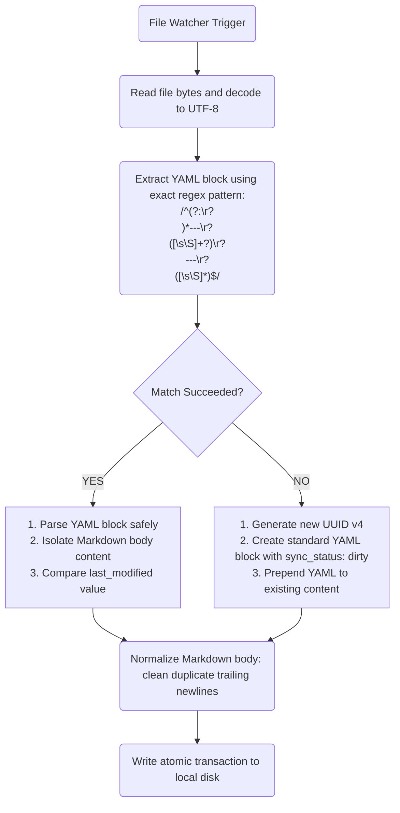

# Technical Specification: Split-Storage & Frontmatter Architecture

This document defines the physical data caching schema for the SQLite engine running on client runtimes (via Drift/Moor bindings) and specifies the structural formatting, cleaning, and parsing constraints for Markdown notes synced directly with the local Obsidian Vault.

---

## 1. SQLite Relational Schema Design

To ensure optimal performance on mobile (Android ARM64) and desktop (Windows x86_64), structured metrics are cached locally inside a reactive SQLite database. State propagation is managed using an offline-first strategy. 

### Mandatory State Tracking Fields
Every relational table inside the cache engine MUST implement the following state synchronization fields:
*   `id`: `TEXT` (UUID v4 string), Primary Key.
*   `created_at`: `INTEGER` (Unix epoch milliseconds), immutable creation timestamp.
*   `updated_at`: `INTEGER` (Unix epoch milliseconds), mutated upon local modification.
*   `synced_at`: `INTEGER` (Unix epoch milliseconds), tracks upstream synchronization receipt. MUST be `NULL` if local modifications are unsynced (dirty state).
*   `is_deleted`: `INTEGER` (boolean flag `0` or `1`), tracks soft deletion state to preserve local delete logs for upstream relay.

---

### Table Specifications

```sql
-- SQLite Table Definition: Habits
CREATE TABLE habits (
    id TEXT PRIMARY KEY NOT NULL,
    title TEXT NOT NULL,
    description TEXT,
    frequency_cron TEXT NOT NULL, -- Cron representation of habit schedule (e.g. '0 9 * * *')
    target_streak INTEGER NOT NULL DEFAULT 0,
    created_at INTEGER NOT NULL,
    updated_at INTEGER NOT NULL,
    synced_at INTEGER,
    is_deleted INTEGER NOT NULL DEFAULT 0
);

-- SQLite Table Definition: Tasks
CREATE TABLE tasks (
    id TEXT PRIMARY KEY NOT NULL,
    title TEXT NOT NULL,
    notes TEXT,
    priority INTEGER NOT NULL DEFAULT 1, -- 1: Low, 2: Medium, 3: High, 4: Critical
    due_date INTEGER,                    -- Epoch milliseconds (optional)
    status TEXT NOT NULL DEFAULT 'TODO', -- 'TODO', 'IN_PROGRESS', 'DONE', 'ABANDONED'
    completed_at INTEGER,                -- Epoch milliseconds
    created_at INTEGER NOT NULL,
    updated_at INTEGER NOT NULL,
    synced_at INTEGER,
    is_deleted INTEGER NOT NULL DEFAULT 0
);

-- SQLite Table Definition: Check-ins
CREATE TABLE checkins (
    id TEXT PRIMARY KEY NOT NULL,
    mood_rating INTEGER NOT NULL,      -- Range: 1 to 10
    energy_rating INTEGER NOT NULL,    -- Range: 1 to 10
    sleep_hours REAL NOT NULL,
    notes TEXT,
    created_at INTEGER NOT NULL,
    updated_at INTEGER NOT NULL,
    synced_at INTEGER,
    is_deleted INTEGER NOT NULL DEFAULT 0
);
```

---

## 2. Obsidian YAML Frontmatter Architecture

Unstructured text assets and daily reflection logs reside inside a designated local Obsidian Vault. The app listens to directory updates via file watchers, automatically parsing and updating notes metadata via YAML frontmatter blocks.

### Rigid Frontmatter YAML Structure
Obsidian note files must begin with a valid, clean YAML block demarcated by triple dashes (`---`). No trailing spaces are permitted after the dashes.

```yaml
---
id: "4a6d71b3-4fe8-4447-b50a-e24c6e93149d"
type: "lifeos_note"
last_modified: 1779951600000
sync_status: "clean"
---
# Note Title
Note markdown content begins here...
```

### Properties Definition Matrix

| Property Name   | Data Type  | Allowed Values / Formats             | Description                                                   |
|:----------------|:-----------|:------------------------------------|:--------------------------------------------------------------|
| `id`            | String     | UUID v4 format (`^[0-9a-f]{8}-...`)  | Unique identifier linking the note to local/remote sync state |
| `type`          | String     | `"lifeos_note"`                     | Standard identifier confirming integration with the LifeOS core|
| `last_modified` | Integer    | Unix epoch milliseconds             | Tracks structural changes to prevent race conditions on write  |
| `sync_status`   | String     | `"clean"`, `"dirty"`, `"conflict"`  | Denotes current sync state against the central backup server   |

---

## 3. Obsidian Note Parsing and Cleaning Logic

When a file system change is detected by the directory watcher, the client engine MUST execute the following pipeline to read/write notes without corrupting Markdown bodies.



### Parsing Specifications

1.  **YAML Block Delimiter Integrity:** The regex parsing engine must look for a starting `---` line at absolute position 0 of the string.
2.  **Missing Frontmatter Injection:** If a markdown file lacks a valid YAML block, the system MUST automatically generate a fresh UUID v4, populate the initial metadata with `sync_status: "dirty"` and `type: "lifeos_note"`, and cleanly write it to the top of the file without deleting user text.
3.  **Frontmatter Cleaning Constraints:**
    *   Keys MUST be alphabetically sorted during write cycles (`id`, `last_modified`, `sync_status`, `type`).
    *   No empty lines are allowed inside the frontmatter block.
    *   All YAML block updates must preserve the unmodified markdown body exactly, ensuring a single empty line separates the terminating `---` and the first header of the markdown text.
    *   Windows style line endings (`\r\n`) must be normalized to standard unix style (`\n`) within the frontmatter to avoid YAML compiler parsing crashes.

---

## Related Specifications
*   [Embedded Network Protocol (tsnet)](EMBEDDED_NETWORK.md)
*   [Transactional Sync Protocol & LWW](SYNC_PROTOCOL.md)


