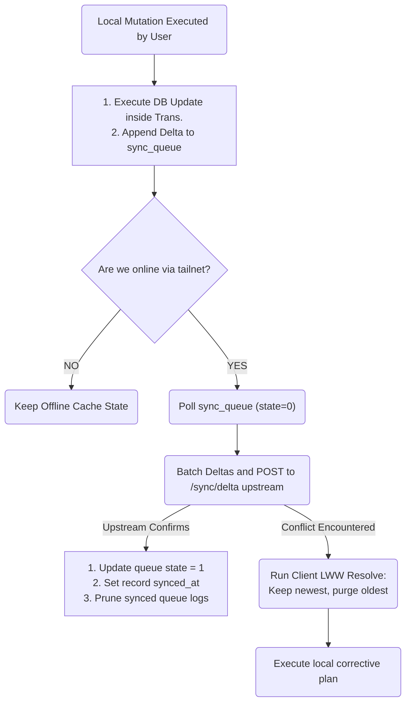

# Technical Specification: Transactional Change Logging Sync Protocol

This specification outlines the design and operational rules for the LifeOS offline-first synchronization protocol. It uses atomic field-level delta logging combined with client-driven Last-Write-Wins (LWW) conflict resolution for structured database fields, and a Conflict-free Replicated Data Type (CRDT) sequence delta/block-level line diffing approach for unstructured Markdown documents, ensuring mathematical convergence and eventual consistency across all devices.

---

## 1. Architectural Strategy

Rather than transferring whole table rows or full-text Markdown notes upon every mutation, the LifeOS synchronization engine implements **Field-Level Delta Syncing**. 

### Benefits
*   **Minimal Payload Footprint:** Transmits only modified values over the mesh network.
*   **Resiliency Under High Latency:** Outages or dropouts on mobile data connections will not corrupt major file databases.
*   **Concurrent Editing Convergence:** Distinct fields of the same database row can be edited on separate clients simultaneously without conflict (e.g. updating a Task's priority on Windows while marking it as complete on Android converges cleanly).

---

## 2. Sync Queue Schema (The Transaction Log)

All client-side mutations MUST trigger an atomic write containing both the primary table modification and a delta record injected directly into the local `sync_queue` table.

```sql
-- SQLite Table Definition: Sync Queue Transaction Log
CREATE TABLE sync_queue (
    id TEXT PRIMARY KEY NOT NULL,         -- UUID v4 of the sync transaction
    target_table TEXT NOT NULL,           -- e.g. 'habits', 'tasks', 'checkins'
    record_id TEXT NOT NULL,              -- UUID v4 of the modified target row
    field_name TEXT NOT NULL,             -- Specific modified column (e.g., 'status')
    old_value TEXT,                       -- JSON string representation of previous value
    new_value TEXT,                       -- JSON string representation of new value
    client_updated_at INTEGER NOT NULL,   -- Unix epoch milliseconds of client mutation
    synced_state INTEGER NOT NULL DEFAULT 0 -- 0: Pending Sync, 1: Synced, 2: Failed/Conflict
);

-- Index to optimize sync queue polling performance
CREATE INDEX idx_sync_queue_pending ON sync_queue (synced_state) WHERE synced_state = 0;
```

---

## 3. The Sync Lifecycle State Machine



---

## 4. Conflict Resolution & Merge Engines

Due to the dual-nature of data in LifeOS (relational database fields vs. unstructured document text), two distinct merge strategies are enforced:

### 4.1. Structured Data: Last-Write-Wins (LWW)
Conflict resolution for SQLite-backed fields (e.g. habits, tasks, check-ins) is computed strictly using **Client-Side Mutation Timestamps** (`client_updated_at`). Because all local edits generate monotonic millisecond timestamps, conflict resolution is deterministic across all nodes.

#### Field-Level LWW Convergence Policy
When a client syncs its delta transactions to the upstream server, or when pulling remote transactions, the system evaluates conflicts using the following logic block:

```
For each incoming delta transaction D_incoming:
    1. Query the matching database record and field locally.
    2. Read local state and locate the latest matching transaction inside the local database:
       - Let T_local be the local record's last modified timestamp.
       - Let T_incoming be D_incoming.client_updated_at.
    
    3. Evaluate comparison:
       If T_incoming > T_local:
           A. Apply new_value directly to the local table target.
           B. Update target record `synced_at` = current timestamp.
           C. Mark local `sync_queue` records matching the target field as SYNCED (state = 1).
       Else:
           A. Discard incoming delta D_incoming (Local has newer data).
           B. Re-sync current local state to upstream to converge remote server.
```

#### Critical Verification Controls
*   **Time-Skew Protection:** Timestamps are offset against network time protocol (NTP) servers during client network handshakes to guard against manually altered system clocks on mobile devices.
*   **Monotonic Counter Fallback:** In the highly improbable event that two conflicting client transactions share the identical millisecond timestamp, the client UUID v4 lexicographical sort order is used as a tie-breaker, guaranteeing deterministic resolution.

### 4.2. Unstructured Documents: Block-Level Sequence CRDT
Using LWW for raw text or Markdown notes would result in catastrophic data loss when concurrent offline edits merge. To resolve this, Markdown files (`.md`) are synced using a simplified JSON-based **Sequence Delta CRDT** combined with line-by-line block diffs:

#### Sequence CRDT Mechanics
1. **Document Representation:** A note is treated as an ordered sequence of text blocks (paragraphs, headers, checklist items) mapped to unique block identifiers (`block_id`).
2. **Operations:** Edits are modeled as operations containing:
   - `op_type`: `INSERT`, `DELETE`, or `REPLACE`
   - `block_id`: Unique cryptographic hash of the block or element
   - `origin_id`: Identifier of the block preceding it in the document flow
   - `value`: Raw text content of the block
   - `lamport_timestamp`: Logical clock to ensure order resolution
3. **Merging Protocol:**
   - Concurrent inserts at the same document location are ordered lexicographically by their `client_id` (Lamport tie-breaker).
   - Deletions are represented by tombstones (`is_deleted = true`), which are garbage-collected only when all active sync nodes acknowledge deletion.
   - Text mutations within the same block are merged using a line-by-line three-way diff engine. If conflicts remain unresolved, both versions are appended to the document as a marked conflict block (Git-style conflict markers).

---

## Related Specifications
*   [Split-Storage & Frontmatter Architecture](DATA_SCHEMAS.md)
*   [Embedded Network Protocol (tsnet)](EMBEDDED_NETWORK.md)

