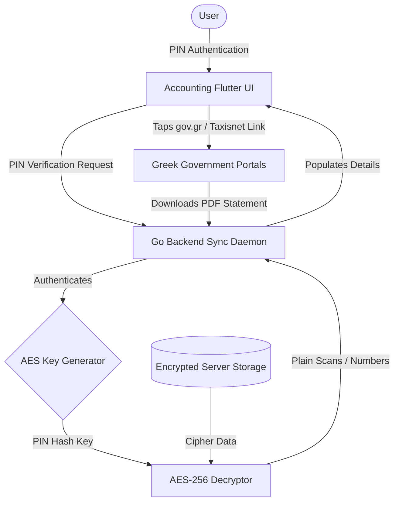

# Accounting | Module Documentation

> [!NOTE]
> **Status:** Conceptual Phase / Design Stage
> **Links:** [[00 - System/Home|Home]] | *Linked Modules: [[Preferences Setting Tab]], [[Home Screen]], [[Banking System]], [[Obsidian Zen Editor]], [[Point Star System]]*

---

## Concept & Vision
The Accounting module acts as the private registry, official document vault, and government portal link hub of LifeOS. It consolidates all official family paperwork, tax numbers, and digital credentials into a secure, easily accessible interface—eliminating the need to search physical folders or repeatedly log into scattered public websites.

### Core Features & Mechanics
1. **Government Credentials Registry:**
   - Central database logging critical registration numbers:
     - **Taxes:** Tax Identification Number (AFM) and Taxisnet login parameters.
     - **Social Security:** National Insurance Numbers (AMKA, AMA).
2. **Official Document Locker:**
   - Securely stores digital copies (PDFs, images) of core family documents:
     - Identification Cards (IDs), Passports, Driver Licenses.
     - Formal declarations, contracts, and digital certificates (GOV.gr files).
3. **Portal Link Hub:**
   - Houses quick-access, categorized bookmark links directing the user to official Greek administration portals (GOV.gr, EFKA, Taxisnet, EFOP) to easily retrieve fresh documents.
4. **Secure rest Encryption:**
   - Due to the sensitive nature of these files, document stores are encrypted at rest on the server.
   - Access to credentials and scanned files requires a local passcode prompt matching the [[Home Screen]] PIN authentication.

---

## Work Done So Far
- **Module Requirements Mapping:** Document classification, credential fields, portal indexes, and server encryption rules defined.
- **Design Philosophy:** Everforest Minimalist Flat-Line UI layout (structured credential detail tables, outline document card grids, clean secure/locked status indicators) mapped.

---

## Current Focus & Actions
- **Crypto Manager Design:** Drafting AES-256 local decryption routines in the Go backend based on PIN hashing.
- **SQLite Database Schema:** Modeling tables for encrypted credential fields, file reference paths, and government portal indexes.

---

## Next Steps & Future Roadmap
- **Scan Upload Tool:** Implementing scanned document loading adapters in Flutter.
- **Zen Editor Notes Sync:** Allowing the [[Obsidian Zen Editor]] to link notes directly to the document registry (e.g. tracking tax filing drafts, or formal declarations).
- **Direct Portal WebView:** Testing native WebViews in Flutter to load taxi portals directly inside isolated workspaces.

---

## Interaction Flows & Diagrams
*Visual blueprint of document indexing, server-side encryption/decryption, and portal access routing.*

## Technical Specs
- [[02 - Technical Specs/Accounting/What to Build|What to Build]]
- [[02 - Technical Specs/Accounting/How to Build|How to Build]]
- [[02 - Technical Specs/Accounting/What to Do|What to Do]]
