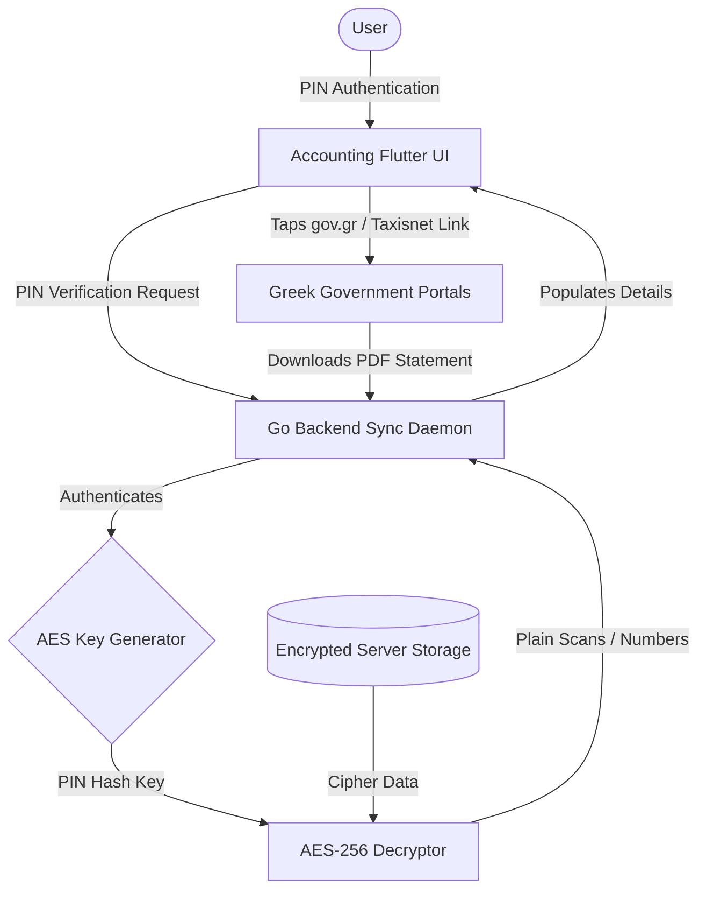

# Accounting | Module Documentation

> [!NOTE]
> **Status:** Implemented / Production Live
> **Links:** [[00 - System/Home|Home]] | *Linked Modules: [[Preferences Setting Tab]], [[Home Screen]], [[Banking System]], [[Obsidian Zen Editor]], [[Point Star System]]*

---

## Concept & Vision
The Accounting module acts as the private registry, official document vault, and government portal link hub of LifeOS. It consolidates all official family paperwork, tax numbers, and digital credentials into a secure, easily accessible interface—eliminating the need to search physical folders or repeatedly log into scattered public websites.

### Core Features & Mechanics
1. **Government Credentials Registry:**
   - Central database logging critical registration numbers:
     - **Taxes:** Tax Identification Number (AFM) and Taxisnet login parameters.
     - **Social Security:** National Insurance Numbers (AMKA, AMA).
2. **Official Document Locker:**
   - Securely stores digital copies (PDFs, images) of core family documents:
     - Identification Cards (IDs), Passports, Driver Licenses.
     - Formal declarations, contracts, and digital certificates (GOV.gr files).
3. **Portal Link Hub:**
   - Houses quick-access, categorized bookmark links directing the user to official Greek administration portals (GOV.gr, EFKA, Taxisnet, EFOP) to easily retrieve fresh documents.
4. **Secure rest Encryption:**
   - Due to the sensitive nature of these files, document stores are encrypted at rest on the server.
   - Access to credentials and scanned files requires a local passcode prompt matching the [[Home Screen]] PIN authentication.

---

## Work Done So Far
- **Accounting View (DONE):** The Flutter client shows government credential cards and secure document cards.
- **Security PIN Curtain (DONE):** Credentials and documents sit behind a security PIN curtain, matching the [[Home Screen]] PIN authentication philosophy.
- **Encrypted Storage (DONE):** Credentials and documents are AES-GCM encrypted at rest in `accounting.db`.
- **Daemon RPC (DONE):** The daemon exposes `/api/accounting/rpc` as a JSON-RPC stub endpoint.
- **Client Data Layer (DONE):** `accounting_dao` provides typed accessors for `AccountingCredentials` and `AccountingDocuments`.

---

## Current Focus & Actions
- **Encryption Hardening:** Reviewing key derivation from the PIN and rotation paths for stored credentials.
- **RPC Expansion:** Growing the JSON-RPC stub into richer document and credential operations.
- **Document UX:** Improving scan upload flows and card metadata display in the locker view.

---

## Next Steps & Future Roadmap
- **Scan Upload Tool (DONE):** Document loading is implemented; ongoing work refines scanned-document adapters in Flutter.
- **Zen Editor Notes Sync:** Allowing the [[Obsidian Zen Editor]] to link notes directly to the document registry (e.g. tracking tax filing drafts, or formal declarations).
- **Direct Portal WebView:** Testing native WebViews in Flutter to load taxi portals directly inside isolated workspaces.

---

## Interaction Flows & Diagrams
*Visual blueprint of document indexing, server-side encryption/decryption, and portal access routing.*

```mermaid
graph TD
    %% Creation Layer
    User([User]) -->|"PIN Authentication"| FlutterUI["Accounting Flutter UI"]
    
    %% Decryption Pipeline
    FlutterUI -->|"PIN Verification Request"| GoDaemon["Go Backend Sync Daemon"]
    GoDaemon -->|"Authenticates"| KeyGenerator{"AES Key Generator"}
    KeyGenerator -->|"PIN Hash Key"| Decryptor["AES-256 Decryptor"]
    
    %% Storage access
    SecureStorage[(Encrypted Server Storage)] -->|"Cipher Data"| Decryptor
    Decryptor -->|"Plain Scans / Numbers"| GoDaemon
    GoDaemon -->|"Populates Details"| FlutterUI
    
    %% Portal Integration
    FlutterUI -->|"Taps gov.gr / Taxisnet Link"| WebPortal["Greek Government Portals"]
    WebPortal -->|"Downloads PDF Statement"| GoDaemon
```

## Technical Specs
- [[02 - Technical Specs/Accounting/What to Build|What to Build]]
- [[02 - Technical Specs/Accounting/How to Build|How to Build]]
- [[02 - Technical Specs/Accounting/What to Do|What to Do]]
