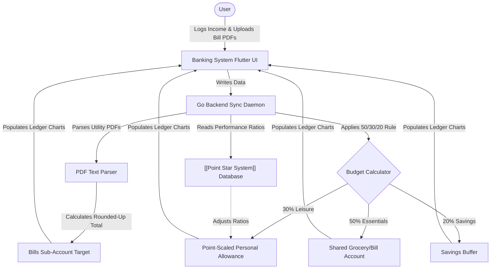

# Banking System | Module Documentation

> [!NOTE]
> **Status:** Conceptual Phase / Design & Planning Stage
> **Links:** [[Home]] | *Linked Modules: [[Preferences Setting Tab]], [[Point Star System]], [[Accounting]]*

---

## Concept & Vision
The Banking System acts as the personal budget coordinator, bill aggregator, and allowance calculator of LifeOS. Recognizing the high API costs and restrictions of direct integrations with Greek banks (such as Eurobank), the module relies on a hybrid framework: parsing notification documents locally and calculating budget allocations, which the user then executes manually.

### Core Features & Mechanics

1. **Local Document PDF Parser & Rounded Bill Calculator:**
   - The Go backend reads bill PDFs (electricity, internet, water) uploaded by the user or fetched from notifications.
   - Extracts the payable values, aggregates the monthly bill totals, and outputs a **rounded-up target sum** (e.g. rounding €186.40 to €200).
   - This target is displayed to the user to manually move to their dedicated bills account and establish standing orders.
   - **Rollover Surplus Management:** Any excess cash remaining in the bills account after payments are finalized (e.g., the €13.60 leftover from the €200 transfer) is rolled over to the next month's ledger. The subsequent month's required transfer target is dynamically reduced by subtracting this surplus, preventing excessive capital accumulation in the bill-paying account.

2. **Income Allocator & Point-Based Allowance:**
   - **Income Pooling:** Logs pooled household income (e.g. €1000).
   - **Behavioral Allowance Split:** The individual "silly things" (leisure) budget is calculated dynamically based on scores from the [[Point Star System]]. A higher star ratio entitles that family member to a larger percentage of the leisure budget.

3. **Global Standard Budget Partitioning:**
   - The system utilizes a standard, custom-tailored 50/30/20 budgeting rule as its baseline:
     - **Essentials (Groceries & Shared Bills):** 50% of monthly income.
     - **Silly Things (Personal Allowances):** 30% of income, split between partners based on Star Point achievements.
     - **Savings & Emergency Funds:** 20% of income, moved to a secure savings buffer.

4. **Voucher Tracking Interface:**
   - Logs completed voucher redemptions from the Point Star System, prompting manual ledger entries once the money is transferred.

---

## Work Done So Far
- **System Logic Formulated:** Budget allocation ratios, PDF parser rules, and Star Points integration parameters mapped.
- **Design Philosophy:** Everforest Minimalist Flat-Line UI layout (grids showing balance charts, solid outlines for sub-accounts, flat list tables for parsed bills) mapped.

---

## Current Focus & Actions
- **PDF Extraction Routines:** Designing Go backend helper functions to parse text coordinates in standard Greek utility bill PDFs.
- **Dynamic Split Algorithms:** Writing calculations to split the personal allowance budget using real-time database inputs from the Point Star System.

---

## Next Steps & Future Roadmap
- **Manual Voucher Ledger:** Flutter UI screens to approve and log voucher redemptions.
- **Monthly Summary Exporter:** Creating simple data sheets to export structured monthly finances to [[Accounting]] templates.

---

## Interaction Flows & Diagrams
*Financial calculation pipeline showing input income, document parsers, database checks, and client dashboard metrics.*

