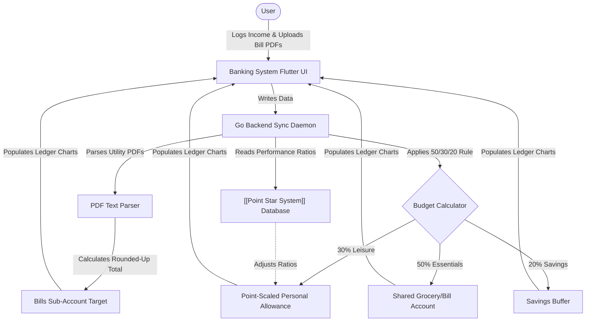

# Banking System | Module Documentation

> [!NOTE]
> **Status:** Implemented / Production Live
> **Links:** [[00 - System/Home|Home]] | *Linked Modules: [[Preferences Setting Tab]], [[Point Star System]], [[Accounting]], [[Home Screen]]*

---

## Concept & Vision
The Banking System acts as the personal budget coordinator, bill aggregator, and allowance calculator of LifeOS. Recognizing the high API costs and restrictions of direct integrations with Greek banks (such as Eurobank), the module relies on a hybrid framework: parsing notification documents locally and calculating budget allocations, which the user then executes manually.

### Core Features & Mechanics

1. **Local Document PDF Parser & Rounded Bill Calculator:**
   - The Go backend reads bill PDFs (electricity, internet, water) uploaded by the user or fetched from notifications.
   - Extracts the payable values, aggregates the monthly bill totals, and outputs a **rounded-up target sum** (e.g. rounding €186.40 to €200).
   - This target is displayed to the user to manually move to their dedicated bills account and establish standing orders.
   - **Rollover Surplus Management:** Any excess cash remaining in the bills account after payments are finalized (e.g., the €13.60 leftover from the €200 transfer) is rolled over to the next month's ledger. The subsequent month's required transfer target is dynamically reduced by subtracting this surplus, preventing excessive capital accumulation in the bill-paying account.

2. **Income Allocator & Point-Based Allowance:**
   - **Income Pooling:** Logs pooled household income (e.g. €1000).
   - **Behavioral Allowance Split:** The individual "silly things" (leisure) budget is calculated dynamically based on scores from the [[Point Star System]]. A higher star ratio entitles that family member to a larger percentage of the leisure budget.

3. **Global Standard Budget Partitioning:**
   - The system utilizes a standard, custom-tailored 50/30/20 budgeting rule as its baseline:
     - **Essentials (Groceries & Shared Bills):** 50% of monthly income.
     - **Silly Things (Personal Allowances):** 30% of income, split between partners based on Star Point achievements.
     - **Savings & Emergency Funds:** 20% of income, moved to a secure savings buffer.

4. **Voucher Tracking Interface:**
   - Logs completed voucher redemptions from the Point Star System, prompting manual ledger entries once the money is transferred.

---

## Work Done So Far
- **Banking Dashboard (DONE):** The Flutter client ships a banking dashboard with accounts, ledger transaction cards, a bill pay tracker, and a budget split indicator.
- **PDF Statement Import (DONE):** The daemon parses statement PDFs via `/api/v1/banking/parse-pdf`.
- **Database Seeding (DONE):** Accounts and transactions are seeded in `finance.db`.
- **Client Data Layer (DONE):** `banking_dao` provides typed accessors for `BankAccounts`, `BankLedgers`, `BillLogs`, and `BankingRollovers`.

---

## Current Focus & Actions
- **PDF Parser Accuracy:** Improving extraction of payables and line items from Greek utility bill PDFs.
- **Rollover Logic:** Polishing the rollover surplus calculation so targets reduce correctly month over month.
- **Budget Split View:** Refining the 50/30/20 budget split indicator with live ledger data.

---

## Next Steps & Future Roadmap
- **Manual Voucher Ledger:** Flutter UI screens to approve and log voucher redemptions from the [[Point Star System]].
- **Monthly Summary Exporter:** Creating simple data sheets to export structured monthly finances to [[Accounting]] templates.
- **Point-Scaled Allowance:** Wiring the dynamic leisure budget split against live Star Point ratios from the [[Point Star System]] database.

---

## Interaction Flows & Diagrams
*Financial calculation pipeline showing input income, document parsers, database checks, and client dashboard metrics.*

```mermaid
graph TD
    %% Inputs
    User1([User]) -->|"Logs Income & Uploads Bill PDFs"| FlutterUI["Banking System Flutter UI"]
    FlutterUI -->|"Writes Data"| GoDaemon["Go Backend Sync Daemon"]
    
    %% PDF Parser
    GoDaemon -->|"Parses Utility PDFs"| PDFParser["PDF Text Parser"]
    PDFParser -->|"Calculates Rounded-Up Total"| TargetBillAccount["Bills Sub-Account Target"]
    
    %% Budget Split Engine
    GoDaemon -->|"Reads Performance Ratios"| PointStar["[[Point Star System]] Database"]
    GoDaemon -->|"Applies 50/30/20 Rule"| BudgetCalculator{"Budget Calculator"}
    
    %% Split Outputs
    BudgetCalculator -->|50% Essentials| Groceries["Shared Grocery/Bill Account"]
    BudgetCalculator -->|20% Savings| Savings["Savings Buffer"]
    BudgetCalculator -->|30% Leisure| PersonalAllowance["Point-Scaled Personal Allowance"]
    PointStar -.->|"Adjusts Ratios"| PersonalAllowance
    
    %% Output
    TargetBillAccount & Groceries & Savings & PersonalAllowance -->|"Populates Ledger Charts"| FlutterUI
```

## Technical Specs
- [[02 - Technical Specs/Banking System/What to Build|What to Build]]
- [[02 - Technical Specs/Banking System/How to Build|How to Build]]
- [[02 - Technical Specs/Banking System/What to Do|What to Do]]
