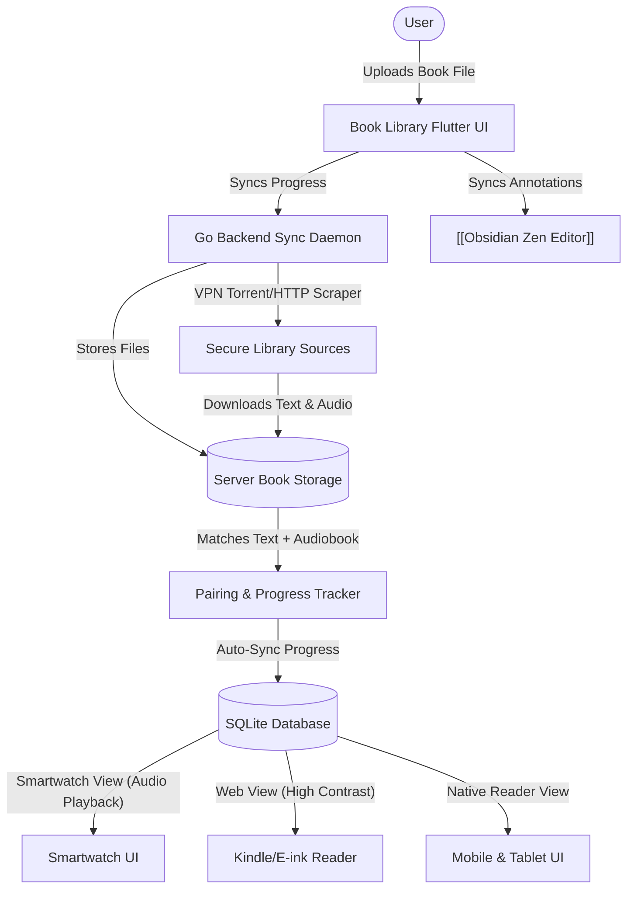

# Book Library | Module Documentation

> [!NOTE]
> **Status:** Conceptual Phase / Design & Planning Stage
> **Links:** [[Home]] | *Linked Modules: [[Preferences Setting Tab]], [[Obsidian Zen Editor]], [[Point Star System]], [[Music Library]]*

---

## Concept & Vision
The Book Library is a unified e-book reader, audiobook player, and study organizer designed to run across multiple device form factors. It acts as a private, self-hosted library server, allowing users to sync their reading progress, listen to audiobooks, and manage text annotations seamlessly.

### Core Features & Mechanics
1. **Integrated Text-to-Audio Mapping:**
   - For cataloged entries, the system attempts to pair the text e-book (EPUB, PDF) with its corresponding audiobook version (M4B, MP3).
   - This allows users to switch between reading on screen and listening on the move, syncing progression markers.
2. **Automated Downloader (Personal VPN Routing):**
   - The Go backend can search public indices and secure channels to locate purchased books or metadata.
   - All external indexing and download actions run through a personal VPN connection on the server.
3. **Omnipresent Multi-Platform Rendering:**
   - **E-Ink/Kindle Compatibility:** A dedicated high-contrast, text-only layout optimized for Kindle browser and E-ink screens.
   - **Cross-Platform Playback:** Interface layouts designed to scale from smartwatches (audio playback controls) to desktop monitors, tablets, and car consoles (Android Auto).
4. **Universal Format Parser:**
   - Native rendering engine in Flutter capable of parsing EPUB structures, PDFs, and standard text formats.

---

## Work Done So Far
- **System Concept Outlined:** Multi-device sync architecture and file pairing protocols defined.
- **Design Philosophy:** Everforest Minimalist Flat-Line UI layout (plain book grid, rounded panels, thin outline indicators, and clear text fields) mapped.

---

## Current Focus & Actions
- **EPUB Parser Engine:** Reviewing open-source Flutter EPUB engines to fork and adapt for the LifeOS core rendering grid.
- **Audiobook Sync Handlers:** Designing sync payloads in the Go backend to coordinate audio timestamps with EPUB page numbers.

---

## Next Steps & Future Roadmap
- **Kindle Web Server Interface:** Building a lightweight, minimal HTML portal hosted by the Go backend to serve books directly to Kindle devices.
- **Smartwatch Audio Controller:** Creating simplified watch UI controller mockups for audiobook controls.
- **Highlight Extraction to Zen Editor:** Creating dynamic links that extract text highlights and annotations from the Book Library directly into notes inside the [[Obsidian Zen Editor]].

---

## Interaction Flows & Diagrams
*Visual pipeline illustrating file synchronization, text-to-audio matching, and cross-platform rendering layouts.*

## Technical Specs
- [[02 - Technical Specs/Book Library/What to Build|What to Build]]
- [[02 - Technical Specs/Book Library/How to Build|How to Build]]
- [[02 - Technical Specs/Book Library/What to Do|What to Do]]
