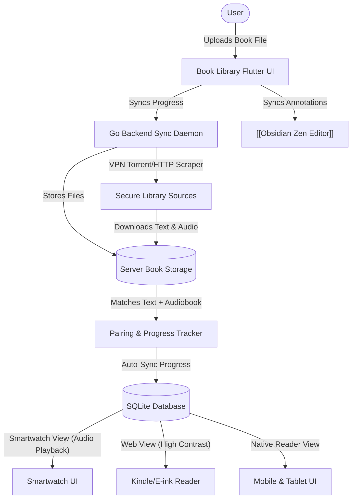

# Book Library | Module Documentation

> [!NOTE]
> **Status:** Implemented / Production Live
> **Links:** [[00 - System/Home|Home]] | *Linked Modules: [[Preferences Setting Tab]], [[Obsidian Zen Editor]], [[Point Star System]], [[Music Library]], [[Project Infinity]], [[Flashcards]]*

---

## Concept & Vision
The Book Library is a unified e-book reader, audiobook player, and study organizer designed to run across multiple device form factors. It acts as a private, self-hosted library server, allowing users to sync their reading progress, listen to audiobooks, and manage text annotations seamlessly.

### Core Features & Mechanics
1. **Integrated Text-to-Audio Mapping:**
   - For cataloged entries, the system attempts to pair the text e-book (EPUB, PDF) with its corresponding audiobook version (M4B, MP3).
   - This allows users to switch between reading on screen and listening on the move, syncing progression markers.
2. **Automated Downloader (Personal VPN Routing):**
   - The Go backend can search public indices and secure channels to locate purchased books or metadata.
   - All external indexing and download actions run through a personal VPN connection on the server.
3. **Omnipresent Multi-Platform Rendering:**
   - **E-Ink/Kindle Compatibility:** A dedicated high-contrast, text-only layout optimized for Kindle browser and E-ink screens.
   - **Cross-Platform Playback:** Interface layouts designed to scale from smartwatches (audio playback controls) to desktop monitors, tablets, and car consoles (Android Auto).
4. **Universal Format Parser:**
   - Native rendering engine in Flutter capable of parsing EPUB structures, PDFs, and standard text formats.

---

## Work Done So Far
- **Library Dashboard (DONE):** The Flutter client shows a book card dashboard for the catalog.
- **Reader Stack (DONE):** An EPUB reader, CBZ reader, and e-ink reader view are implemented.
- **Audiobook Player (DONE):** An audiobook player with full playback controls is live.
- **Highlight Curtain (DONE):** A highlight curtain overlays text selection for marking passages.
- **Search View (DONE):** A search view queries multiple sources — Project Gutenberg, OpenLibrary, MangaDex, and Anna's Archive — with parallel search.
- **Zen AI Panel (DONE):** An AI panel provides describe, summarize, and chat actions via daemon LLM endpoints (default `llama3.2` through Ollama).
- **Background Downloads (DONE):** Book download jobs run in the background.
- **Persistence (DONE):** Reading progress and highlights are stored in `books.db`; the client uses `books_dao`.

---

## Current Focus & Actions
- **Reader Polish:** Refining EPUB/CBZ rendering, pagination, and e-ink contrast tuning.
- **Zen AI Refinement:** Improving summarization quality and chat context for the current book.
- **Download Manager:** Hardening background jobs with resume and retry behavior.

---

## Next Steps & Future Roadmap
- **Kindle Web Server Interface:** Building a lightweight, minimal HTML portal hosted by the Go backend to serve books directly to Kindle devices.
- **Smartwatch Audio Controller:** Creating simplified watch UI controller mockups for audiobook controls.
- **Highlight Extraction to Zen Editor:** Creating dynamic links that extract text highlights and annotations from the Book Library directly into notes inside the [[Obsidian Zen Editor]]; highlights are already captured in `books.db`, ready for the export link.
- **Text-to-Audio Pairing:** The pairing of EPUB/PDF entries with M4B/MP3 audiobooks and synced progression markers remains on the roadmap.

---

## Interaction Flows & Diagrams
*Visual pipeline illustrating file synchronization, text-to-audio matching, and cross-platform rendering layouts.*

```mermaid
graph TD
    %% Input Source
    User([User]) -->|"Uploads Book File"| FlutterUI["Book Library Flutter UI"]
    
    %% Server Engine
    FlutterUI -->|"Syncs Progress"| ServerSync["Go Backend Sync Daemon"]
    ServerSync -->|"Stores Files"| Storage[(Server Book Storage)]
    
    %% Downloader
    ServerSync -->|"VPN Torrent/HTTP Scraper"| ExternalLib["Secure Library Sources"]
    ExternalLib -->|"Downloads Text & Audio"| Storage
    
    %% Pairing & Sync
    Storage -->|"Matches Text + Audiobook"| PairingEngine["Pairing & Progress Tracker"]
    PairingEngine -->|"Auto-Sync Progress"| Database[(SQLite Database)]
    
    %% Cross-Platform Views
    Database -->|"Smartwatch View (Audio Playback)"| Smartwatch["Smartwatch UI"]
    Database -->|"Web View (High Contrast)"| Kindle["Kindle/E-ink Reader"]
    Database -->|"Native Reader View"| Tablet["Mobile & Tablet UI"]
    
    %% Review Integration
    FlutterUI -->|"Syncs Annotations"| ZenEditor["[[Obsidian Zen Editor]]"]
```

## Technical Specs
- [[02 - Technical Specs/Book Library/What to Build|What to Build]]
- [[02 - Technical Specs/Book Library/How to Build|How to Build]]
- [[02 - Technical Specs/Book Library/What to Do|What to Do]]
