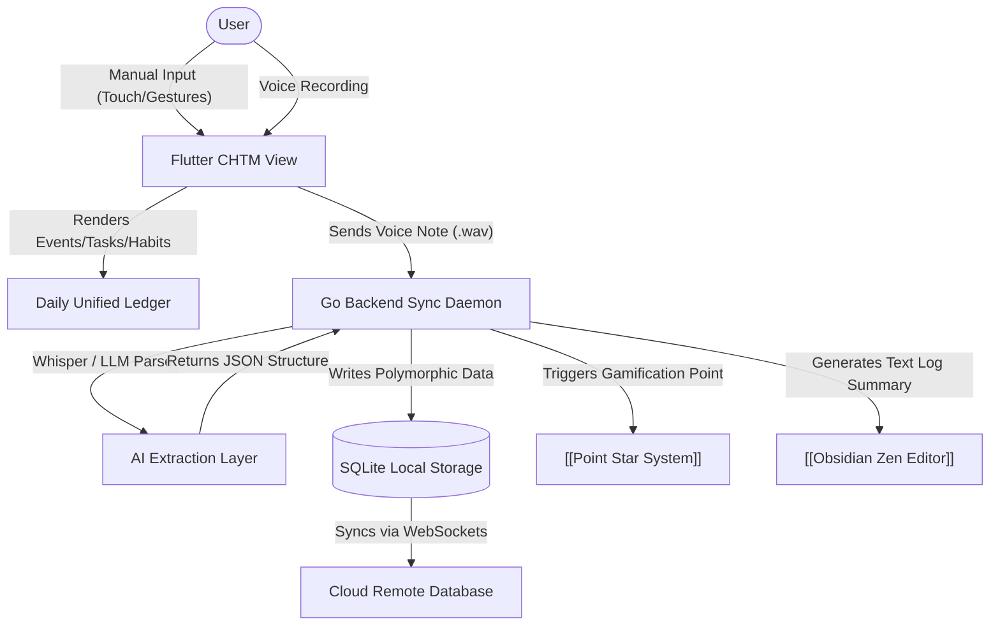

# Calendar Habit Task Manager | Module Documentation

> [!NOTE]
> **Status:** Conceptual Phase / Planning for Next Development Sprint
> **Links:** [[00 - System/Home|Home]] | *Linked Modules: [[Preferences Setting Tab]], [[Obsidian Zen Editor]], [[Point Star System]], [[Home Screen]]*

---

## Concept & Vision
The Calendar Habit Task Manager (CHTM) is designed as a unified personal coordination hub. It eliminates the friction of switching between separate calendar, task management, and habit-tracking apps by merging them into a single, cohesive, minimalist layout.

The interface is a hybrid inspired by three key design systems:
1. **TimeTree (Shared Calendaring & Simplicity):** Focuses on highly visual, shared group/family calendars, color-coded schedules, simple user workflows, and clean transition animations.
2. **Loop Habit Tracker (Visual Metric Grid):** Borrowing Loop's grid-based visual habit tracking, check-in history charts, custom schedule options (e.g. specific days of the week, N times per week/month), and clean progress indicators.
3. **Classic Task Manager:** Simple list execution, subtask lists, priority tags, and deadline scheduling.

### Unified Daily Ledger
Instead of compartmentalized tabs, the interface centers on the **Daily Ledger**. Selecting a day in the calendar displays:
- **Events:** TimeTree-style shared and private calendar appointments.
- **Habits:** Habit check-in blocks scheduled for that day (e.g. complete gym session, read 10 pages).
- **Tasks:** Action items due or actively scheduled for today.
- **Point Star Integration Rule:** Completing a standard task or daily habit awards **+1 Star Point** (with multipliers for consecutive streaks). Completing high-priority tasks awards **+5 Star Points**. Neglecting a scheduled habit or failing a chore deducts **-2 Star Points** from the user's active balance.

### Voice-to-Task AI Engine
To minimize input friction, the CHTM incorporates an AI-powered voice capture system. The user taps a quick microphone shortcut, records a natural voice note, and sends it to the server. The Go daemon processes the audio through an LLM handler to extract structured JSON fields:
- **Task Title**
- **Due Date / Time**
- **Category / Tags**
- **Priority Level**
The system then automatically updates the active task list and logs it without manual typing.

---

## Work Done So Far
- **System Architecture Mapping:** The unified data model combining calendar events, tasks, and habits has been defined.
- **Design Philosophy:** Everforest Minimalist Flat-Line UI matching the overall LifeOS theme has been drafted. It aligns with the existing codebase:
  - **Backgrounds:** Scaffold screens in `EverforestColors.bg0` (Deep Charcoal) and container cards in `bg1` (Dark Charcoal).
  - **Borders:** Containers structured with clean 1px borders in `EverforestColors.bg2`.
  - **Fills & Corners:** Rounded card components (16px radius) with flat, solid background fills (no gradients or transparency blur).
  - **Color-Coded Status Highlights:** Active statuses mapped to specific Everforest accents (`green` for checked habits, `yellow` for pending items, `blue` for primary metrics).
  - **Typography & Scale:** Uppercase headers in `EverforestColors.fg` (Beige) with clean letter-spacing, accompanied by responsive scale feedback animations (0.9x scale on click).

---

## Current Focus & Actions
- **Database Schema Modeling:** Designing a SQLite schema in the Go backend to hold polymorphic schedules (events, checklist tasks, recurring habit patterns with frequency rules) under a unified timeline table.
- **Flutter UI Prototypes:** Designing the calendar widget grid with custom gestures for habit check-offs (sliding to complete, tapping for historical metrics).

---

## Next Steps & Future Roadmap
- **AI Voice Parser Handler:** Implementing the whisper/local LLM voice-extraction pipeline in the Go backend daemon to parse verbal tasks.
- **Shared Calendar Synchronization:** Building real-time WebSocket communication layer for group calendars (syncing events instantly between users, modeling the TimeTree core synchronization loops).
- **Gamified Feedback:** Connecting completed tasks and habits directly to the [[Point Star System]] to award stars and achievements dynamically.

---

## Interaction Flows & Diagrams
*Visual diagram representing the unified database structures, local WebSocket engine, and voice transcription system.*

## Technical Specs
- [[02 - Technical Specs/Calendar Habit Task Manager/What to Build|What to Build]]
- [[02 - Technical Specs/Calendar Habit Task Manager/How to Build|How to Build]]
- [[02 - Technical Specs/Calendar Habit Task Manager/What to Do|What to Do]]
