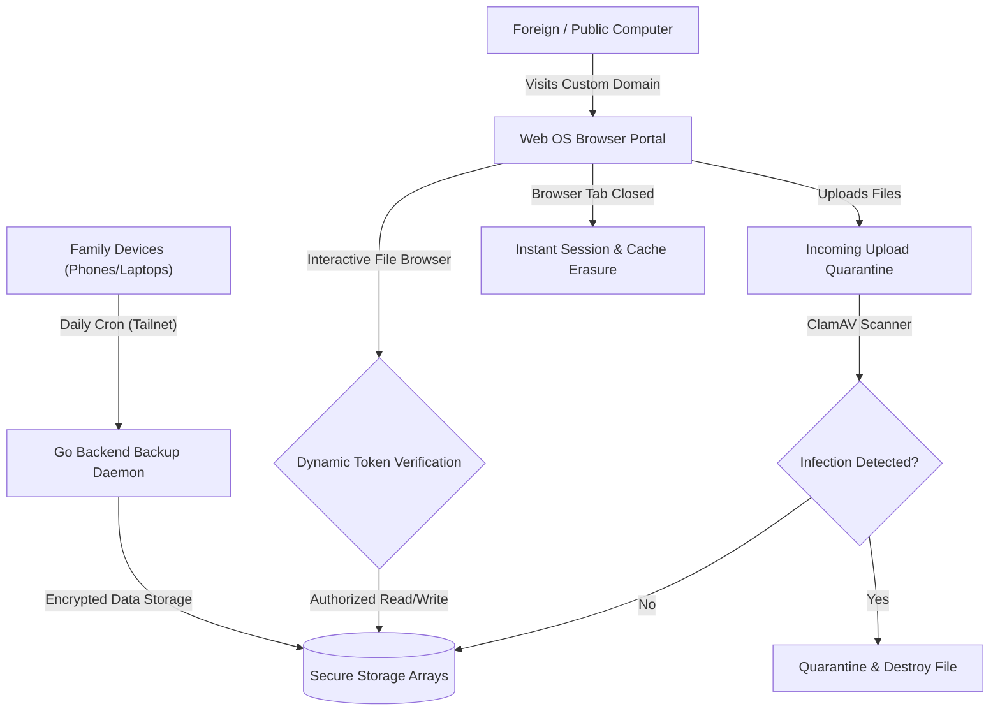

# Cloud & Fake Virtual Machine | Module Documentation

> [!NOTE]
> **Status:** Conceptual Phase / Design Stage
> **Links:** [[00 - System/Home|Home]] | *Linked Modules: [[Preferences Setting Tab]], [[Virtual Machine Management]], [[Dark Web Management]], [[Photo Video Gallery]]*

---

## Concept & Vision
The Cloud & Fake Virtual Machine module manages secure, automated device backups (the cloud layer) and provides a secure, web-based operating system portal (the fake VM layer) for anonymous and app-less server access.

### Core Features

1. **Automated Personal Cloud Sync:**
   - Background daemon runs daily, automated secure replication of target folders, configurations, and settings from all registered family devices (smartphones, laptops, tablets) to the central LifeOS storage arrays.

2. **Web OS Portal (The "Fake" Virtual Machine):**
   - Serves an interactive, web-based operating system UI (React/Flutter web application) from a private, customized domain.
   - Designed for family members or the system owner to quickly access, view, and organize their personal data without installing the native LifeOS client application.
   - **Disposable Anonymous Upload Portal:** Ideal for working on public or untrusted external computers:
     - The user opens the Web OS portal in a browser, uploads files or documents to the server, and closes the tab.
     - Closing the tab instantly wipes all browser cache and local session cookies, leaving zero forensic footprints on the foreign host machine.
   - **Security Inspection Pipeline:** To protect the server infrastructure, files uploaded through the web OS portal pass through sandboxed security scanning filters (malware verification, executable checkers) before being committed to the main vault.

---

## Work Done So Far
- **Module Requirements Drafted:** Architectural boundaries separating backup daemon schedules, Web OS browser sandboxing, and security filter models established.
- **Design Philosophy:** Everforest Minimalist Flat-Line UI layout (grid directories, clean outline buttons, simple progress status bars, beige text elements) mapped.

---

## Current Focus & Actions
- **Web OS UI Prototype:** Designing the layout grid for the browser-based client dashboard using basic HTML5/Flutter Web modules.
- **File Scanner Pipeline Wrapper:** Building wrappers for ClamAV scan daemons inside the Go backend to clean incoming uploads.

---

## Next Steps & Future Roadmap
- **Sync Backup Daemon Schedule:** Writing Cron scheduling utilities in the Go backend to catalog and run background data sync loops for target nodes.
- **Dynamic Session Cleaner:** Implementing security routines to force-wipe cookies, sessionStorage, and IndexedDB data on page unloading events.
- **Sandboxed File Verification:** Setting up virtualization environments on the server to execute and analyze uploaded documents in isolation before saving them to database paths.

---

## Interaction Flows & Diagrams
*Data pipeline illustrating automated cloud replication, Web OS interaction, and incoming file security checks.*

## Technical Specs
- [[02 - Technical Specs/Cloud & Fake Virtual Machine/What to Build|What to Build]]
- [[02 - Technical Specs/Cloud & Fake Virtual Machine/How to Build|How to Build]]
- [[02 - Technical Specs/Cloud & Fake Virtual Machine/What to Do|What to Do]]
