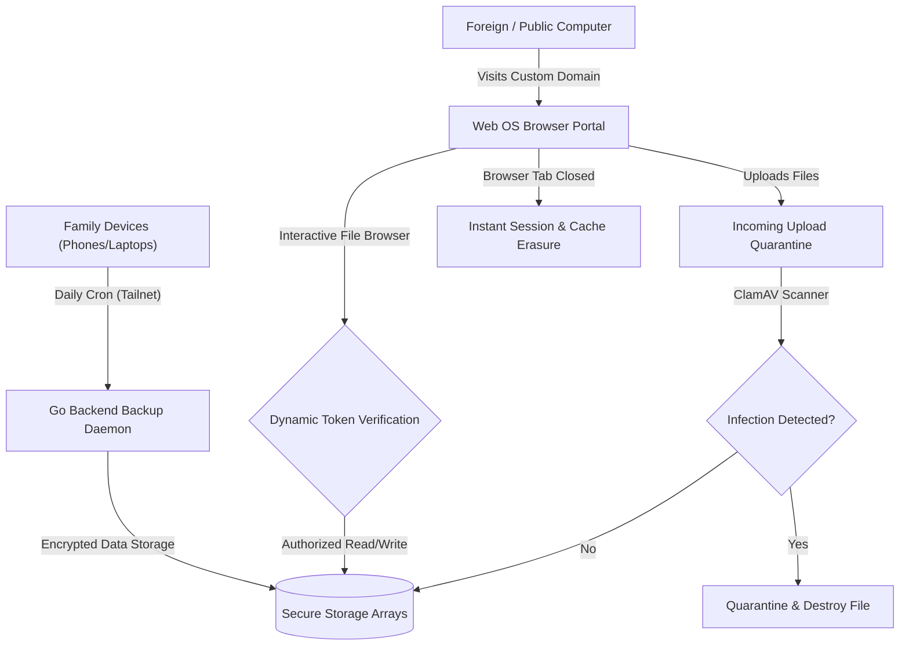

# Cloud & Fake Virtual Machine | Module Documentation

> [!NOTE]
> **Status:** Partially Implemented
> **Links:** [[00 - System/Home|Home]] | *Linked Modules: [[Preferences Setting Tab]], [[Virtual Machine Management]], [[Dark Web Management]], [[Photo Video Gallery]]*

---

## Concept & Vision
The Cloud & Fake Virtual Machine module manages secure, automated device backups (the cloud layer) and provides a secure, web-based operating system portal (the fake VM layer) for anonymous and app-less server access.

### Core Features

1. **Automated Personal Cloud Sync:**
   - Background daemon runs daily, automated secure replication of target folders, configurations, and settings from all registered family devices (smartphones, laptops, tablets) to the central LifeOS storage arrays.

2. **Web OS Portal (The "Fake" Virtual Machine):**
   - Serves an interactive, web-based operating system UI (React/Flutter web application) from a private, customized domain.
   - Designed for family members or the system owner to quickly access, view, and organize their personal data without installing the native LifeOS client application.
   - **Disposable Anonymous Upload Portal:** Ideal for working on public or untrusted external computers:
     - The user opens the Web OS portal in a browser, uploads files or documents to the server, and closes the tab.
     - Closing the tab instantly wipes all browser cache and local session cookies, leaving zero forensic footprints on the foreign host machine.
   - **Security Inspection Pipeline:** To protect the server infrastructure, files uploaded through the web OS portal pass through sandboxed security scanning filters (malware verification, executable checkers) before being committed to the main vault.

---

## Work Done So Far
- **Cloud Backup Dashboard (DONE):** The Flutter client ships a cloud backup dashboard with a backup status list and a quarantine view.
- **Daemon Backup API (DONE):** The Go daemon serves `/api/v1/backup` with `list`, `upload`, `download`, `upload/chunk`, and `upload/merge` endpoints.
- **Client Data Layer (DONE):** `cloud_dao` provides typed accessors for `DeviceBackups`, `BackupLogs`, and `UploadQuarantines`, backed by `cloud_sync_service` and `device_backup_service`.
- **Upload Scan Stub (DONE):** Daemon endpoints `/api/v1/cloud/web-os`, `/api/v1/cloud/backups`, and `/api/v1/cloud/upload` exist with a `clamdscan` check on uploads.
- **Not Yet Implemented:** The Web OS browser portal ("fake VM") and sandbox execution remain stubs.

---

## Current Focus & Actions
- **Backup Flow Polish:** Refining chunked upload merging, backup status tracking, and quarantine review in the dashboard.
- **Quarantine Integration:** Completing the flow where flagged uploads surface in the quarantine view for promote or discard decisions.
- **Web OS Portal Planning:** Scoping the browser-based fake VM layer so the interactive portal can move from stub to functional.

---

## Next Steps & Future Roadmap
- **Sync Backup Daemon Schedule:** Writing Cron scheduling utilities in the Go backend to catalog and run background data sync loops for target nodes; the backup API and services are already live.
- **Web OS UI Prototype (DONE):** Stub endpoints are in place; the full HTML5/Flutter Web dashboard portal is the next build target.
- **Dynamic Session Cleaner:** Implementing security routines to force-wipe cookies, sessionStorage, and IndexedDB data on page unloading events once the portal ships.
- **Sandboxed File Verification:** Setting up virtualization environments on the server to execute and analyze uploaded documents in isolation before saving them to database paths; only the clamdscan check is currently wired.

---

## Interaction Flows & Diagrams
*Data pipeline illustrating automated cloud replication, Web OS interaction, and incoming file security checks.*

```mermaid
graph TD
    %% Backup Flow
    Devices["Family Devices (Phones/Laptops)"] -->|"Daily Cron (Tailnet)"| CloudSync["Go Backend Backup Daemon"]
    CloudSync -->|"Encrypted Data Storage"| MainStorage[(Secure Storage Arrays)]
    
    %% Web OS Flow
    ForeignPC["Foreign / Public Computer"] -->|"Visits Custom Domain"| WebOS["Web OS Browser Portal"]
    WebOS -->|"Interactive File Browser"| WebSession{"Dynamic Token Verification"}
    WebSession -->|"Authorized Read/Write"| MainStorage
    
    %% Upload Sanitization
    WebOS -->|"Uploads Files"| SecuritySandbox["Incoming Upload Quarantine"]
    SecuritySandbox -->|"ClamAV Scanner"| MalwareCheck{Infection Detected?}
    MalwareCheck -->|"Yes"| Destroy["Quarantine & Destroy File"]
    MalwareCheck -->|"No"| MainStorage
    
    %% Session Wipe
    WebOS -->|"Browser Tab Closed"| Wipe["Instant Session & Cache Erasure"]
```

## Technical Specs
- [[02 - Technical Specs/Cloud & Fake Virtual Machine/What to Build|What to Build]]
- [[02 - Technical Specs/Cloud & Fake Virtual Machine/How to Build|How to Build]]
- [[02 - Technical Specs/Cloud & Fake Virtual Machine/What to Do|What to Do]]
