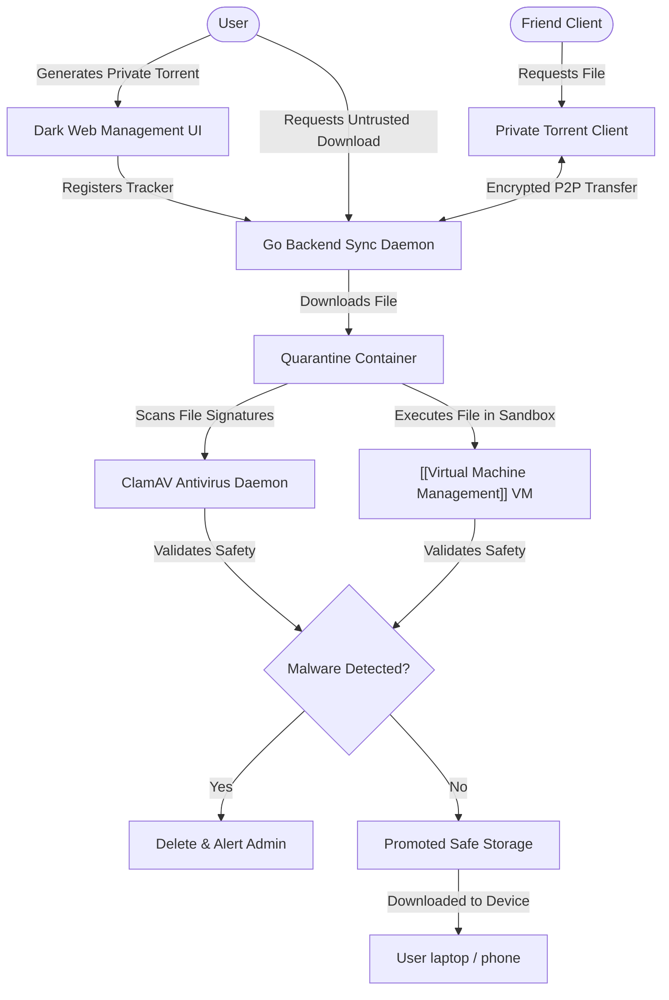

# Dark Web Management | Module Documentation

> [!NOTE]
> **Status:** Conceptual Phase / Design Stage
> **Links:** [[00 - System/Home|Home]] | *Linked Modules: [[Preferences Setting Tab]], [[Virtual Machine Management]], [[Cloud & Fake Virtual Machine]], [[Movie Library]], [[Book Library]], [[Point Star System]]*

---

## Concept & Vision
The Dark Web Management module functions as a secure peer-to-peer (P2P) file-sharing hub and an isolated download sandbox wrapper. It provides users with secure torrent client management to share assets with friends and run automated malware filtering on untrusted downloads.

### Core Features & Mechanics
1. **Secure Private Torrent Engine:**
   - A self-hosted P2P sharing platform where users can generate custom `.torrent` files or magnet links directly from their local libraries (e.g. sharing movie catalog rips, photo vaults, or e-books).
   - Direct, high-speed encrypted file transfers between friends via custom torrent configurations, bypassing centralized file-hosting sites.
2. **Quarantined Downloader & Antivirus Filter:**
   - Untrusted software downloads (such as applications, utilities, or cracked software) are routed through a sandboxed quarantine container on the server.
   - **Multi-Stage Security Scan:**
     - **Signature Scanning:** Backend Go routines pipe the downloaded file through ClamAV or other local signature-matching engines.
     - **Sandbox Analysis:** Leverages the [[Virtual Machine Management]] engine to execute and monitor file behaviors inside an isolated micro-VM before declaring it safe.
     - **Safe Promotion:** Once declared clean, the server moves the file to user-accessible storage arrays for download to laptops or phones.

---

## Work Done So Far
- **Module Requirements Mapping:** Secure torrent seeding logic, private tracker generation, and ClamAV integration requirements defined.
- **Design Philosophy:** Everforest Minimalist Flat-Line UI layout (lists of active torrent seeds, solid upload/download progress indicators, clean outline tables for quarantine files, red/green security flags) mapped.

---

## Current Focus & Actions
- **Torrent Client API Hook:** Designing API wrappers in the Go backend to communicate with daemon torrent clients (such as transmission-daemon).
- **Scanner Wrapper Implementation:** Designing file scan scripts in Go to automate post-download analysis.

---

## Next Steps & Future Roadmap
- **Private Tracker Generator:** Building automated magnet-link generators inside the Flutter client UI.
- **Dynamic Virus Analysis Console:** Visual dashboard in Flutter displaying scanning logs, file sandboxing alerts, and quarantine lists.
- **Automated Media Integration:** Linkages with [[Movie Library]] and [[Book Library]] to automatically seed downloaded materials to whitelisted friend IPs.

---

## Interaction Flows & Diagrams
*P2P sharing pipeline, isolated quarantine download sequences, and virus filter checks.*

## Technical Specs
- [[02 - Technical Specs/Dark Web Management/What to Build|What to Build]]
- [[02 - Technical Specs/Dark Web Management/How to Build|How to Build]]
- [[02 - Technical Specs/Dark Web Management/What to Do|What to Do]]
