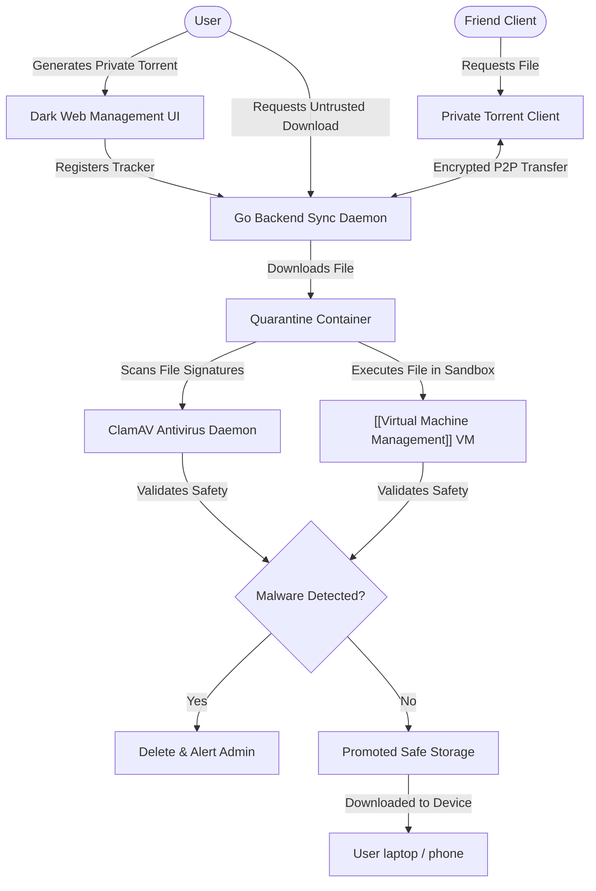

# Dark Web Management | Module Documentation

> [!NOTE]
> **Status:** Implemented / Production Live
> **Links:** [[00 - System/Home|Home]] | *Linked Modules: [[Preferences Setting Tab]], [[Virtual Machine Management]], [[Cloud & Fake Virtual Machine]], [[Movie Library]], [[Book Library]], [[Point Star System]]*

---

## Concept & Vision
The Dark Web Management module functions as a secure peer-to-peer (P2P) file-sharing hub and an isolated download sandbox wrapper. It provides users with secure torrent client management to share assets with friends and run automated malware filtering on untrusted downloads.

### Core Features & Mechanics
1. **Secure Private Torrent Engine:**
   - A self-hosted P2P sharing platform where users can generate custom `.torrent` files or magnet links directly from their local libraries (e.g. sharing movie catalog rips, photo vaults, or e-books).
   - Direct, high-speed encrypted file transfers between friends via custom torrent configurations, bypassing centralized file-hosting sites.
2. **Quarantined Downloader & Antivirus Filter:**
   - Untrusted software downloads (such as applications, utilities, or cracked software) are routed through a sandboxed quarantine container on the server.
   - **Multi-Stage Security Scan:**
     - **Signature Scanning:** Backend Go routines pipe the downloaded file through ClamAV or other local signature-matching engines.
     - **Sandbox Analysis:** Leverages the [[Virtual Machine Management]] engine to execute and monitor file behaviors inside an isolated micro-VM before declaring it safe.
     - **Safe Promotion:** Once declared clean, the server moves the file to user-accessible storage arrays for download to laptops or phones.

---

## Work Done So Far
- **Torrent Dashboard (DONE):** The Flutter client shows a torrent dashboard with an active torrents list and a quarantine warnings panel.
- **Database Seeding (DONE):** Torrents are seeded in `darkweb.db`.
- **Daemon API (DONE):** The Go daemon serves `/api/v1/darkweb/torrents` plus a `/promote` endpoint.
- **Antivirus Quarantine Flow (DONE):** Cloud uploads run a `clamdscan` antivirus check, and flagged files are moved to quarantine.
- **Client Data Layer (DONE):** `darkweb_dao` provides typed accessors for `Torrents`, `TorrentPeers`, and `SharedFiles`.

---

## Current Focus & Actions
- **Quarantine Workflow:** Polishing the quarantine review and promote/delete actions from the warnings panel.
- **Peer Monitoring:** Expanding torrent peer and shared-file visibility in the dashboard.
- **Scan Integration:** Tightening the link between uploads, clamdscan results, and quarantine status reporting.

---

## Next Steps & Future Roadmap
- **Private Tracker Generator:** Building automated magnet-link generators inside the Flutter client UI to seed new shares without manual `.torrent` files.
- **Dynamic Virus Analysis Console (DONE):** The quarantine and warnings panel shipped; deeper scanning logs and sandbox alerts are planned extensions.
- **Sandbox Analysis:** Leveraging the [[Virtual Machine Management]] engine to execute and monitor files in an isolated micro-VM before promotion remains on the roadmap.
- **Automated Media Integration:** Linkages with [[Movie Library]] and [[Book Library]] to automatically seed downloaded materials to whitelisted friend IPs.

---

## Interaction Flows & Diagrams
*P2P sharing pipeline, isolated quarantine download sequences, and virus filter checks.*

```mermaid
graph TD
    %% Torrent Sharing
    User1([User]) -->|"Generates Private Torrent"| FlutterUI["Dark Web Management UI"]
    FlutterUI -->|"Registers Tracker"| GoDaemon["Go Backend Sync Daemon"]
    Friend([Friend Client]) -->|"Requests File"| TorrentClient["Private Torrent Client"]
    TorrentClient <-->|"Encrypted P2P Transfer"| GoDaemon
    
    %% Quarantined Download Flow
    User1 -->|"Requests Untrusted Download"| GoDaemon
    GoDaemon -->|"Downloads File"| Quarantine["Quarantine Container"]
    Quarantine -->|"Scans File Signatures"| ClamAV["ClamAV Antivirus Daemon"]
    Quarantine -->|"Executes File in Sandbox"| MicroVM["[[Virtual Machine Management]] VM"]
    
    %% Security Validation
    ClamAV & MicroVM -->|"Validates Safety"| SecurityCheck{Malware Detected?}
    SecurityCheck -->|"Yes"| ThreatAction["Delete & Alert Admin"]
    SecurityCheck -->|"No"| PromotedStorage["Promoted Safe Storage"]
    PromotedStorage -->|"Downloaded to Device"| ClientLaptop["User laptop / phone"]
```

## Technical Specs
- [[02 - Technical Specs/Dark Web Management/What to Build|What to Build]]
- [[02 - Technical Specs/Dark Web Management/How to Build|How to Build]]
- [[02 - Technical Specs/Dark Web Management/What to Do|What to Do]]
