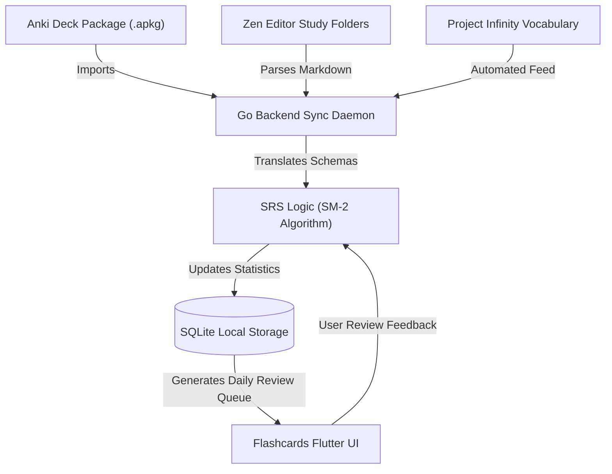

# Flashcards | Module Documentation

> [!NOTE]
> **Status:** Conceptual Phase / Planning for Implementation
> **Links:** [[Home]] | *Linked Modules: [[Preferences Setting Tab]], [[Obsidian Zen Editor]], [[Project Infinity]]*

---

## Concept & Vision
The Flashcards module is the primary active recall and spaced repetition engine of LifeOS. It is built to serve as the structural testing ground for data captured in other modules, particularly the vocabulary and trivia elements of [[Project Infinity]].

### Key Integrations
1. **Anki Deck Imports:** To avoid starting from scratch, the system incorporates an import utility for standard Anki packages (`.apkg`). This allows users to download and load pre-existing public study decks directly into the local SQLite database.
2. **Zen Editor Integration:** The module acts as an automated parser of Markdown files from the [[Obsidian Zen Editor]]:
   - **Inline Flashcards:** A specific syntax (such as `Question::Answer` or customized block dividers) within standard notes is parsed by the Go daemon to dynamically generate new review cards.
   - **Folder-Based Cards:** Placing Markdown files inside designated study subfolders automatically converts them into flashcard decks (using the frontmatter for question/answer pairings).

---

## Work Done So Far
- **System Architecture Design:** Establishing the active recall system architecture connecting external imports and internal notes parsing.
- **Design Philosophy:** Everforest Minimalist Flat-Line UI layout planned (flat-colored card faces, solid outlines, minimalist pass/fail buttons).

---

## Current Focus & Actions
- **Spaced Repetition System (SRS) Logic:** Designing an implementation of the SM-2 algorithm (SuperMemo-2) in Go to track card intervals, repetitions, and ease factors.
- **Anki Package Parser Specs:** Researching file-unzipping and schema conversion rules to translate Anki's internal SQLite files into the LifeOS SQLite database structure.

---

## Next Steps & Future Roadmap
- **Interactive Review Interface:** Developing the Flutter view for card sessions, featuring simple swipe gestures or tap actions to reveal answers and log review scores.
- **Deck Collections Dashboard:** Creating a minimalist grid list of all custom decks, showing active card counts, review queues, and daily statistics.
- **Point Star Integration:** Linking successful study sessions or daily streaks to the [[Point Star System]] for gamified feedback.

---

## Interaction Flows & Diagrams
*Data flow of the Spaced Repetition engine receiving card data from Anki decks, Project Infinity, and Zen Editor notes.*

