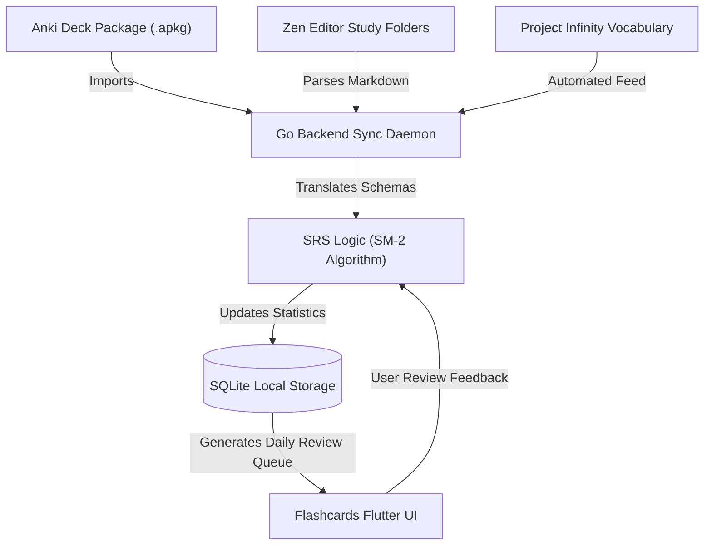

# Flashcards | Module Documentation

> [!NOTE]
> **Status:** Implemented / Production Live
> **Links:** [[00 - System/Home|Home]] | *Linked Modules: [[Preferences Setting Tab]], [[Obsidian Zen Editor]], [[Project Infinity]], [[Knowledge Base]], [[Point Star System]]*

---

## Concept & Vision
The Flashcards module is the primary active recall and spaced repetition engine of LifeOS. It is built to serve as the structural testing ground for data captured in other modules, particularly the vocabulary and trivia elements of [[Project Infinity]].

### Key Integrations
1. **Anki Deck Imports:** To avoid starting from scratch, the system incorporates an import utility for standard Anki packages (`.apkg`). This allows users to download and load pre-existing public study decks directly into the local SQLite database.
2. **Zen Editor Integration:** The module acts as an automated parser of Markdown files from the [[Obsidian Zen Editor]]:
   - **Inline Flashcards:** A specific syntax (such as `Question::Answer` or customized block dividers) within standard notes is parsed by the Go daemon to dynamically generate new review cards.
   - **Folder-Based Cards:** Placing Markdown files inside designated study subfolders automatically converts them into flashcard decks (using the frontmatter for question/answer pairings).

---

## Work Done So Far
- **Deck Dashboard (DONE):** The Flutter client shows a deck card dashboard listing all study decks.
- **SM-2 Review Sessions (DONE):** The spaced repetition session screen is live, tracking interval, repetitions, and ease factor per card per the SM-2 algorithm.
- **Database Seeding (DONE):** Decks are seeded in `flashcards.db`.
- **Daemon API (DONE):** The Go daemon serves `/api/v1/flashcards/decks` plus `/create`, `/import-anki`, and `/scan` endpoints.
- **Client Data Layer (DONE):** `flashcards_dao` provides typed accessors for `FlashcardDecks`, `Flashcards`, and `FlashcardReviews`.

---

## Current Focus & Actions
- **Review Flow Polish:** Refining the session UX (reveal, pass/fail scoring, queue ordering) and daily review queue generation.
- **Import Hardening:** Improving Anki package import reliability and markdown scan coverage for [[Obsidian Zen Editor]] study folders.
- **Statistics:** Expanding per-deck stats (due counts, streak tracking) on the dashboard.

---

## Next Steps & Future Roadmap
- **Interactive Review Interface (DONE):** Shipped as the SM-2 session screen; swipe/tap interactions and scoring are live, with ongoing polish.
- **Deck Collections Dashboard (DONE):** Shipped as the deck card grid showing active card counts and review queues; daily statistics are being extended.
- **Point Star Integration:** Linking successful study sessions or daily streaks to the [[Point Star System]] for gamified feedback remains on the roadmap.

---

## Interaction Flows & Diagrams
*Data flow of the Spaced Repetition engine receiving card data from Anki decks, Project Infinity, and Zen Editor notes.*

```mermaid
graph TD
    %% Input Sources
    AnkiFile["Anki Deck Package (.apkg)"] -->|"Imports"| SyncDaemon["Go Backend Sync Daemon"]
    ZenNotes["Zen Editor Study Folders"] -->|"Parses Markdown"| SyncDaemon
    Infinity["Project Infinity Vocabulary"] -->|"Automated Feed"| SyncDaemon
    
    %% Processing & Database
    SyncDaemon -->|"Translates Schemas"| SRSEngine["SRS Logic (SM-2 Algorithm)"]
    SRSEngine -->|"Updates Statistics"| LocalDB[(SQLite Local Storage)]
    
    %% View Layer
    LocalDB -->|"Generates Daily Review Queue"| FlutterUI["Flashcards Flutter UI"]
    FlutterUI -->|"User Review Feedback"| SRSEngine
```

## Technical Specs
- [[02 - Technical Specs/Flashcards/What to Build|What to Build]]
- [[02 - Technical Specs/Flashcards/How to Build|How to Build]]
- [[02 - Technical Specs/Flashcards/What to Do|What to Do]]
