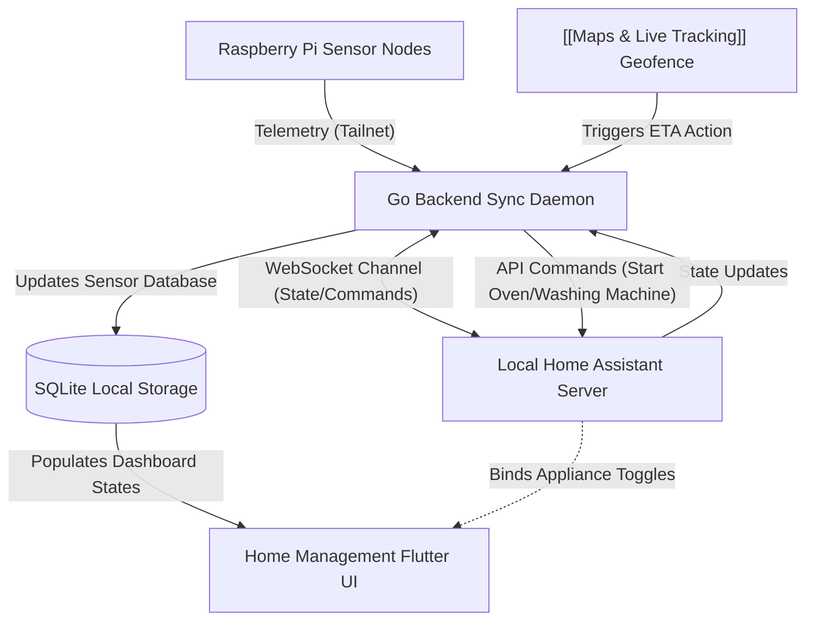

# Home Management | Module Documentation

> [!NOTE]
> **Status:** Conceptual Phase / Hardware & Integration Planning
> **Links:** [[Home]] | *Linked Modules: [[Preferences Setting Tab]], [[Maps & Live Tracking]]*

---

## Concept & Vision
The Home Management module is the central dashboard and integration hub for all smart home devices, local environmental sensors, and appliance automations within the LifeOS framework. It serves as a unified command center, communicating directly with a local Home Assistant server and private open-source hardware nodes.

### Core Architecture Features
1. **Home Assistant API Integration:**
   - Establishes a local WebSocket connection to the Home Assistant instance, allowing bidirectional communication (reading sensor logs and firing device controls).
   - Unified interface showing lights, plugs, thermostat controls, and kitchen appliances.
2. **Open-Source Local Hardware (Raspberry Pi Nodes):**
   - The user plans to build custom Raspberry Pi nodes equipped with environmental sensors (temperature, humidity, air quality, lock status).
   - These sensors stream state telemetry directly to the Go daemon over the local Tailscale network.
3. **Automated Geofence Linkage:**
   - Integrates directly with the geofencing engine in [[Maps & Live Tracking]].
   - Receives proximity events from the server (e.g. crossing the 1 km border on the way home) and fires automation rules (such as preheating the oven, turning on the washing machine, or opening the garage door).

---

## Work Done So Far
- **System Requirements Drafted:** Hardware topology, webhook schemas, and Home Assistant interface requirements defined.
- **Design Philosophy:** Everforest Minimalist Flat-Line UI layout (grid of toggle cards, solid outline borders, flat state toggle switches, simple progress bars) mapped.

---

## Current Focus & Actions
- **Home Assistant API Wrapper:** Writing OAuth2 and WebSocket client drivers in Go to authenticate and receive real-time device updates from the Home Assistant instance.
- **Local Sensor Daemon:** Drafting a lightweight python/go script to deploy on the custom Raspberry Pi sensor nodes to publish telemetry.

---

## Next Steps & Future Roadmap
- **Proximity Automation Engine:** Developing rules in the Go server to parse geofence ETAs and coordinate appliance starters.
- **Custom Hardware Integration:** Sourcing and assembling open-source smart switches, temperature probes, and smart relays.
- **Console Interface Layout:** Designing the dashboard view in Flutter, focusing on simple flat layouts matching the general spatial engine grids.

---

## Interaction Flows & Diagrams
*Data flow detailing Raspberry Pi sensors, Home Assistant WebSocket channels, and geofence automation triggers.*

## Technical Specs
- [[02 - Technical Specs/Home Management/What to Build|What to Build]]
- [[02 - Technical Specs/Home Management/How to Build|How to Build]]
- [[02 - Technical Specs/Home Management/What to Do|What to Do]]
