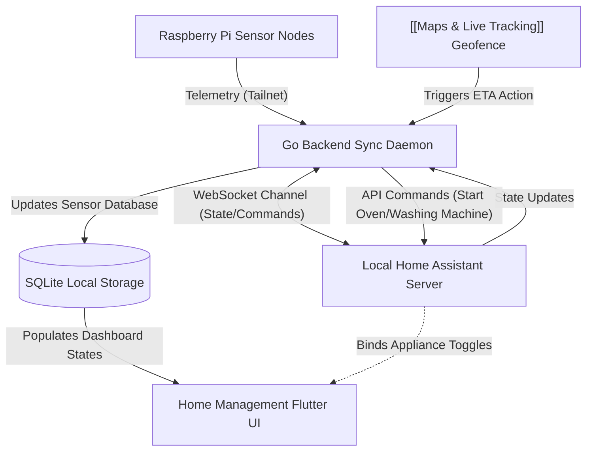

# Home Management | Module Documentation

> [!NOTE]
> **Status:** Implemented / Production Live
> **Links:** [[00 - System/Home|Home]] | *Linked Modules: [[Preferences Setting Tab]], [[Maps & Live Tracking]], [[Point Star System]]*

---

## Concept & Vision
The Home Management module is the central dashboard and integration hub for all smart home devices, local environmental sensors, and appliance automations within the LifeOS framework. It serves as a unified command center, communicating directly with a local Home Assistant server and private open-source hardware nodes.

### Core Architecture Features
1. **Home Assistant API Integration:**
   - Establishes a local WebSocket connection to the Home Assistant instance, allowing bidirectional communication (reading sensor logs and firing device controls).
   - Unified interface showing lights, plugs, thermostat controls, and kitchen appliances.
2. **Open-Source Local Hardware (Raspberry Pi Nodes):**
   - The user plans to build custom Raspberry Pi nodes equipped with environmental sensors (temperature, humidity, air quality, lock status).
   - These sensors stream state telemetry directly to the Go daemon over the local Tailscale network.
3. **Automated Geofence Linkage:**
   - Integrates directly with the geofencing engine in [[Maps & Live Tracking]].
   - Receives proximity events from the server (e.g. crossing the 1 km border on the way home) and fires automation rules (such as preheating the oven, turning on the washing machine, or opening the garage door).

---

## Work Done So Far
- **Smart Home Dashboard (DONE):** The Flutter client renders a smart home dashboard with a device grid toggle and sensor logs panel.
- **Device Schedules (DONE):** Schedule management for devices is implemented in the dashboard UI.
- **Daemon API (DONE):** The Go daemon serves `/api/v1/home/devices`, `/api/v1/home/devices/toggle`, and `/api/v1/home/sensors/report`.
- **Database Seeding (DONE):** `home.db` is seeded with devices and sensor logs.
- **Client Data Layer (DONE):** `home_management_dao` provides typed accessors for `SmartDevices`, `EnvironmentLogs`, and `DeviceSchedules`.

---

## Current Focus & Actions
- **Sensor Visualization:** Enriching the sensor logs panel with longer-range environment history and trend indicators.
- **Schedule Refinement:** Polishing device schedule creation, editing, and conflict handling.
- **Automation Rules:** Wiring the daemon to react to sensor thresholds and scheduled events with automatic device actions.

---

## Next Steps & Future Roadmap
- **Proximity Automation Engine:** Developing rules in the Go server to parse geofence ETAs (from [[Maps & Live Tracking]]) and coordinate appliance starters; the local sensor and device command layer is already in place.
- **Custom Hardware Integration:** Sourcing and assembling open-source smart switches, temperature probes, and smart relays for the Raspberry Pi sensor nodes; the API and database side is ready to ingest their telemetry.
- **Console Interface Layout (DONE):** The dashboard grid view is live; ongoing polish continues on the flat layouts matching the spatial engine grids.
- **Home Assistant API Wrapper:** The WebSocket/API driver for a local Home Assistant instance remains planned for deeper hardware integration beyond the built-in device system.

---

## Interaction Flows & Diagrams
*Data flow detailing Raspberry Pi sensors, Home Assistant WebSocket channels, and geofence automation triggers.*

```mermaid
graph TD
    %% Telemetry Inputs
    RPiSensors["Raspberry Pi Sensor Nodes"] -->|"Telemetry (Tailnet)"| GoDaemon["Go Backend Sync Daemon"]
    GoDaemon -->|"Updates Sensor Database"| LocalDB[(SQLite Local Storage)]
    
    %% Home Assistant Channel
    GoDaemon <-->|"WebSocket Channel (State/Commands)"| HomeAssistant["Local Home Assistant Server"]
    HomeAssistant -->|"State Updates"| GoDaemon
    
    %% Geofence Actions
    MapsManager["[[Maps & Live Tracking]] Geofence"] -->|"Triggers ETA Action"| GoDaemon
    GoDaemon -->|"API Commands (Start Oven/Washing Machine)"| HomeAssistant
    
    %% UI Rendering
    LocalDB -->|"Populates Dashboard States"| FlutterUI["Home Management Flutter UI"]
    HomeAssistant -.->|"Binds Appliance Toggles"| FlutterUI
```

## Technical Specs
- [[02 - Technical Specs/Home Management/What to Build|What to Build]]
- [[02 - Technical Specs/Home Management/How to Build|How to Build]]
- [[02 - Technical Specs/Home Management/What to Do|What to Do]]
