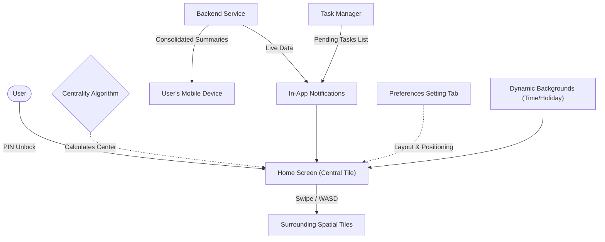

# Home Screen | Module Documentation

> [!NOTE]
> **Status:** Concept Defined / Future Development Planned
> **Links:** [[Home]] | *Linked Modules: [[Preferences Setting Tab]]*

---

## Concept & Vision
The Home Screen functions identically to a mobile operating system's lock screen and main portal. It acts as the primary gateway into the application, where the user can enter a personalized PIN to unlock the environment before navigating to the surrounding tiles.

- **Centrality Algorithm:** A background algorithm calculates the precise center of the spatial grid dynamically. Whether the layout is 3x3 (centering at `[1,1]`) or larger like 4x4 (centering at `[3,3]`), the Home Screen is automatically anchored in the middle of the workspace.
- **Lock Screen Philosophy:** Similar to a smartphone, it provides immediate, at-a-glance access to shortcuts, notifications, the current time, and critical pending tasks without requiring the user to dive deep into the system.

---

## Work Done So Far
- **Current State:** The Home Screen currently exists as a clean, minimalistic clock view (displaying time and date in the Everforest theme) positioned in the center of the `spatial_engine` grid.
- **Dynamic Backgrounds (Planned Foundation):** The conceptual groundwork is laid for dynamic wallpapers. Backgrounds will automatically adapt based on the time of day, system theme (dark mode), or specific holidays. There will also be support for custom, user-selected backgrounds.

---

## Current Focus & Actions
- **Conceptual Blueprint:** At this phase, no immediate code changes are being applied to the Home Screen. The focus is strictly on establishing a solid design philosophy.
- **Observation & Planning:** The concept is kept open and adaptable to see what special elements (like Smart Home integrations) might fit perfectly as the rest of the application's design matures.

---

## Next Steps & Future Roadmap
- **Home Labbing & Shared Organization:** Designed for shared use (e.g., with a partner) to organize daily routines, habits, and schedules. 
- **In-App Task Dashboard:** Within the app, the Home Screen will feature a scrollable feed showing tasks to be done today, this week, month, or year. It will allow setting criteria, triggering automations, and checking off completed items directly.
- **Consolidated "Smart" Push Notifications:** Instead of spamming the user's real mobile device with dozens of individual reminders, the backend will send a single, aggregated push notification (e.g., "1 new update, 10 pending tasks for the day"). It functions as a summarized dashboard delivered externally.
- **Advanced Preferences Integration:** Layout customization (e.g., where to position the clock, where messages appear, toggling minimalist modes) will be moved into the general preferences. This will be modeled after mobile OS settings—using clean, nested menus for task-oriented configuration, which will be detailed further in [[Preferences Setting Tab]].

---

## Interaction Flows & Diagrams
*Visual model detailing the Home Screen's role as the central spatial nexus and notification hub.*

