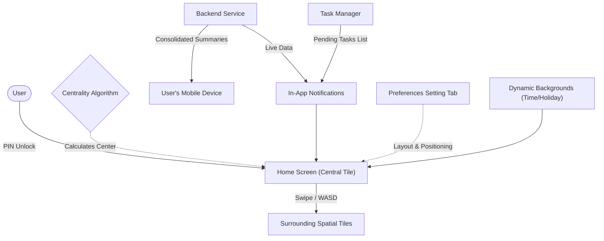

# Home Screen | Module Documentation

> [!NOTE]
> **Status:** Implemented / Production Live
> **Links:** [[00 - System/Home|Home]] | *Linked Modules: [[Preferences Setting Tab]], [[Calendar Habit Task Manager]], [[Point Star System]]*

---

## Concept & Vision
The Home Screen functions identically to a mobile operating system's lock screen and main portal. It acts as the primary gateway into the application, where the user can enter a personalized PIN to unlock the environment before navigating to the surrounding tiles.

- **Centrality Algorithm:** A background algorithm calculates the precise center of the spatial grid dynamically. Whether the layout is 3x3 (centering at `[1,1]`) or larger like 4x4 (centering at `[3,3]`), the Home Screen is automatically anchored in the middle of the workspace.
- **Lock Screen Philosophy:** Similar to a smartphone, it provides immediate, at-a-glance access to shortcuts, notifications, the current time, and critical pending tasks without requiring the user to dive deep into the system.

---

## Work Done So Far
- **Clock Widget (DONE):** The central clock view (Everforest theme) is live and anchored at the center of the `spatial_engine` grid.
- **Lock Screen Overlay (DONE):** A full lock screen overlay gates entry with PIN authentication plus login and OAuth sign-in options (GitHub, Google).
- **Notifications Feed (DONE):** An in-app feed polls `/api/v1/notifications` every 4 seconds and surfaces live notifications on the Home Screen.
- **Connection Status Badge (DONE):** The Home Screen displays the active network state: `HEADSCALE MESH`, `LOCAL WI-FI`, or `REMOTE CLOUD`.
- **Spatial Grid Home Module (DONE):** The Home Screen is registered as a spatial grid tile with point-gated app launches; an RPG player card overlay is available on the lock screen.

---

## Current Focus & Actions
- **Notification Polish:** Refining notification grouping and delivery timing so the feed stays unobtrusive.
- **RPG Overlay Enhancements:** Continuing work on the player card overlay (stats, streak data) tied to the [[Point Star System]].
- **Grid Integration:** Tightening the relationship between point-gated launches and the [[Calendar Habit Task Manager]] task feed.

---

## Next Steps & Future Roadmap
- **Home Labbing & Shared Organization:** Designed for shared use (e.g., with a partner) to organize daily routines, habits, and schedules; scheduling layers will build on the implemented CHTM data.
- **In-App Task Dashboard:** Within the app, the Home Screen will feature a scrollable feed showing tasks to be done today, this week, month, or year. It will allow setting criteria, triggering automations, and checking off completed items directly.
- **Consolidated "Smart" Push Notifications:** Instead of spamming the user's real mobile device with dozens of individual reminders, the backend will send a single, aggregated push notification (e.g., "1 new update, 10 pending tasks for the day"). It functions as a summarized dashboard delivered externally.
- **Advanced Preferences Integration:** Layout customization (e.g., where to position the clock, where messages appear, toggling minimalist modes) will be moved into the general preferences. This will be modeled after mobile OS settings—using clean, nested menus for task-oriented configuration, which will be detailed further in [[Preferences Setting Tab]].
- **Dynamic Backgrounds:** Scheduled wallpapers that adapt to time of day, theme, or holidays are still planned on top of the live clock view.

---

## Interaction Flows & Diagrams
*Visual model detailing the Home Screen's role as the central spatial nexus and notification hub.*

```mermaid
graph TD
    %% User Entry
    User([User]) -->|PIN Unlock| HomeScreen["Home Screen (Central Tile)"]
    
    %% Dynamic Positioning
    GridCalc{"Centrality Algorithm"} -.->|Calculates Center| HomeScreen
    
    %% Content Feeds
    Backend["Backend Service"] -->|Consolidated Summaries| MobilePush["User's Mobile Device"]
    Backend -->|Live Data| NotificationCenter["In-App Notifications"]
    Tasks["Task Manager"] -->|Pending Tasks List| NotificationCenter
    NotificationCenter --> HomeScreen
    
    %% Customization
    Preferences["Preferences Setting Tab"] -.->|Layout & Positioning| HomeScreen
    DynamicBG["Dynamic Backgrounds (Time/Holiday)"] --> HomeScreen
    
    %% Navigation
    HomeScreen -->|Swipe / WASD| SurroundingTiles["Surrounding Spatial Tiles"]
```

## Technical Specs
- [[02 - Technical Specs/Home Screen/What to Build|What to Build]]
- [[02 - Technical Specs/Home Screen/How to Build|How to Build]]
- [[02 - Technical Specs/Home Screen/What to Do|What to Do]]
