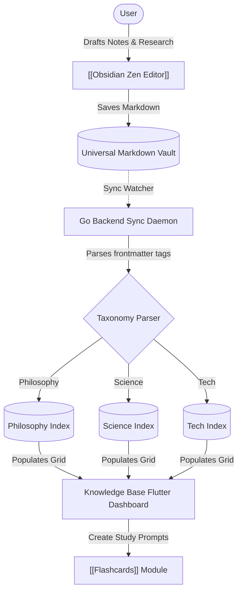

# Knowledge Base | Module Documentation

> [!NOTE]
> **Status:** Conceptual Phase / Planning for Implementation
> **Links:** [[Home]] | *Linked Modules: [[Obsidian Zen Editor]], [[Project Infinity]], [[Flashcards]]*

---

## Concept & Vision
The Knowledge Base acts as the structured central repository for all personal research, academic records, and general notes. It behaves as a personal "second brain" that tracks what the user has learned, what they are currently exploring, and what subjects they plan to study next.

### Centralized Repository & Inter-App Links
The Knowledge Base is designed to connect directly with the vault files of the [[Obsidian Zen Editor]]:
- **Long-Form Research Notes:** Rather than isolated, custom data blobs, raw Markdown documents stored in the vault are classified and linked inside the Knowledge Base dashboard.
- **Categorical Mapping:** Documents are parsed for frontmatter categories (such as Tech, Science, Philosophy, History) to dynamically organize pages into structural visual folders.
- **Active Review Integration:** If a topic in the Knowledge Base needs active review, the user can easily flag the folder to generate study prompts in the [[Flashcards]] module.

---

## Work Done So Far
- **System Concept Outlined:** Core metadata structure mapping subject fields, research tags, and status variables has been established.
- **Design Philosophy:** Everforest Minimalist Flat-Line UI layout mapped (clean categorised directories, solid 1px borders, grid of index cards).

---

## Current Focus & Actions
- **Categorization Hierarchy:** Modeling metadata structures in SQLite to store page relationships, tags, and category taxonomies.
- **Search & Filter Rules:** Formulating fast searching routines in Go to index markdown headers, keywords, and tags for rapid retrieval.

---

## Next Steps & Future Roadmap
- **Interactive Directory view:** Building a Flutter interface that shows a clean grid of subject files, displaying note counts, dynamic progress meters, and study statuses.
- **Auto-Linking System:** Implementing search algorithms that suggest relationships between new research files and existing notes.
- **Point Star Integration:** Linking subject completions or new note additions to the [[Point Star System]] for feedback.

---

## Interaction Flows & Diagrams
*Visual model illustrating how Markdown research pages are parsed, structured, and indexed in the Knowledge Base.*

## Technical Specs
- [[02 - Technical Specs/Knowledge Base/What to Build|What to Build]]
- [[02 - Technical Specs/Knowledge Base/How to Build|How to Build]]
- [[02 - Technical Specs/Knowledge Base/What to Do|What to Do]]
