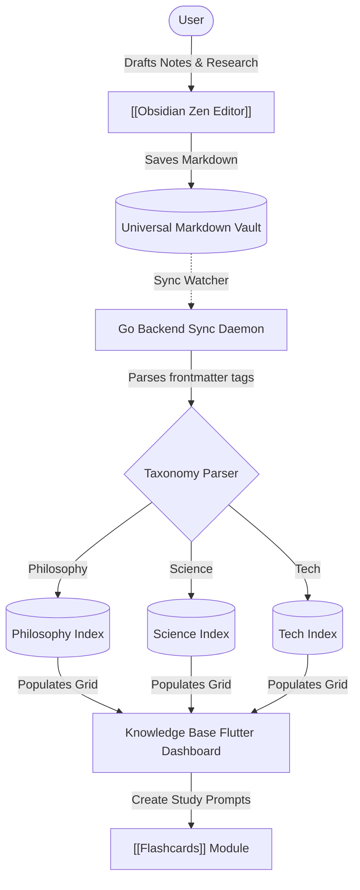

# Knowledge Base | Module Documentation

> [!NOTE]
> **Status:** Implemented / Production Live
> **Links:** [[00 - System/Home|Home]] | *Linked Modules: [[Obsidian Zen Editor]], [[Project Infinity]], [[Flashcards]], [[Point Star System]]*

---

## Concept & Vision
The Knowledge Base acts as the structured central repository for all personal research, academic records, and general notes. It behaves as a personal "second brain" that tracks what the user has learned, what they are currently exploring, and what subjects they plan to study next.

### Centralized Repository & Inter-App Links
The Knowledge Base is designed to connect directly with the vault files of the [[Obsidian Zen Editor]]:
- **Long-Form Research Notes:** Rather than isolated, custom data blobs, raw Markdown documents stored in the vault are classified and linked inside the Knowledge Base dashboard.
- **Categorical Mapping:** Documents are parsed for frontmatter categories (such as Tech, Science, Philosophy, History) to dynamically organize pages into structural visual folders.
- **Active Review Integration:** If a topic in the Knowledge Base needs active review, the user can easily flag the folder to generate study prompts in the [[Flashcards]] module.

---

## Work Done So Far
- **Knowledge Dashboard (DONE):** The Flutter client ships a dashboard with topic cards and a relationship graph, rendering categories and their interconnections in the Everforest Flat-Line layout.
- **Daemon Data Service (DONE):** Topics and relationships are served by the Go daemon from `knowledge.db` via `/api/v1/knowledge/categories` and `/api/v1/knowledge/articles`.
- **Client Data Layer (DONE):** The `knowledge_base_dao` provides typed accessors for `KnowledgeTopics` and `KnowledgeRelationships`.

---

## Current Focus & Actions
- **Deeper Linking:** Expanding cross-references so vault notes, articles, and topics surface related content from other modules ([[Flashcards]], [[Obsidian Zen Editor]]).
- **Graph Polish:** Refining the relationship graph rendering and adding richer topic metadata to the dashboard cards.
- **Article Pipeline:** Tightening the daemon's article indexing so new vault notes appear in the Knowledge Base with minimal delay.

---

## Next Steps & Future Roadmap
- **Interactive Directory view (DONE):** Shipped as the dashboard grid of topic cards with counts and statuses; further refinement of study statuses and progress meters is ongoing.
- **Auto-Linking System (DONE):** Shipped as the relationship graph; ongoing work adds smarter suggestions between new research files and existing notes.
- **Point Star Integration:** Linking subject completions or new note additions to the [[Point Star System]] for feedback remains on the roadmap.

---

## Interaction Flows & Diagrams
*Visual model illustrating how Markdown research pages are parsed, structured, and indexed in the Knowledge Base.*

```mermaid
graph TD
    %% Creation Layer
    User([User]) -->|"Drafts Notes & Research"| ZenEditor["[[Obsidian Zen Editor]]"]
    ZenEditor -->|"Saves Markdown"| MDVault[(Universal Markdown Vault)]
    
    %% Processing & Categorization
    MDVault -.->|"Sync Watcher"| SyncDaemon["Go Backend Sync Daemon"]
    SyncDaemon -->|"Parses frontmatter tags"| CategoryFilter{"Taxonomy Parser"}
    CategoryFilter -->|"Philosophy"| Philo[(Philosophy Index)]
    CategoryFilter -->|"Science"| Science[(Science Index)]
    CategoryFilter -->|"Tech"| Tech[(Tech Index)]
    
    %% Dashboard View
    Philo & Science & Tech -->|"Populates Grid"| KBView["Knowledge Base Flutter Dashboard"]
    KBView -->|"Create Study Prompts"| Flashcards["[[Flashcards]] Module"]
```

## Technical Specs
- [[02 - Technical Specs/Knowledge Base/What to Build|What to Build]]
- [[02 - Technical Specs/Knowledge Base/How to Build|How to Build]]
- [[02 - Technical Specs/Knowledge Base/What to Do|What to Do]]
