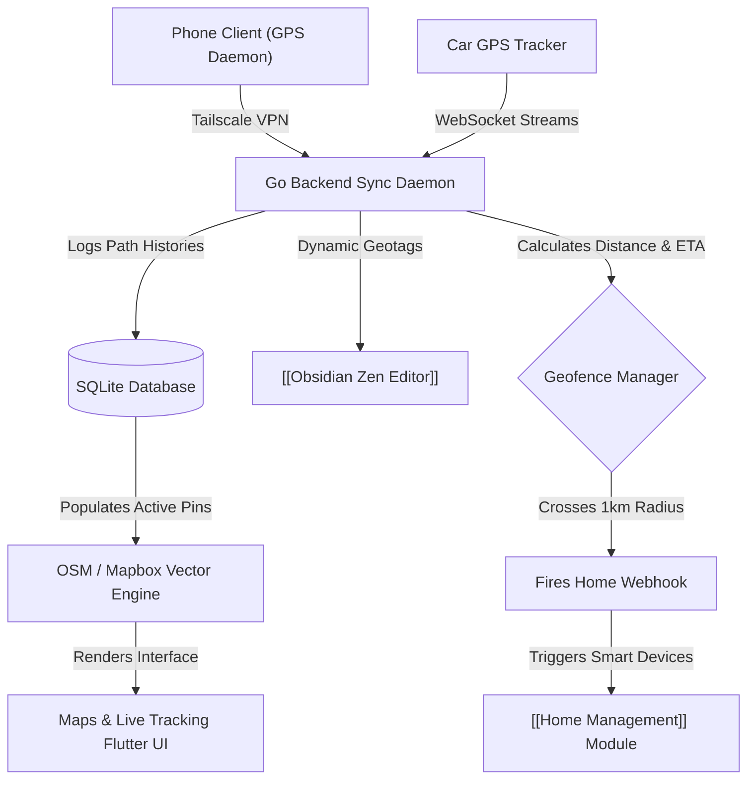

# Maps & Live Tracking | Module Documentation

> [!NOTE]
> **Status:** Conceptual Phase / Design & Planning Stage
> **Links:** [[Home]] | *Linked Modules: [[Preferences Setting Tab]], [[Obsidian Zen Editor]], [[Home Management]], [[Photo Video Gallery]]*

---

## Concept & Vision
The Maps & Live Tracking module acts as the private geospatial visualizer and real-time telemetry center for LifeOS. It replaces commercial tracking services with a self-hosted client-server mapping infrastructure, providing coordinates tracking, private spatial bookmarks, offline routing, and automated geofence rules.

### Core Features & Mechanics
1. **Private Geolocation & Map Caching:**
   - Incorporates OpenStreetMap/Mapbox rendering engines with local vector map caching to support offline navigation (ideal for car-mounted dashboards).
   - **Private Place Ledger:** Users can bookmark visited coordinates, tag places, and write reviews. This data is kept strictly on the local database and syncs with the [[Obsidian Zen Editor]], remaining independent from Google Maps public ratings.
2. **Active Telemetry Trackers:**
   - Real-time location streams utilizing Tailscale-bound WebSockets to track:
     - **Personal coordinates:** Real-time updates for family members.
     - **Asset/Vehicle trackers:** Dedicated background tracker in the car to display parking coordinates and mapping routes (making it simple to locate vehicles in large parking lots).
3. **Geofenced Automation Integration:**
   - Backend algorithms calculate distance, travel velocity, and estimated time of arrival (ETA) toward defined coordinates (e.g. Home Zone, Summer House).
   - **Proximity Automation Triggers:** Crossing a specific geofence threshold (e.g. 1 km or a 5-minute travel window) heading home automatically sends trigger payloads to the [[Home Management]] module to start home appliances (oven, washing machine, climate controls).

---

## Work Done So Far
- **Module Concept Defined:** Proximity triggers, GPS telemetry protocols, and offline map cache parameters mapped out.
- **Design Philosophy:** Everforest Minimalist Flat-Line UI (clean mapping layers, solid card outlines for trackers, flat coordinate overlays, minimalist status indicators) drafted.

---

## Current Focus & Actions
- **GPS Coordinates API:** Designing HTTP post endpoints in the Go server for client devices to report background GPS coordinates securely.
- **Geofence Calculation Library:** Writing spatial range checks in Go to calculate circular or polygon geofence overlaps.

---

## Next Steps & Future Roadmap
- **Home Assistant API Webhooks:** Creating the Webhook client in Go to bridge geolocation states to Home Assistant actions.
- **Offline Vector Map Downloader:** Integrating Mapbox/OSM style sheet downloaders to save geographical packages locally.
- **Photo Metadata Pinning:** Linking with the [[Photo Video Gallery]] to display photos taken at specific geographic locations on the map.

---

## Interaction Flows & Diagrams
*Geotagging, telemetry streaming, and automated geofence triggering pipelines.*

## Technical Specs
- [[02 - Technical Specs/Maps & Live Tracking/What to Build|What to Build]]
- [[02 - Technical Specs/Maps & Live Tracking/How to Build|How to Build]]
- [[02 - Technical Specs/Maps & Live Tracking/What to Do|What to Do]]
