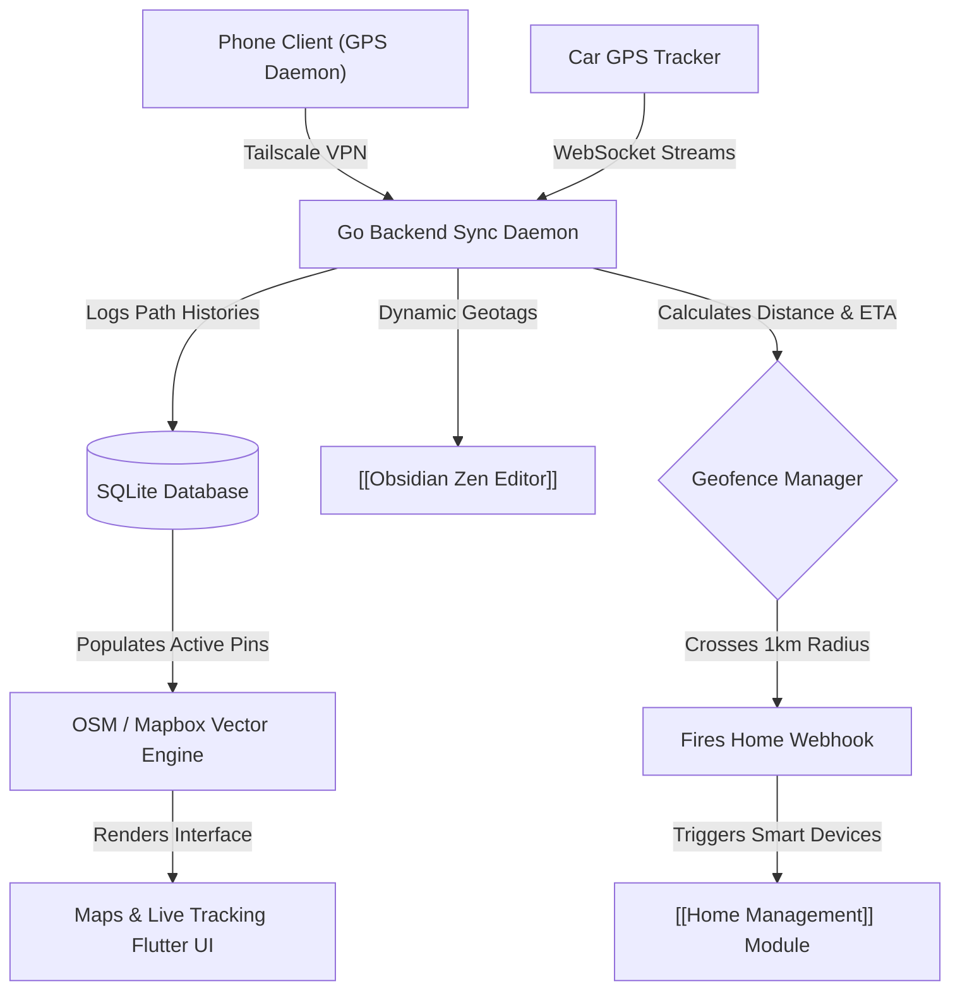

# Maps & Live Tracking | Module Documentation

> [!NOTE]
> **Status:** Implemented / Production Live
> **Links:** [[00 - System/Home|Home]] | *Linked Modules: [[Preferences Setting Tab]], [[Obsidian Zen Editor]], [[Home Management]], [[Photo Video Gallery]], [[Point Star System]]*

---

## Concept & Vision
The Maps & Live Tracking module acts as the private geospatial visualizer and real-time telemetry center for LifeOS. It replaces commercial tracking services with a self-hosted client-server mapping infrastructure, providing coordinates tracking, private spatial bookmarks, offline routing, and automated geofence rules.

### Core Features & Mechanics
1. **Private Geolocation & Map Caching:**
   - Incorporates OpenStreetMap/Mapbox rendering engines with local vector map caching to support offline navigation (ideal for car-mounted dashboards).
   - **Private Place Ledger:** Users can bookmark visited coordinates, tag places, and write reviews. This data is kept strictly on the local database and syncs with the [[Obsidian Zen Editor]], remaining independent from Google Maps public ratings.
2. **Active Telemetry Trackers:**
   - Real-time location streams utilizing Tailscale-bound WebSockets to track:
     - **Personal coordinates:** Real-time updates for family members.
     - **Asset/Vehicle trackers:** Dedicated background tracker in the car to display parking coordinates and mapping routes (making it simple to locate vehicles in large parking lots).
3. **Geofenced Automation Integration:**
   - Backend algorithms calculate distance, travel velocity, and estimated time of arrival (ETA) toward defined coordinates (e.g. Home Zone, Summer House).
   - **Proximity Automation Triggers:** Crossing a specific geofence threshold (e.g. 1 km or a 5-minute travel window) heading home automatically sends trigger payloads to the [[Home Management]] module to start home appliances (oven, washing machine, climate controls).

---

## Work Done So Far
- **Map Rendering:** flutter_map with OpenStreetMap rendering, plus an animated dark radar sweep widget and offline tile cache for disconnected use.
- **Geofence Tooling:** Geofence editor with drawer overlay supporting circle and polygon shapes; geofence enter automations fire webhooks.
- **Navigation & Telemetry:** Turn-by-turn navigation overlay, live feed preview, and report banner in the client; background GPS capture via `geolocator`.
- **Discovery & Services:** mDNS local device discovery and a geocoding service for address lookup.
- **Go Backend Location API:**
  - `GET /api/v1/radar/geofences` — Returns active geofences with coordinates and radius.
  - `POST /api/v1/radar/report` — Parses GPS reports, runs haversine proximity checks, broadcasts via WebSocket.
  - `WS /api/v1/radar/live` — Real-time WebSocket broker for live coordinate streaming between devices.
  - `geofence.go` — Haversine distance engine and proximity trigger detection.
  - `websocket.go` — WebSocket broker with client registration, broadcast, and auto-cleanup.
- **Flutter Client Integration:**
  - `LiveSharingPlugin` — WebSocket client that connects to `/api/v1/radar/live` and displays live feeds.
  - `MapsDashboardWidget` — Fetches backend data, shows WebSocket connection status, and displays live location cards.
  - `MapsDao` — Extended with `deleteGeofence`, `deleteBookmark`, `updateGeofenceActive` queries.

---

## Current Focus & Actions
- **GPS Coordinates API:** `POST /api/v1/radar/report` active and processing background GPS reports.
- **Geofence Calculation Library:** Haversine distance engine implemented with proximity trigger detection and enter automation webhooks.
- **WebSocket Telemetry:** Live coordinate streaming operational via the gorilla/websocket broker.
- **Radar Feed Stability:** Monitoring the live radar feed and radar sweep animation for drift and reconnect edge cases.
- **Offline Tile Tuning:** Optimizing the offline tile cache size and refresh strategy for car-dashboard use.

---

## Next Steps & Future Roadmap
- **(DONE) Geofence Enter Automations:** Geofence crossing fires webhooks to [[Home Management]] to trigger smart-device actions.
- **(DONE) Live Radar Feed:** WebSocket telemetry (`/api/v1/radar/live`) streams coordinates between devices with the live feed preview in the dashboard.
- **(DONE) Offline Map Cache:** Local tile caching supports offline navigation; full vector package download remains the next evolution.
- **Home Assistant API Webhooks:** Expanding the webhook client in Go to bridge geolocation states to Home Assistant actions beyond enter automations.
- **Photo Metadata Pinning:** Linking with the [[Photo Video Gallery]] to display photos taken at specific geographic locations on the map.

---

## Interaction Flows & Diagrams
*Geotagging, telemetry streaming, and automated geofence triggering pipelines.*

```mermaid
graph TD
    %% Telemetry Sources
    Phone["Phone Client (GPS Daemon)"] -->|"Tailscale VPN"| GoDaemon["Go Backend Sync Daemon"]
    CarTracker["Car GPS Tracker"] -->|"WebSocket Streams"| GoDaemon
    
    %% Storage & Indexing
    GoDaemon -->|"Logs Path Histories"| LocalDB[(SQLite Database)]
    GoDaemon -->|"Dynamic Geotags"| ZenEditor["[[Obsidian Zen Editor]]"]
    
    %% Map Render Layer
    LocalDB -->|"Populates Active Pins"| MapEngine["OSM / Mapbox Vector Engine"]
    MapEngine -->|"Renders Interface"| FlutterUI["Maps & Live Tracking Flutter UI"]
    
    %% Geofencing Logic
    GoDaemon -->|"Calculates Distance & ETA"| GeofenceManager{"Geofence Manager"}
    GeofenceManager -->|"Crosses 1km Radius"| AutomationTrigger["Fires Home Webhook"]
    AutomationTrigger -->|"Triggers Smart Devices"| HomeAssistant["[[Home Management]] Module"]
```

## Technical Specs
- [[02 - Technical Specs/Maps & Live Tracking/What to Build|What to Build]]
- [[02 - Technical Specs/Maps & Live Tracking/How to Build|How to Build]]
- [[02 - Technical Specs/Maps & Live Tracking/What to Do|What to Do]]
