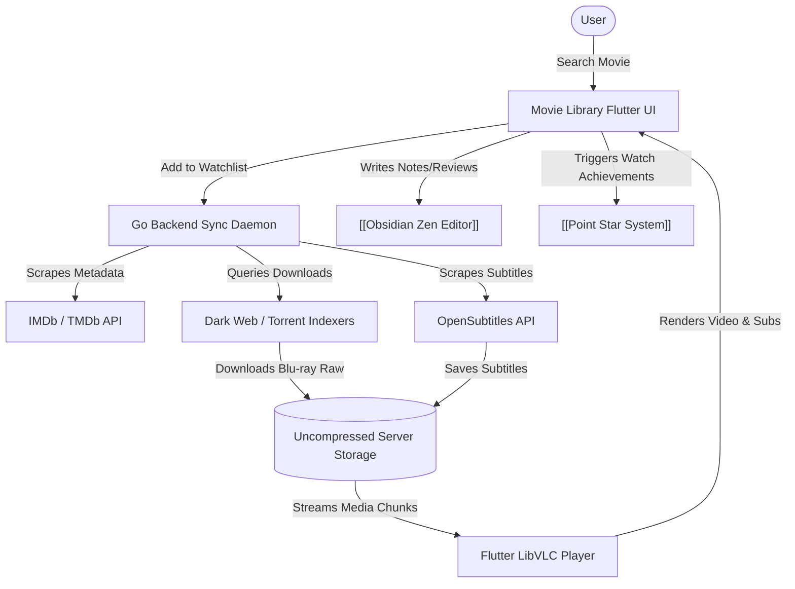

# Movie Library | Module Documentation

> [!NOTE]
> **Status:** Conceptual Phase / Design & Planning Stage
> **Links:** [[Home]] | *Linked Modules: [[Preferences Setting Tab]], [[Obsidian Zen Editor]], [[Point Star System]]*

---

## Concept & Vision
The Movie Library is a self-hosted, advanced media cataloging, downloading, and playback platform built into LifeOS. It serves as a private, highly customized alternative to services like Netflix, Plex, or Jellyfin. The module combines metadata scraping, automated dark-web indexing, a background download manager, and a fully featured subtitle-integrated media player.

### Core Features & Mechanics
1. **Automated Search & Background Download Manager:**
   - Users can search for movies online directly from the Flutter UI.
   - When a movie is added to the **Watchlist**, the Go server backend searches the web and dark web directories for the highest uncompressed source quality (Blu-ray raw or remux).
   - Slow links are queued to download in the background overnight on the server, ensuring files are fully cached and ready by morning.
2. **Flexible Playback Architecture:**
   - **On-Demand Streaming:** High-bandwidth streaming directly from the server to local clients without complex transcoding that compromises image quality.
   - **Offline Local Download:** Media can be downloaded directly to mobile or laptop storage for offline viewing.
3. **Metadata & Personal Logging:**
   - Automatic fetching of covers, descriptions, and ratings from TMDb and IMDb APIs.
   - **Personal Review Ledger:** Integrated logging system allowing the user to add private ratings, custom watch counters, and reviews. This connects directly to the [[Obsidian Zen Editor]], syncing movie reviews to Markdown vault documents.
4. **VLC-Powered Advanced Media Player:**
   - Integrating a native media player (powered by LibVLC/VLC controller wrapper).
   - **Subtitles Automation:** Automated querying of the OpenSubtitles API to search, download, sync, and display multi-language subtitles on the fly.

---

## Work Done So Far
- **Module Definition:** Deep structural requirements for the media player and background download loops have been finalized.
- **Design Philosophy:** Everforest Minimalist Flat-Line UI layout (grid of movie cards, solid outline borders, metadata listings in Everforest cream/grey typography) drafted.

---

## Current Focus & Actions
- **Torrent/Usenet Client Wrapper:** Designing interfaces for the Go daemon to interact with backend torrent and downloader clients (like qBittorrent or NZBGet).
- **SQLite Database Schema:** Modeling tables to hold local media files, IMDb metadata caches, watchlist queues, and subtitle reference paths.

---

## Next Steps & Future Roadmap
- **VLC Flutter Integration:** Embedding the libvlc native video controller inside the Flutter app.
- **OpenSubtitles Client Integration:** Writing the subtitle search and download handlers in the Go daemon.
- **Zen Editor Linkage:** Building custom Markdown templates in the [[Obsidian Zen Editor]] that automatically render movie metadata cards and render reviews back to the Movie Library database.
- **Point Star Integration:** Rewarding points via the [[Point Star System]] when a movie review is completed or a watchlist item is finalized.

---

## Interaction Flows & Diagrams
*Media pipeline illustrating online search, background download manager, metadata scraper, and VLC playback system.*

