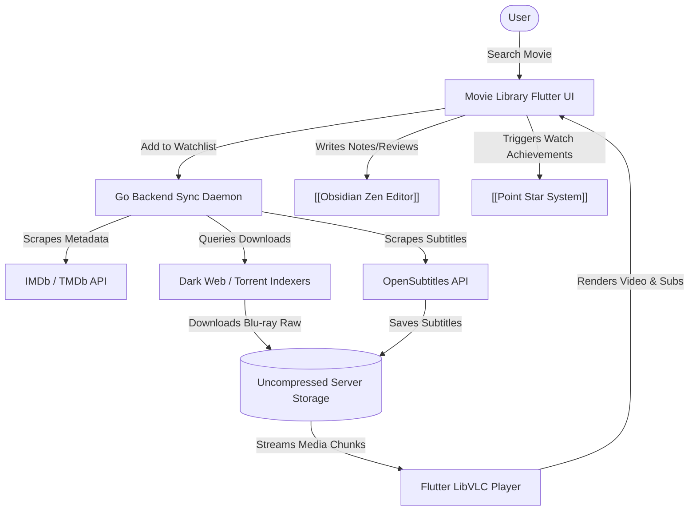

# Movie Library | Module Documentation

> [!NOTE]
> **Status:** Implemented / Production Live
> **Links:** [[00 - System/Home|Home]] | *Linked Modules: [[Preferences Setting Tab]], [[Obsidian Zen Editor]], [[Point Star System]], [[Dark Web Management]]*

---

## Concept & Vision
The Movie Library is a self-hosted, advanced media cataloging, downloading, and playback platform built into LifeOS. It serves as a private, highly customized alternative to services like Netflix, Plex, or Jellyfin. The module combines metadata scraping, automated dark-web indexing, a background download manager, and a fully featured subtitle-integrated media player.

### Core Features & Mechanics
1. **Automated Search & Background Download Manager:**
   - Users can search for movies online directly from the Flutter UI.
   - When a movie is added to the **Watchlist**, the Go server backend searches the web and dark web directories for the highest uncompressed source quality (Blu-ray raw or remux).
   - Slow links are queued to download in the background overnight on the server, ensuring files are fully cached and ready by morning.
2. **Flexible Playback Architecture:**
   - **On-Demand Streaming:** High-bandwidth streaming directly from the server to local clients without complex transcoding that compromises image quality.
   - **Offline Local Download:** Media can be downloaded directly to mobile or laptop storage for offline viewing.
3. **Metadata & Personal Logging:**
   - Automatic fetching of covers, descriptions, and ratings from TMDb and IMDb APIs.
   - **Personal Review Ledger:** Integrated logging system allowing the user to add private ratings, custom watch counters, and reviews. This connects directly to the [[Obsidian Zen Editor]], syncing movie reviews to Markdown vault documents.
4. **VLC-Powered Advanced Media Player:**
   - Integrating a native media player (powered by LibVLC/VLC controller wrapper).
   - **Subtitles Automation:** Automated querying of the OpenSubtitles API to search, download, sync, and display multi-language subtitles on the fly.

---

## Work Done So Far
- **TMDB Metadata Enrichment:** Posters, overviews, genres, and ratings are fetched via TMDB (key held in the daemon only) and displayed across the library.
- **Browse & Search:** Movie browsing and search with filters (status, genre, rating) in the Flutter client.
- **Statuses & Watchlist:** Movies track AVAILABLE / DOWNLOADING / WATCHED states; the watchlist drives library views.
- **Personal Reviews:** Private reviews with ratings are logged per movie.
- **VLC Player:** VLC-based player screen handles local playback; subtitles tables live in `movies.db`.
- **Event Streaming:** `movies:watched` events broadcast through the events bus for cross-module reactions.
- **Client Persistence:** `movie_repository` and `movies_dao` manage local data access.

---

## Current Focus & Actions
- **Metadata Refresh:** Keeping TMDB enrichment current and handling rating/overview fallbacks gracefully.
- **Player Polish:** Refining the VLC player screen, subtitle loading, and resume behaviour.
- **Watchlist Workflow:** Tuning the AVAILABLE / DOWNLOADING / WATCHED transitions and event emission on completion.

---

## Next Steps & Future Roadmap
- **(DONE) VLC Flutter Integration:** The libvlc-based player screen is embedded in the client for local playback.
- **(DONE) Subtitles Foundation:** Subtitle tables are in `movies.db`; multi-language subtitle search/download automation remains the next layer.
- **(DONE) Review Ledger:** Personal reviews with ratings are logged and surfaced in the library.
- **Dark-Web / Torrent Download Engine:** Wiring background download manager hooks (indexer queries, overnight queueing) into the daemon.
- **Zen Editor Linkage:** Building custom Markdown templates in the [[Obsidian Zen Editor]] that automatically render movie metadata cards and render reviews back to the Movie Library database.
- **Point Star Integration:** Rewarding points via the [[Point Star System]] when a movie review is completed or a watchlist item is finalized (watched events already stream via the events bus).

---

## Interaction Flows & Diagrams
*Media pipeline illustrating online search, background download manager, metadata scraper, and VLC playback system.*

```mermaid
graph TD
    %% User Search & Watchlist
    User([User]) -->|"Search Movie"| FlutterUI["Movie Library Flutter UI"]
    FlutterUI -->|"Add to Watchlist"| ServerSync["Go Backend Sync Daemon"]
    
    %% Scrapers & Download Engine
    ServerSync -->|"Scrapes Metadata"| MetaAPI["IMDb / TMDb API"]
    ServerSync -->|"Queries Downloads"| Downloader["Dark Web / Torrent Indexers"]
    Downloader -->|"Downloads Blu-ray Raw"| LocalStorage[(Uncompressed Server Storage)]
    
    %% Subtitles Engine
    ServerSync -->|"Scrapes Subtitles"| OpenSubtitles["OpenSubtitles API"]
    OpenSubtitles -->|"Saves Subtitles"| LocalStorage
    
    %% Playback Pipeline
    LocalStorage -->|"Streams Media Chunks"| VLCEngine["Flutter LibVLC Player"]
    VLCEngine -->|"Renders Video & Subs"| FlutterUI
    
    %% Review Logs
    FlutterUI -->|"Writes Notes/Reviews"| ZenEditor["[[Obsidian Zen Editor]]"]
    FlutterUI -->|"Triggers Watch Achievements"| Points["[[Point Star System]]"]
```

## Technical Specs
- [[02 - Technical Specs/Movie Library/What to Build|What to Build]]
- [[02 - Technical Specs/Movie Library/How to Build|How to Build]]
- [[02 - Technical Specs/Movie Library/What to Do|What to Do]]
