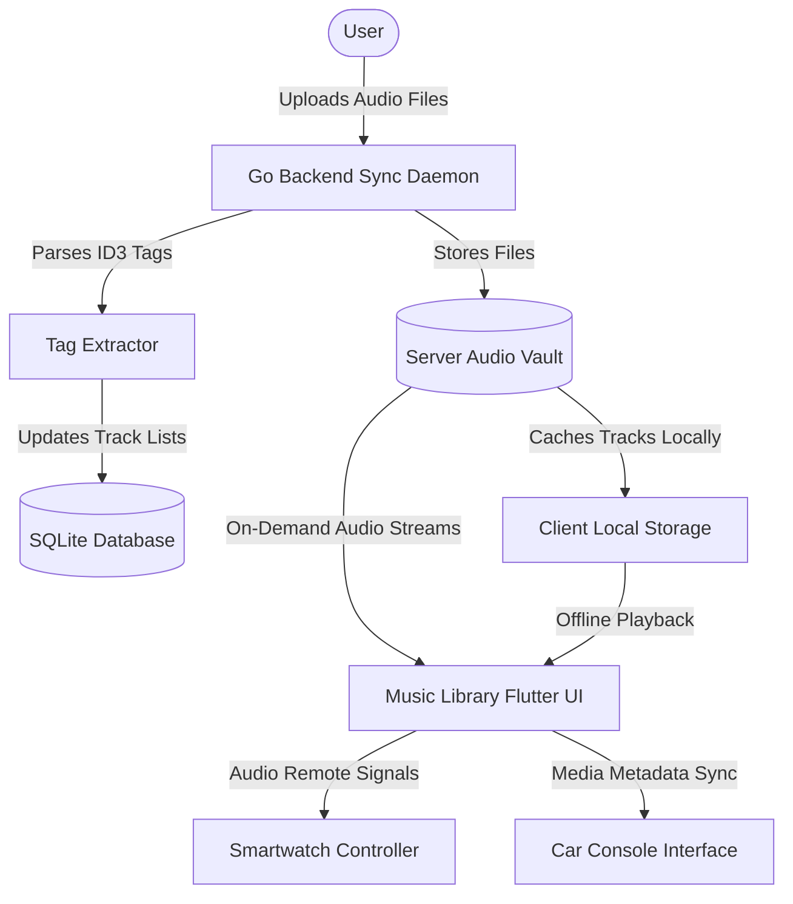

# Music Library | Module Documentation

> [!NOTE]
> **Status:** Conceptual Phase / Design & Planning Stage
> **Links:** [[Home]] | *Linked Modules: [[Preferences Setting Tab]], [[Book Library]], [[Project Infinity]], [[Flashcards]], [[Point Star System]]*

---

## Concept & Vision
The Music Library is a self-hosted personal music cloud built into LifeOS. It serves as a private, high-fidelity alternative to streaming services (like Spotify or Apple Music). The module enables users to upload their own digital music collections to the server, stream them on demand, or cache them locally for offline listening.

### Key Features & Mechanics
1. **Dynamic Streaming & Offline Caching:**
   - Play high-fidelity audio (FLAC, ALAC, MP3, AAC) directly from the LifeOS backend.
   - Smart offline manager allows the user to download specific albums, playlists, or tracks to local client memory for playback without internet access.
2. **Cross-Device Remote & Playback:**
   - Responsive playback interfaces designed to scale seamlessly across devices:
     - **Smartphones & Tablets:** Standard dashboard with library browsing, queue management, and playlist curation.
     - **Smartwatches:** Light media controller for quick volume adjustments, track skipping, and local caching.
     - **Car Consoles:** Simplified interface optimized for Android Auto/Apple CarPlay dashboards.
3. **Metadata & Lyrics Sync Engine:**
   - Automated parser reads internal audio tags (ID3, Vorbis comments) to catalog artist information, album structures, and release years.
   - Synchronized lyrics viewer that pulls time-synced lyrics from server caches or external APIs.
   - **Lyrics Translation Study Engine:** Tapping any foreign word inside the dynamic synced lyrics interface instantly routes it to the [[Project Infinity]] dictionary to fetch definitions, auto-generating an active recall study card in the [[Flashcards]] module.
   - **Point Star Integration Rule:** Actively studying and translating lyrics for foreign-language tracks awards **+2 Star Points** per song completed.

---

## Work Done So Far
- **Module Concept Defined:** Scope for playback logic, caching policies, and cross-platform remote controllers established.
- **Design Philosophy:** Everforest Minimalist Flat-Line UI (grid of album covers, solid cards, thin outlines, plain lists, clean uppercase headers) drafted.

---

## Current Focus & Actions
- **Flutter Audio Engine Evaluation:** Reviewing Dart audio playback packages (such as `just_audio` or `audioplayers`) to integrate into the Flutter client core.
- **Music Indexer Engine:** Planning the folder scanner in Go to recursively read and catalog directories of audio files on the server.

---

## Next Steps & Future Roadmap
- **Playlist Manager Schema:** Modeling SQLite tables to handle user-created playlists, track queues, and offline synchronization markers.
- **Smartwatch Controller:** Drafting the Bluetooth/network protocol for smartwatches to interact with the active mobile/desktop audio player.
- **Subsonic API Compatibility:** Exploring implementation of a Subsonic-compatible API endpoint in the Go server, allowing standard community music apps to connect directly to the LifeOS music library.

---

## Interaction Flows & Diagrams
*Audio streaming pipeline showing metadata extraction, caching engine, and playback control layers.*

