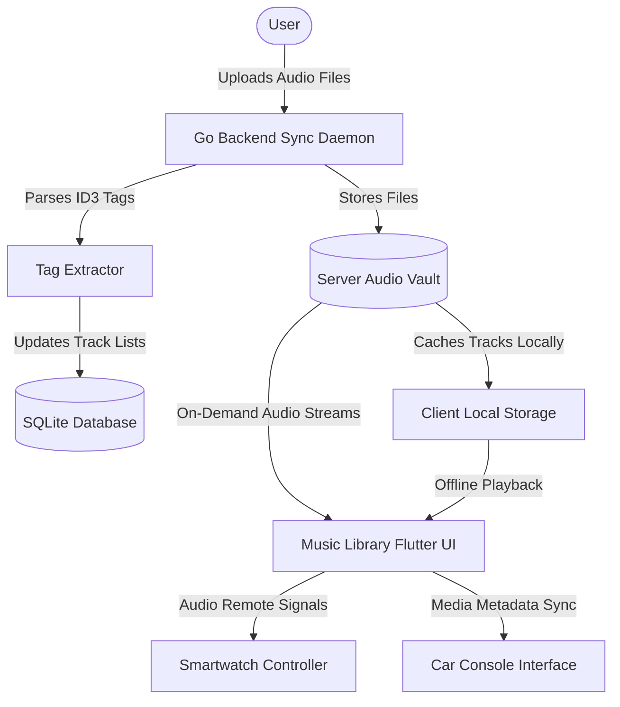

# Music Library | Module Documentation

> [!NOTE]
> **Status:** Implemented / Production Live
> **Links:** [[00 - System/Home|Home]] | *Linked Modules: [[Preferences Setting Tab]], [[Book Library]], [[Project Infinity]], [[Flashcards]], [[Point Star System]]*

---

## Concept & Vision
The Music Library is a self-hosted personal music cloud built into LifeOS. It serves as a private, high-fidelity alternative to streaming services (like Spotify or Apple Music). The module enables users to upload their own digital music collections to the server, stream them on demand, or cache them locally for offline listening.

### Key Features & Mechanics
1. **Dynamic Streaming & Offline Caching:**
   - Play high-fidelity audio (FLAC, ALAC, MP3, AAC) directly from the LifeOS backend.
   - Smart offline manager allows the user to download specific albums, playlists, or tracks to local client memory for playback without internet access.
2. **Cross-Device Remote & Playback:**
   - Responsive playback interfaces designed to scale seamlessly across devices:
     - **Smartphones & Tablets:** Standard dashboard with library browsing, queue management, and playlist curation.
     - **Smartwatches:** Light media controller for quick volume adjustments, track skipping, and local caching.
     - **Car Consoles:** Simplified interface optimized for Android Auto/Apple CarPlay dashboards.
3. **Metadata & Lyrics Sync Engine:**
   - Automated parser reads internal audio tags (ID3, Vorbis comments) to catalog artist information, album structures, and release years.
   - Synchronized lyrics viewer that pulls time-synced lyrics from server caches or external APIs.
   - **Lyrics Translation Study Engine:** Tapping any foreign word inside the dynamic synced lyrics interface instantly routes it to the [[Project Infinity]] dictionary to fetch definitions, auto-generating an active recall study card in the [[Flashcards]] module.
   - **Point Star Integration Rule:** Actively studying and translating lyrics for foreign-language tracks awards **+2 Star Points** per song completed.

---

## Work Done So Far
- **Audiophile Music Studio UI:** Poweramp v3-style interface with now-playing sheet, queue sheet, equalizer modal (presets incl. Audiophile Reference), waveform seekbar, track metadata modal, and lyrics viewer.
- **DSP Equalizer:** 10-band equalization via Android Equalizer on mobile and lavfi filters on Windows.
- **Smart Listening:** Smart mixes and playlists tabs for curated listening.
- **Downloads & Streaming:** yt-dlp search/download through the daemon; m4a proxy streaming with background cache (CORS + byte-range support); LRCLIB synced lyrics.
- **Local Library Scanning:** Phone audio discovery via `on_audio_query`; playback engines are `just_audio` plus `media_kit`.
- **Mini-Player Dock:** Persistent dock with the Audiophile Quality Tag.
- **Daemon API:** `/api/v1/music` exposes `tracks`, `search`, `download`, `lyrics`, `stream`, and `resolve` endpoints.

---

## Current Focus & Actions
- **Playback Engine Tuning:** Balancing `just_audio` and `media_kit` behaviour, gapless playback, and equalizer routing across devices.
- **Cache & Stream Polish:** Refining the background cache and byte-range proxy for smooth scrubbing and offline replay.
- **UI Refinement:** Polishing the now-playing/queue sheets and lyrics viewer, keeping the Everforest flat-line aesthetic.

---

## Next Steps & Future Roadmap
- **(DONE) Playlist Manager:** Smart mixes and playlist tabs are live in the client; deeper schema work for user-created playlists and offline markers remains.
- **(DONE) Metadata & Lyrics Sync:** Track metadata parsing plus LRCLIB synced lyrics (with the lyrics viewer) are operational.
- **Smartwatch Controller:** Drafting the Bluetooth/network protocol for smartwatches to interact with the active mobile/desktop audio player.
- **Subsonic API Compatibility:** Exploring implementation of a Subsonic-compatible API endpoint in the Go server, allowing standard community music apps to connect directly to the LifeOS music library.
- **Lyrics Translation Study Engine:** Routing tapped foreign words in the lyrics viewer to the [[Project Infinity]] dictionary and auto-generating [[Flashcards]] study cards.

---

## Interaction Flows & Diagrams
*Audio streaming pipeline showing metadata extraction, caching engine, and playback control layers.*

```mermaid
graph TD
    %% Input Source
    User([User]) -->|"Uploads Audio Files"| ServerSync["Go Backend Sync Daemon"]
    
    %% Processing & Library Management
    ServerSync -->|"Stores Files"| AudioVault[(Server Audio Vault)]
    ServerSync -->|"Parses ID3 Tags"| MetadataExtractor["Tag Extractor"]
    MetadataExtractor -->|"Updates Track Lists"| Database[(SQLite Database)]
    
    %% Delivery & Playback
    AudioVault -->|"On-Demand Audio Streams"| FlutterUI["Music Library Flutter UI"]
    AudioVault -->|"Caches Tracks Locally"| OfflineCache["Client Local Storage"]
    OfflineCache -->|"Offline Playback"| FlutterUI
    
    %% Remote Sync
    FlutterUI -->|"Audio Remote Signals"| Smartwatch["Smartwatch Controller"]
    FlutterUI -->|"Media Metadata Sync"| CarConsole["Car Console Interface"]
```

## Technical Specs
- [[02 - Technical Specs/Music Library/What to Build|What to Build]]
- [[02 - Technical Specs/Music Library/How to Build|How to Build]]
- [[02 - Technical Specs/Music Library/What to Do|What to Do]]
