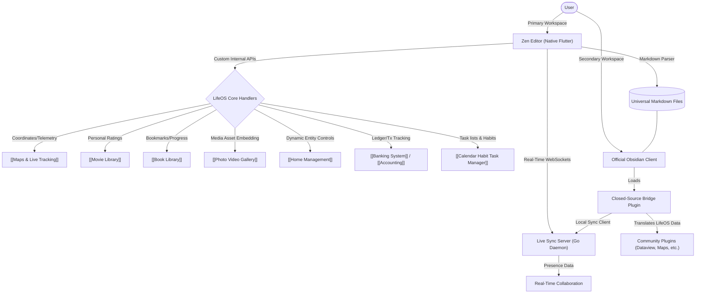

# Obsidian Zen Editor | Module Documentation

> [!NOTE]
> **Status:** UI Built / Core Logic in Development
> **Links:** [[Home]] | *Linked Modules: [[Maps & Live Tracking]], [[Movie Library]], [[Book Library]], [[Photo Video Gallery]], [[Home Management]], [[Banking System]], [[Accounting]], [[Calendar Habit Task Manager]]*

---

## Concept & Vision
The Zen Editor is the central vault and knowledge system of LifeOS. While it remains fully compatible with standard Obsidian Markdown, it is specifically designed to escape the strict limitations, heavy RAM usage, and plugin restrictions of the standalone Obsidian application.

- **Overcoming Limitations:** The Zen Editor provides native, flawless live syncing and real-time collaboration (seeing who is typing) without relying on paid services or unstable third-party plugins. By being built natively in Flutter, it consumes drastically less RAM.
- **Deep Inter-App Ecosystem:** The primary vision is seamless integration across all LifeOS tiles. For example, trip planning notes in the Zen Editor can interact directly with the [[Maps & Live Tracking]] tile to instantly pass coordinates and directions without clunky app-switching.
- **Unified Custom Metadata & Multi-App Hub:** The editor acts as a dynamic metadata hub and dashboard interface for all other LifeOS modules:
  - **Books:** Tracking reading progress, bookmarks, and read/unread lists natively.
  - **Movies:** Injecting personal ratings and notes directly into the server's movie database alongside external API data (like IMDb).
  - **Photos & Videos:** Direct gallery asset linking, native high-performance media embeds, and media-rich logs.
  - **Home Assistant:** Embedded smart home entities, dynamic device toggle triggers, and device configuration linkages directly from text lines.
  - **Financials (Banking & Accounting):** Automatic linking of transactions, live ledger balance updates in financial summary pages, and custom formatting for financial audits.
  - **Habit & Task Manager:** Displaying live progress charts, habit tracking checkboxes, and unified scheduling views integrated with text logs.
  - **Maps & Live Tracking:** Storing trip planning paths, waypoint listings, and triggering live Tailscale location telemetry tracking links.
- **Unrestricted Native Plugins:** Complete freedom to build and execute powerful plugins natively within Flutter, breaking free from mobile/desktop compatibility limits present in standard Obsidian.
- **Point Star Integration Rule:** Writing, reading, or editing notes inside the Zen Workspace awards **+5 Star Points** per hour of active, focused work (calculated dynamically by the backend daemon based on file modification timestamps).

---

## Hybrid Architecture: Standalone Editor & Obsidian Bridge
To achieve maximum speed while maintaining complete data portability and vault longevity, a hybrid system has been chosen:
1. **Primary Workspace (Standalone Flutter App):** A fully native, lightweight markdown editor optimized for mobile and spatial desktop grids. It syncs notes via WebSockets to the LifeOS Go daemon.
2. **Obsidian Compatibility Bridge (Closed-Source Translation Plugin):** A custom, private Obsidian plugin developed to bridge the gap if official Obsidian is used as a desktop/client interface.
   - **Translation Engine:** The plugin intercepts elements and syntax that are unique to the LifeOS ecosystem (such as dynamic module sync commands, custom inter-app links, and unified metadata blocks).
   - **Community Plugin Mapping:** It converts these proprietary structures on the fly, feeding them into relevant Obsidian community plugins (like Dataview, Advanced Tables, or custom leaflet maps) so they function perfectly inside Obsidian.
   - **Local Server Syncing:** The plugin establishes a secure connection to the LifeOS daemon to download real-time edits, resolving conflicts and ensuring two-way sync between the local Markdown files and the LifeOS server.

---

## Work Done So Far
- **Visual Frontend:** The core visual interface and UI layout for the Zen Editor have been successfully built and implemented within the spatial grid.
- **Markdown Compatibility:** The base structure is designed to be fully compatible with Obsidian's Markdown format.

---

## Current Focus & Actions
- **Core Logic & Plugin Architecture:** The immediate focus is building the underlying mechanics, settings, and the custom plugin framework.
- **Internal API Routing:** Developing a custom internal API/handler system so the Zen Editor can communicate effortlessly with other LifeOS tiles. This will allow the editor to directly invoke custom handlers for the movie library or push coordinates to the maps module natively.

---

## Next Steps & Future Roadmap
- **Plugin Porting & Enhancement:** Identifying the most powerful community plugins from Obsidian, rebuilding them natively in Flutter for LifeOS, and optimizing them to be far more user-friendly and tightly integrated.
- **3D Graph Editor:** Implementing a three-dimensional graph view to visualize the web of connected notes and thoughts, evolving Obsidian's 2D graph into an immersive spatial experience.
- **Vault Reporting & Tracking:** Integrating advanced tracking mechanisms (like daily summary reports and maps tracking) directly into the vault system, turning the Zen Editor into the ultimate life-logging and reporting hub.

---

## Interaction Flows & Diagrams
*Visual model of the hybrid standalone/bridge plugin architecture.*

