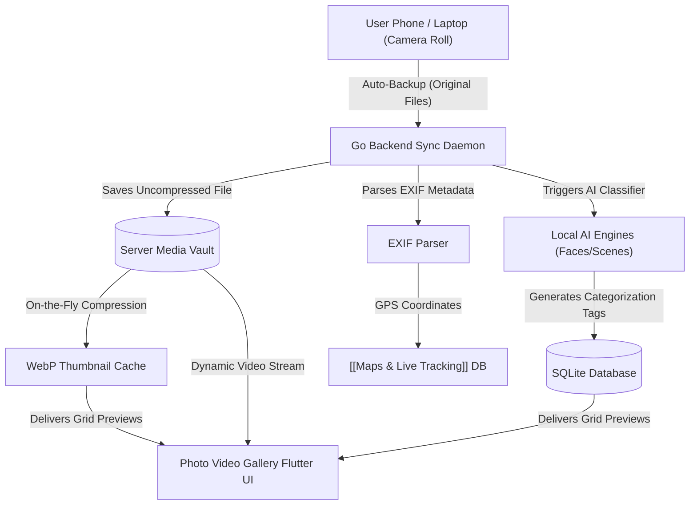

# Photo Video Gallery | Module Documentation

> [!NOTE]
> **Status:** Conceptual Phase / Design & Planning Stage
> **Links:** [[Home]] | *Linked Modules: [[Preferences Setting Tab]], [[Obsidian Zen Editor]], [[Maps & Live Tracking]]*

---

## Concept & Vision
The Photo Video Gallery is designed as a self-hosted, private alternative to Google Photos, built to run seamlessly inside the LifeOS ecosystem. Its core objective is to offer a high-performance, fluent, and secure space to store, stream, and catalog all personal media assets without third-party cloud dependencies.

The module is inspired by two key design and performance concepts:
1. **Aves Gallery (Libre Version):** Embraces Aves' layout fluency, gesture-driven media navigation, rich metadata views, and clean, high-performance rendering.
2. **Google Photos Cloud Paradigm (Seamless Streaming):** Enables background media backups from mobile and desktop clients directly to the LifeOS server. The client application streams high-resolution media on demand, eliminating the need to store massive libraries locally on device storage.

### Core Architecture Features
- **Uncompressed Backups:** Retains 100% of the original photo/video files on the server storage without quality loss.
- **On-the-Fly Optimization:** The Go server backend dynamically generates lightweight WebP thumbnails and optimized stream segments for fast previews and lag-free grid scrolling.
- **Server-Side AI Categorization:** An automated background thread parses uploaded assets to run local machine-learning classification:
  - **Facial Clustering:** Groups photos containing similar faces.
  - **Scene & Object Tagging:** Tags landscapes, buildings, documents, and events.
  - **Geographic Mapping:** Extracts EXIF coordinate data to map photo locations on a spatial grid, linking directly with the [[Maps & Live Tracking]] module.

---

## Work Done So Far
- **Design Philosophy Defined:** Everforest Minimalist Flat-Line UI specifications (smooth scroll animation triggers, flat card containers, 1px lines, and rounded borders, avoiding glassmorphic panels) mapped out.
- **Boilerplate Folder Setup:** Local mock assets paths and base directories have been configured.

---

## Current Focus & Actions
- **API Streaming Endpoint Design:** Modeling endpoints in the Go server to deliver byte-range video streaming and dynamic thumbnail generation.
- **EXIF Metadata Parser:** Writing initial EXIF data extractors in Go to scan and log file metadata (capture dates, camera models, GPS coordinates).

---

## Next Steps & Future Roadmap
- **Client Backup Sync Daemon:** Creating a background sync utility in the Flutter client to auto-detect new camera-roll additions and upload them to the backend server.
- **Dynamic Geolocation Clustering:** Mapping media assets onto the [[Maps & Live Tracking]] canvas, allowing the user to view photos by tapping geographic locations.
- **Media Log Embedding:** Allowing the [[Obsidian Zen Editor]] to embed these hosted gallery assets directly into Markdown logs with native streaming previews.

---

## Interaction Flows & Diagrams
*Data pipeline representing media backups, server-side classification, thumbnail caching, and Flutter streaming views.*

