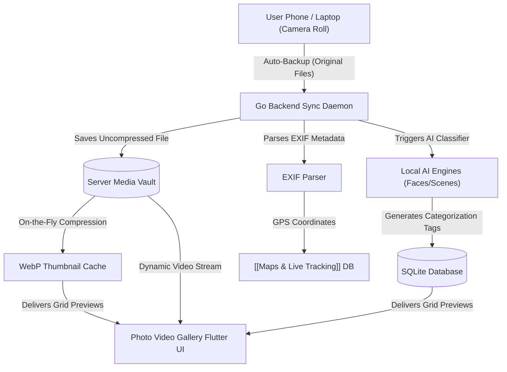

# Photo Video Gallery | Module Documentation

> [!NOTE]
> **Status:** Implemented / Production Live
> **Links:** [[00 - System/Home|Home]] | *Linked Modules: [[Preferences Setting Tab]], [[Obsidian Zen Editor]], [[Maps & Live Tracking]], [[Point Star System]]*

---

## Concept & Vision
The Photo Video Gallery is designed as a self-hosted, private alternative to Google Photos, built to run seamlessly inside the LifeOS ecosystem. Its core objective is to offer a high-performance, fluent, and secure space to store, stream, and catalog all personal media assets without third-party cloud dependencies.

The module is inspired by two key design and performance concepts:
1. **Aves Gallery (Libre Version):** Embraces Aves' layout fluency, gesture-driven media navigation, rich metadata views, and clean, high-performance rendering.
2. **Google Photos Cloud Paradigm (Seamless Streaming):** Enables background media backups from mobile and desktop clients directly to the LifeOS server. The client application streams high-resolution media on demand, eliminating the need to store massive libraries locally on device storage.

### Core Architecture Features
- **Uncompressed Backups:** Retains 100% of the original photo/video files on the server storage without quality loss.
- **On-the-Fly Optimization:** The Go server backend dynamically generates lightweight WebP thumbnails and optimized stream segments for fast previews and lag-free grid scrolling.
- **Server-Side AI Categorization:** An automated background thread parses uploaded assets to run local machine-learning classification:
  - **Facial Clustering:** Groups photos containing similar faces.
  - **Scene & Object Tagging:** Tags landscapes, buildings, documents, and events.
  - **Geographic Mapping:** Extracts EXIF coordinate data to map photo locations on a spatial grid, linking directly with the [[Maps & Live Tracking]] module.

---

## Work Done So Far
- **Aves Libre Replica Viewer:** A 1:1 recreation of the Aves Libre experience with the `aves_repo` vendored as the reference implementation.
- **Viewer Features:** Full-screen viewer, video scrubber, metadata sheet, album list, and cloud view all shipped in the Flutter client.
- **Map & Sharing:** Gallery map view with clustering and async location loading; peer-to-peer share over port 4444.
- **Backup & Scanning:** Backup activity panel plus device scanning via `photo_manager`.
- **Smart Picker:** Deduplication and similarity detection using sha256, dHash, and dominant colors through `/api/v1/gallery`.
- **Local Persistence:** `gallery.db` stores assets; client access goes through `gallery_dao`.

---

## Current Focus & Actions
- **Viewer Polish:** Refining grid smoothness, scrubber behaviour, and metadata rendering across large libraries.
- **Clustering Tuning:** Adjusting map clustering thresholds and async location-loading performance on large media sets.
- **Backup Reliability:** Monitoring the backup activity panel and device scanning pipeline for edge cases (duplicates, interrupted uploads).

---

## Next Steps & Future Roadmap
- **(DONE) Dynamic Geolocation Clustering:** Media assets are mapped onto the gallery map view with clustering, linked to the [[Maps & Live Tracking]] canvas.
- **(DONE) Client Backup Pipeline:** Camera-roll scanning via `photo_manager` and the backup activity panel are live; continuous auto-backup of new additions remains a refinement.
- **Server-Side AI Categorization:** Adding local ML classification (facial clustering, scene/object tagging) to the daemon processing thread.
- **Media Log Embedding:** Allowing the [[Obsidian Zen Editor]] to embed these hosted gallery assets directly into Markdown logs with native streaming previews.

---

## Interaction Flows & Diagrams
*Data pipeline representing media backups, server-side classification, thumbnail caching, and Flutter streaming views.*

```mermaid
graph TD
    %% Input Layer
    UserDevice["User Phone / Laptop (Camera Roll)"] -->|"Auto-Backup (Original Files)"| SyncDaemon["Go Backend Sync Daemon"]
    
    %% Storage & Processing
    SyncDaemon -->|"Saves Uncompressed File"| FileStorage[(Server Media Vault)]
    SyncDaemon -->|"Parses EXIF Metadata"| ExifParser["EXIF Parser"]
    SyncDaemon -->|"Triggers AI Classifier"| LocalAI["Local AI Engines (Faces/Scenes)"]
    
    %% Database Updates
    ExifParser -->|"GPS Coordinates"| MapsDB["[[Maps & Live Tracking]] DB"]
    LocalAI -->|"Generates Categorization Tags"| MetadataDB[(SQLite Database)]
    
    %% Caching Layer
    FileStorage -->|"On-the-Fly Compression"| WebPCache["WebP Thumbnail Cache"]
    
    %% Client Rendering
    WebPCache & MetadataDB -->|"Delivers Grid Previews"| FlutterUI["Photo Video Gallery Flutter UI"]
    FileStorage -->|"Dynamic Video Stream"| FlutterUI
```

## Technical Specs
- [[02 - Technical Specs/Photo Video Gallery/What to Build|What to Build]]
- [[02 - Technical Specs/Photo Video Gallery/How to Build|How to Build]]
- [[02 - Technical Specs/Photo Video Gallery/What to Do|What to Do]]
