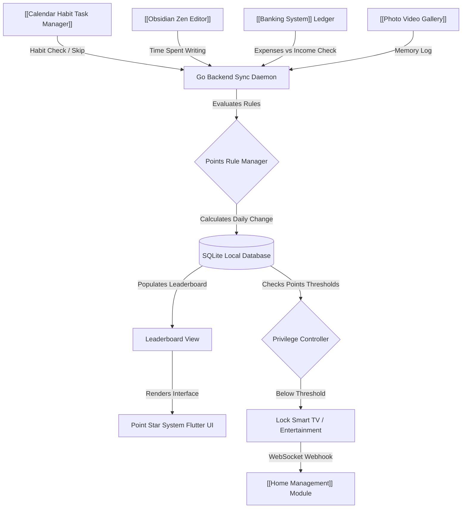

# Point Star System | Module Documentation

> [!NOTE]
> **Status:** Conceptual Phase / Design & Planning Stage
> **Links:** [[00 - System/Home|Home]] | *Linked Modules: [[Calendar Habit Task Manager]], [[Obsidian Zen Editor]], [[Book Library]], [[Banking System]], [[Accounting]], [[Home Management]], [[Flashcards]], [[Music Library]], [[Project Infinity]], [[Knowledge Base]]*

---

## Concept & Vision
The Point Star System is the central gamification engine and behavioral ledger of LifeOS. It is designed to act as the primary feedback loop for daily productivity, financial discipline, study routines, and family coordination. By assigning numerical "Star Points" to activities, the system rewards positive habits while gamifying family decision-making in a lighthearted, engaging way.

### Core Features & Mechanics

1. **Global Module Listeners (Unified Reward Engine):**
   - The Point Star System acts as a central collector, listening to data triggers from all other LifeOS modules:
     - **Habits & Tasks:** Brushing teeth (+1 pt), completing a daily run (+10 pts, -2 pts if skipped), or domestic chores like washing dishes (-points if neglected).
     - **Zen Workspace & Books:** Writing research logs or reading progress triggers points based on time spent and pages read in the [[Book Library]].
     - **Financial Hygiene:** Monitored via the [[Banking System]] and [[Accounting]] ledgers. If monthly expenses exceed income, stars are automatically deducted.
     - **Lifestyle & Mental Health:** Small positive actions like taking photos of good memories in the gallery or logging a walk award points (+1 pt).

2. **Leaderboards & Family Dispute Resolution:**
   - A real-time family leaderboard (e.g. comparing progress with partners or children).
   - Leaderboards can be used to gamify decisions; for instance, the family member with the highest monthly star score gets the final choice of vacation destination.

3. **Voucher Redemption & Access Restrictions:**
   - **Ticket Store:** Stars can be accumulated and redeemed for physical or financial rewards (e.g. 1000 stars = €10 pocket money, or vacation planning tickets).
   - **Dynamic Privileges:** If an individual's behavior metrics fall below specific thresholds, the server can trigger automated webhooks to lock or restrict leisure systems (like smart TV access in [[Home Management]] or custom entertainment streams) until the score is restored.

4. **No-Code Rule configurator:**
   - A user-friendly Flutter dashboard to add new custom tasks, set point rules, configure penalties, and define monthly milestones on the fly without making code changes.

---

## Work Done So Far
- **Behavioral Framework Defined:** Basic points structure, penalty rules, module integrations, and gamification loops defined.
- **Design Philosophy:** Everforest Minimalist Flat-Line UI layout (leaderboard grids, line graphs tracking historical scores, custom voucher card illustrations with 1px border cards) mapped.

---

## Current Focus & Actions
- **Points Evaluation Engine:** Designing Go handlers to receive, process, and check custom point rules from other modules.
- **Unified User Schema:** Modeling database tables in SQLite to link family profile cards, current point balances, active checklists, and historical score streams.

---

## Next Steps & Future Roadmap
- **No-Code Task Rule Builder:** Developing the Flutter interface to add custom points rules dynamically.
- **Automated Privilege Lockouts:** Integrating hooks with [[Home Management]] to toggle device access states dynamically based on leaderboard scores.
- **Voucher Ledger View:** Creating a mock "ticket roll" view in Flutter to display redeemable family vouchers.

---

## Interaction Flows & Diagrams
*Data pipeline illustrating points logging from various tiles, database calculation, leaderboard rendering, and reward triggers.*

## Technical Specs
- [[02 - Technical Specs/Point Star System/What to Build|What to Build]]
- [[02 - Technical Specs/Point Star System/How to Build|How to Build]]
- [[02 - Technical Specs/Point Star System/What to Do|What to Do]]
