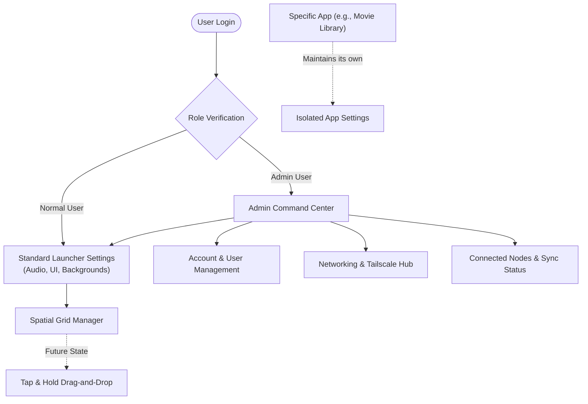

# Preferences Setting Tab | Module Documentation

> [!NOTE]
> **Status:** Concept Defined / Active Development
> **Links:** [[00 - System/Home|Home]] | *Linked Modules: [[YouTube Client]], [[Virtual Machine Management]], [[Dark Web Management]], and all other modules (Global Scope)*

---

## Concept & Vision
The Preferences Setting Tab serves as the central management hub exclusively for the LifeOS **launcher and core framework**, rather than acting as a catch-all for every application module. 

- **Global Launcher Management:** This tab controls global parameters such as the number of active tiles, account management, notification behaviors (sounds, popups), background aesthetics, fluency/graphics settings, and general system audio.
- **Central Networking Hub:** It acts as the command center for networking configurations, specifically managing Tailscale connections, live syncing, and system node status.
- **Decentralized App Settings:** To keep the global preferences clean, individual modules (like the Movie Library or Photo Gallery) will maintain their own isolated sub-menus for module-specific configurations (e.g., sorting filters). The central Preferences Tab will only govern the operating system's global behavior.

---

## Work Done So Far
- **Foundational Settings:** The settings currently handle foundational features such as Tailnet Sync toggles, OLED Deep Black canvas themes, and the basic mapping of the spatial grid layout.
- **Initial Grid Configurator:** A static implementation of the tiling manager currently exists to organize the 3x3 layout.

---

## Current Focus & Actions
- **Backend Stability & Polishing:** The immediate focus is ensuring a flawless, bug-free connection to the backend and resolving any visual anomalies within the settings interface.
- **User Role Implementation:** Establishing a robust User Role architecture:
  - **Normal User:** Standard customization and daily usage.
  - **Admin User:** Exclusive access for system diagnostics, node monitoring, and budget rule configurations.
  - **Child User:** A locked, restricted profile. The Preferences engine broadcasts this status globally to enforce automated, timer-based lockouts, gate the [[YouTube Client]] via Star Points, and hide all VM, SSH, and Torrent controls in the [[Virtual Machine Management]] and [[Dark Web Management]] tiles when active star balances fall below threshold rules.

---

## Next Steps & Future Roadmap
- **Interactive Spatial Tiling Manager:** Evolving the grid configurator from a static menu into a dynamic, visual interface. Users will be able to "tap, hold, and drag" tiles freely across the spatial grid, mirroring the intuitive experience of rearranging apps on a smartphone home screen.
- **Advanced Node Monitoring:** Expanding the networking section to give the Admin real-time visibility into all connected devices and their live-syncing status across the LifeOS network.

---

## Interaction Flows & Diagrams
*Visual model of the Preferences Architecture, User Roles, and Networking Controls.*

## Technical Specs
- [[02 - Technical Specs/Preferences Setting Tab/What to Build|What to Build]]
- [[02 - Technical Specs/Preferences Setting Tab/How to Build|How to Build]]
- [[02 - Technical Specs/Preferences Setting Tab/What to Do|What to Do]]
