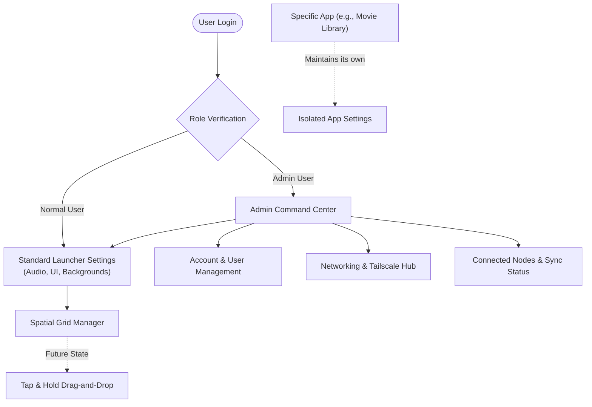

# Preferences Setting Tab | Module Documentation

> [!NOTE]
> **Status:** Implemented / Production Live
> **Links:** [[00 - System/Home|Home]] | *Linked Modules: [[YouTube Client]], [[Virtual Machine Management]], [[Dark Web Management]], and all other modules (Global Scope)*

---

## Concept & Vision
The Preferences Setting Tab serves as the central management hub exclusively for the LifeOS **launcher and core framework**, rather than acting as a catch-all for every application module. 

- **Global Launcher Management:** This tab controls global parameters such as the number of active tiles, account management, notification behaviors (sounds, popups), background aesthetics, fluency/graphics settings, and general system audio.
- **Central Networking Hub:** It acts as the command center for networking configurations, specifically managing Tailscale connections, live syncing, and system node status.
- **Decentralized App Settings:** To keep the global preferences clean, individual modules (like the Movie Library or Photo Gallery) will maintain their own isolated sub-menus for module-specific configurations (e.g., sorting filters). The central Preferences Tab will only govern the operating system's global behavior.

---

## Work Done So Far
- **Configurator Module:** The settings module is live on the spatial grid and includes the grid configurator, my profile, the admin console (family user management), and the online users list.
- **Spatial Matrix Editor:** Rows and columns can be added or dropped directly in the UI, with the home and configurator cells protected from removal.
- **Android Launcher Widget:** A launcher widget surfaces preferences and diagnostics from the home screen.
- **Legacy Settings Plugin:** Provides the OTA update check and system diagnostics path, keeping older settings features available.
- **Backing Services:** Preferences are stored reactively via `PreferencesService` (JSON-reactive store) with `SystemSettings` tables in the database.

---

## Current Focus & Actions
- **Backend Stability & Polishing:** Ensuring flawless, bug-free connectivity to the daemon and resolving any visual anomalies within the settings interface.
- **Role Enforcement Review:** Verifying the Normal / Admin / Child user-role behaviour (child lockouts, gated [[YouTube Client]] via Star Points, hidden VM/SSH/Torrent controls) against current point balances.
- **Grid Editor Ergonomics:** Tuning the matrix editor interaction so tile re-arrangement stays intuitive across devices.

---

## Next Steps & Future Roadmap
- **(DONE) Spatial Matrix Editor:** The grid editor is operational with add/drop row and column support plus protected home/configurator cells; "tap, hold, and drag" free-form tile movement remains the next evolution of this interface.
- **(DONE) User Roles & Admin Console:** Family user management and the online users list are live; deeper diagnostics and budget-rule configuration remain on the roadmap.
- **Advanced Node Monitoring:** Expanding the networking section to give the Admin real-time visibility into all connected devices and their live-syncing status across the LifeOS network.

---

## Interaction Flows & Diagrams
*Visual model of the Preferences Architecture, User Roles, and Networking Controls.*

```mermaid
graph TD
    %% Roles
    User([User Login]) --> RoleCheck{Role Verification}
    RoleCheck -->|Normal User| StandardSettings["Standard Launcher Settings
    (Audio, UI, Backgrounds)"]
    RoleCheck -->|Admin User| AdminSettings["Admin Command Center"]
    
    %% Admin Tools
    AdminSettings --> AccountMgmt["Account & User Management"]
    AdminSettings --> NetHub["Networking & Tailscale Hub"]
    AdminSettings --> LiveNodes["Connected Nodes & Sync Status"]
    AdminSettings --> StandardSettings
    
    %% Grid Manager
    StandardSettings --> GridManager["Spatial Grid Manager"]
    GridManager -.->|Future State| DragDrop["Tap & Hold Drag-and-Drop"]
    
    %% App Delegation
    AppModule["Specific App (e.g., Movie Library)"] -.->|Maintains its own| AppSettings["Isolated App Settings"]
```

## Technical Specs
- [[02 - Technical Specs/Preferences Setting Tab/What to Build|What to Build]]
- [[02 - Technical Specs/Preferences Setting Tab/How to Build|How to Build]]
- [[02 - Technical Specs/Preferences Setting Tab/What to Do|What to Do]]
