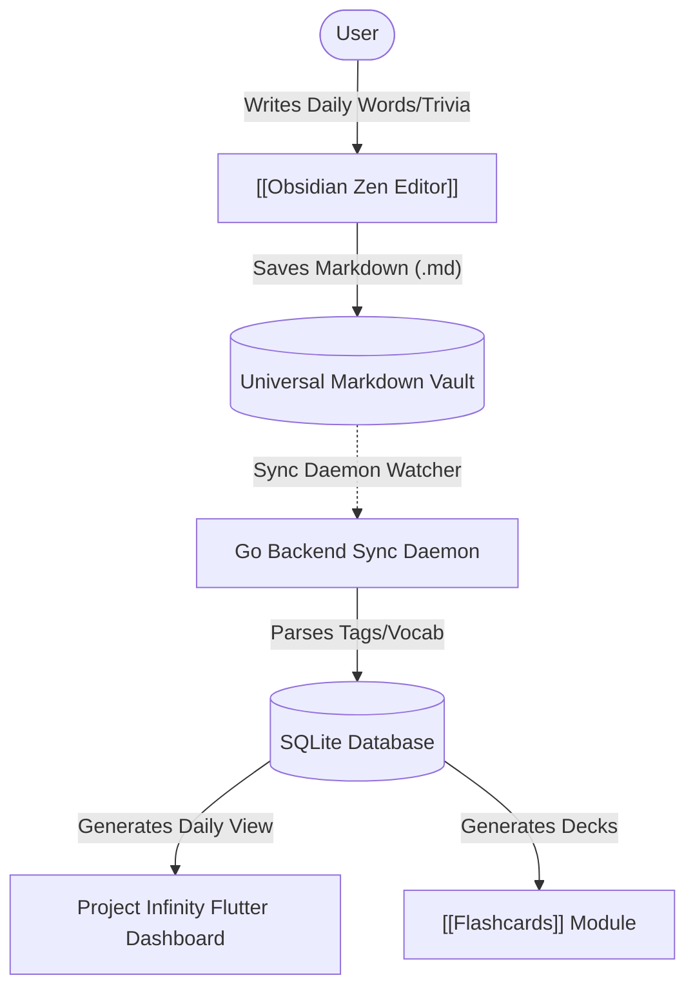

# Project Infinity | Module Documentation

> [!NOTE]
> **Status:** Conceptual Phase / Planning for Implementation
> **Links:** [[Home]] | *Linked Modules: [[Obsidian Zen Editor]], [[Flashcards]], [[Knowledge Base]]*

---

## Concept & Vision
Project Infinity is the dedicated space for daily cognitive learning and vocabulary expansion. Created to run as a collaborative daily ritual, the module automates and tracks a three-part daily learning cycle:
1. **Daily Greek Word:** Selecting one Greek word every day, capturing its exact definition, writing its meaning, and translating it into English.
2. **Unusual English Word:** Sourcing an uncommon or interesting English word and defining it in Greek.
3. **Useless Fact of the Day:** Logging one random, interesting piece of trivia that expands general knowledge.

### Multi-Workspace Integration
Project Infinity acts as a custom view layer feeding directly into the core knowledge engine:
- **Zen Workspace Integration:** Instead of manual configuration inside a standalone screen, users can write these daily entries directly in the [[Obsidian Zen Editor]] using a specific directory layout or tag structure. The system parses these files and populates the Project Infinity dashboard automatically.
- **Dynamic Flashcard Creation:** Every vocabulary word and trivia fact generated inside Project Infinity automatically populates active decks in the [[Flashcards]] module.

---

## Work Done So Far
- **Concept Definition:** The daily three-part learning structure has been established and approved.
- **Workflow Architecture:** Visual integration flow connecting raw Markdown notes in the Zen Editor to automated vocabulary database parsing has been planned.

---

## Current Focus & Actions
- **Data Schemas Design:** Defining structural layouts for custom dictionaries, vocabulary tables, and historical daily logs in the Go daemon.
- **UI Mockups:** Drafting simple Everforest-themed screens to show the "Word of the Day" cards.

---

## Next Steps & Future Roadmap
- **Dictionary API Integrations:** Connecting the Go backend to open-source or custom dictionary APIs for automatic translations and definition retrieval.
- **Interactive Study Space:** Building a dedicated UI slot in Flutter to view past words, review learning statistics, and log daily facts.
- **Vocabulary Export:** Creating features to export custom compiled lists to external formats.

---

## Interaction Flows & Diagrams
*Data flow showing the integration between the Zen Editor, Project Infinity, and Flashcards.*

