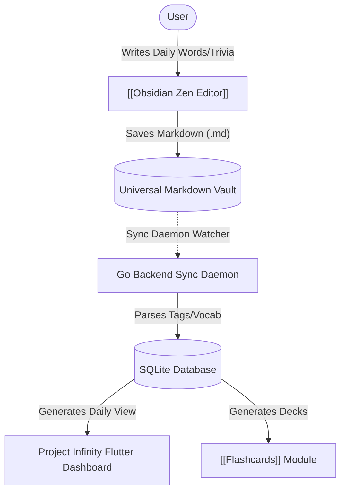

# Project Infinity | Module Documentation

> [!NOTE]
> **Status:** Implemented / Production Live
> **Links:** [[00 - System/Home|Home]] | *Linked Modules: [[Obsidian Zen Editor]], [[Flashcards]], [[Knowledge Base]], [[Point Star System]]*

---

## Concept & Vision
Project Infinity is the dedicated space for daily cognitive learning and vocabulary expansion. Created to run as a collaborative daily ritual, the module automates and tracks a three-part daily learning cycle:
1. **Daily Greek Word:** Selecting one Greek word every day, capturing its exact definition, writing its meaning, and translating it into English.
2. **Unusual English Word:** Sourcing an uncommon or interesting English word and defining it in Greek.
3. **Useless Fact of the Day:** Logging one random, interesting piece of trivia that expands general knowledge.

### Multi-Workspace Integration
Project Infinity acts as a custom view layer feeding directly into the core knowledge engine:
- **Zen Workspace Integration:** Instead of manual configuration inside a standalone screen, users can write these daily entries directly in the [[Obsidian Zen Editor]] using a specific directory layout or tag structure. The system parses these files and populates the Project Infinity dashboard automatically.
- **Dynamic Flashcard Creation:** Every vocabulary word and trivia fact generated inside Project Infinity automatically populates active decks in the [[Flashcards]] module.

---

## Work Done So Far
- **Daily Dashboard:** Flutter dashboard with a word-of-the-day card and a trivia log timeline, styled per the Everforest theme.
- **Seeded Content:** Daily Greek words and daily trivia are seeded in `infinity.db` for ongoing rotation.
- **Daemon API:** `GET /api/v1/infinity/daily` serves the daily word/trivia payload to the client.
- **Client Persistence:** `infinity_dao` exposes the `DailyWords` and `DailyTrivias` tables for history and stats.

---

## Current Focus & Actions
- **Dashboard Polish:** Refining the word-of-the-day card and trivia timeline visuals and empty states.
- **Content Pipeline:** Maintaining the seeded daily word/trivia rotation and preparing richer fact sources.
- **Workspace Integration:** Exploring tighter coupling with the [[Obsidian Zen Editor]] so daily entries written in the vault feed the dashboard automatically.

---

## Next Steps & Future Roadmap
- **(DONE) Interactive Study Space:** The dedicated dashboard slot showing the word of the day, trivia log, and daily history is live in Flutter.
- **Dictionary API Integrations:** Connecting the Go backend to open-source or custom dictionary APIs for automatic translations and definition retrieval.
- **Vocabulary Export:** Creating features to export custom compiled lists to external formats.
- **Zen Workspace Parsing:** Parsing daily entries written in [[Obsidian Zen Editor]] vault files to populate the dashboard automatically.
- **Flashcard Pipeline:** Feeding every vocabulary word and trivia fact into active decks in the [[Flashcards]] module.

---

## Interaction Flows & Diagrams
*Data flow showing the integration between the Zen Editor, Project Infinity, and Flashcards.*

```mermaid
graph TD
    %% User Inputs
    User([User]) -->|"Writes Daily Words/Trivia"| ZenEditor["[[Obsidian Zen Editor]]"]
    
    %% File Processing
    ZenEditor -->|"Saves Markdown (.md)"| MDVault[(Universal Markdown Vault)]
    MDVault -.->|"Sync Daemon Watcher"| SyncDaemon["Go Backend Sync Daemon"]
    
    %% Database Parsing
    SyncDaemon -->|"Parses Tags/Vocab"| LocalDB[(SQLite Database)]
    LocalDB -->|"Generates Daily View"| InfView["Project Infinity Flutter Dashboard"]
    
    %% Flashcard Pipeline
    LocalDB -->|"Generates Decks"| Flashcards["[[Flashcards]] Module"]
```

## Technical Specs
- [[02 - Technical Specs/Project Infinity/What to Build|What to Build]]
- [[02 - Technical Specs/Project Infinity/How to Build|How to Build]]
- [[02 - Technical Specs/Project Infinity/What to Do|What to Do]]
