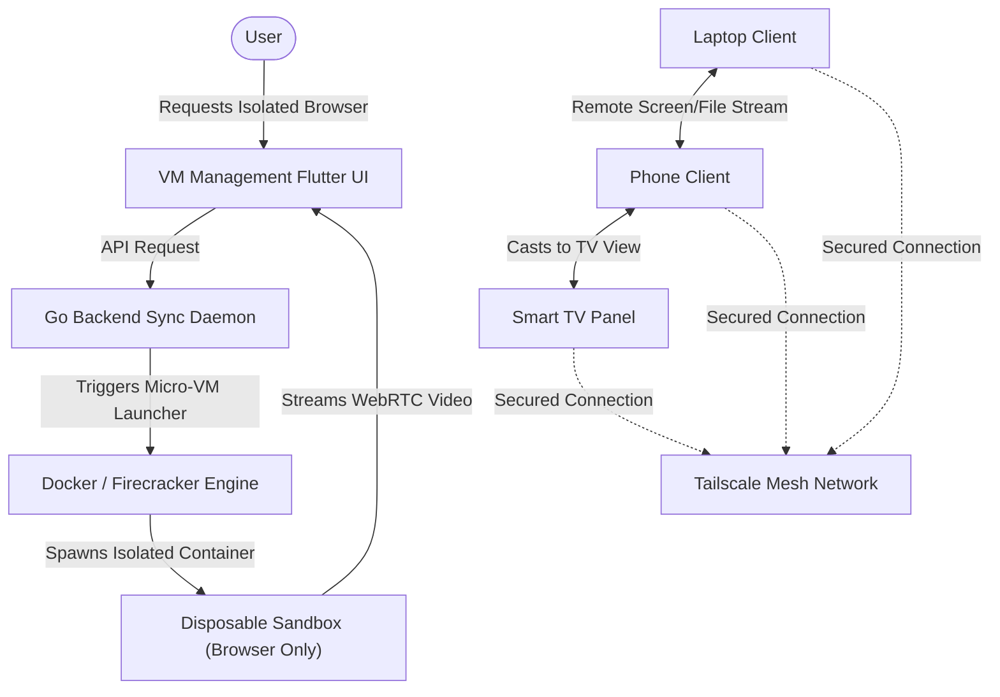

# Virtual Machine Management | Module Documentation

> [!NOTE]
> **Status:** Conceptual Phase / Design Stage
> **Links:** [[Home]] | *Linked Modules: [[Preferences Setting Tab]], [[Cloud & Fake Virtual Machine]], [[Dark Web Management]]*

---

## Concept & Vision
The Virtual Machine Management module controls the virtualization, sandboxing, and device-streaming engine of LifeOS. It manages disposable micro-VMs and containerized workspaces on the server, while providing screen-sharing and folder-structure streaming between interconnected devices on the local Tailscale network.

### Core Architecture Features

1. **Disposable, Isolated Sandboxes (Disposability Engine):**
   - Users can spin up lightweight, single-use virtual environments (using micro-VMs like Firecracker or container sandboxes) directly from the Flutter UI.
   - **Safe Browsing Sessions:** Isolated web browsers that run inside disposable containers, preventing untrusted scripts or dark-web traffic from interacting with the host system.
   - **Categorized Task VMs:** Dedicated, isolated workspaces for specific tasks (such as coding sandboxes, database tests, or studying environments) to ensure clean separation of concerns.

2. **Form-Factor Adaptive Virtualization:**
   - The type of virtualized session adapts automatically to the user's active client:
     - **Mobile Clients:** Spin up virtualized mobile sandboxes (such as Redroid or isolated Android containers) on the server to prevent clunky desktop interfaces on mobile screens.
     - **Desktop Clients:** Spin up lightweight Linux desktop interfaces (VNC/WebRTC-based).

3. **Inter-Device Streaming & Control (Remote Mirroring):**
   - Cross-platform screen streaming between registered nodes (e.g. casting the phone to the TV, or accessing the laptop screen on a tablet).
   - **Remote File System Explorer:** Securely browse, drag, and copy files from a phone's internal storage via the laptop interface when the device is not physically adjacent.

---

## Work Done So Far
- **System Requirements Drafted:** Core isolation protocols, Scrcpy/VNC mirroring adapters, and adaptive layout concepts defined.
- **Design Philosophy:** Everforest Minimalist Flat-Line UI layout (grid of active VM cards, solid outlines, terminal consoles with monochrome text, scale click feedback) mapped.

---

## Current Focus & Actions
- **Docker / Firecracker CLI Integration:** Creating Go command-line wrappers to initialize, monitor, and destroy container sandboxes dynamically on the server.
- **Tailscale Device Discovery:** Formulating connection routines to identify active system nodes and check mirror capabilities.

---

## Next Steps & Future Roadmap
- **Isolated Browser Streaming:** Building WebRTC streams to pipe isolated browser audio and video from the server container directly into the client.
- **Redroid Flutter Client:** Testing Flutter integrations with Android-in-container rendering protocols.
- **Remote File Explorer Adapter:** Implementing file transfer APIs that bypass standard OS sharing menus, routing files through private Tailnet nodes directly.

---

## Interaction Flows & Diagrams
*Visual layout of the disposable sandbox engine and cross-device streaming pathways.*

## Technical Specs
- [[02 - Technical Specs/Virtual Machine Management/What to Build|What to Build]]
- [[02 - Technical Specs/Virtual Machine Management/How to Build|How to Build]]
- [[02 - Technical Specs/Virtual Machine Management/What to Do|What to Do]]
