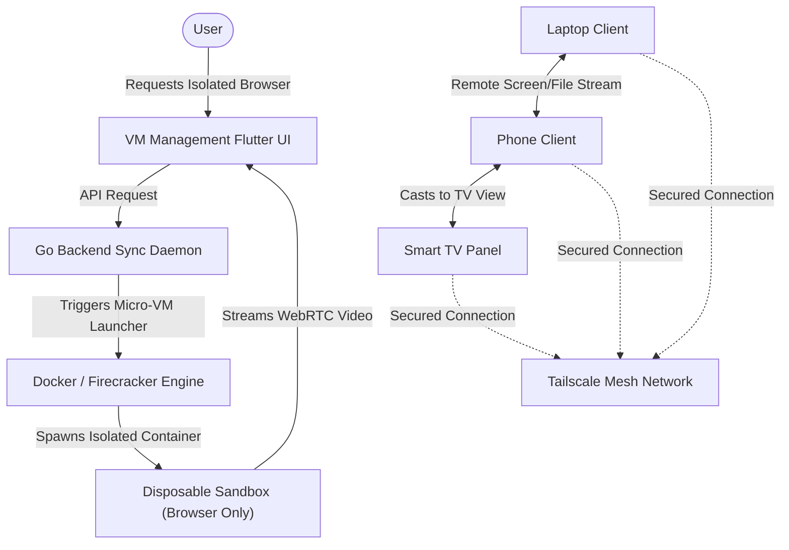

# Virtual Machine Management | Module Documentation

> [!NOTE]
> **Status:** Implemented / Production Live
> **Links:** [[00 - System/Home|Home]] | *Linked Modules: [[Preferences Setting Tab]], [[Cloud & Fake Virtual Machine]], [[Dark Web Management]], [[YouTube Client]]*

---

## Concept & Vision
The Virtual Machine Management module controls the virtualization, sandboxing, and device-streaming engine of LifeOS. It manages disposable micro-VMs and containerized workspaces on the server, while providing screen-sharing and folder-structure streaming between interconnected devices on the local Tailscale network.

### Core Architecture Features

1. **Disposable, Isolated Sandboxes (Disposability Engine):**
   - Users can spin up lightweight, single-use virtual environments (using micro-VMs like Firecracker or container sandboxes) directly from the Flutter UI.
   - **Safe Browsing Sessions:** Isolated web browsers that run inside disposable containers, preventing untrusted scripts or dark-web traffic from interacting with the host system.
   - **Categorized Task VMs:** Dedicated, isolated workspaces for specific tasks (such as coding sandboxes, database tests, or studying environments) to ensure clean separation of concerns.

2. **Form-Factor Adaptive Virtualization:**
   - The type of virtualized session adapts automatically to the user's active client:
     - **Mobile Clients:** Spin up virtualized mobile sandboxes (such as Redroid or isolated Android containers) on the server to prevent clunky desktop interfaces on mobile screens.
     - **Desktop Clients:** Spin up lightweight Linux desktop interfaces (VNC/WebRTC-based).

3. **Inter-Device Streaming & Control (Remote Mirroring):**
   - Cross-platform screen streaming between registered nodes (e.g. casting the phone to the TV, or accessing the laptop screen on a tablet).
   - **Remote File System Explorer:** Securely browse, drag, and copy files from a phone's internal storage via the laptop interface when the device is not physically adjacent.

---

## Work Done So Far
- **VM Dashboard:** Condensed VM cards view in the Flutter client, plus the legacy Hyper-V card and desktop multi-window VM panel for direct machine windows.
- **Remote File Explorer:** Working view into remote filesystem structures across registered machines, backed by the daemon explorer endpoint.
- **Daemon Endpoints:** `/api/v1/vm` (list), `/api/v1/vm/toggle` (power state), `/api/v1/vm/discovery` (network discovery), and `/api/v1/vm/explore` (remote browsing) are live in the Go daemon.
- **Host Utilities:** `wol.go` implements Wake-on-LAN wake signals; `hyperv.go` wraps Hyper-V host management commands.
- **Local Persistence:** `vm.db` is seeded with the known VMs; client access goes through `vm_dao`.

---

## Current Focus & Actions
- **Power-State Reliability:** Polishing toggle/wake flows (WOL retries, discovery refresh) so VMs respond consistently from the dashboard and desktop panels.
- **Explorer Ergonomics:** Improving the remote file explorer navigation and feedback for large directory trees.
- **Sandbox Pipeline Research:** Continuing evaluation of Docker / Firecracker-style CLI wrappers and Tailscale node discovery for future disposable-sandbox sessions.

---

## Next Steps & Future Roadmap
- **(DONE) Remote File Explorer Adapter:** File transfer and browsing routed through private Tailnet nodes is live via `/api/v1/vm/explore` with the in-client explorer view.
- **(DONE) Machine Power Control:** VM listing, toggling, and WOL wake are operational across the dashboard and legacy Hyper-V card.
- **Isolated Browser Streaming:** Building WebRTC streams to pipe isolated browser audio and video from the server container directly into the client.
- **Redroid Flutter Client:** Testing Flutter integrations with Android-in-container rendering protocols.
- **Disposable Sandbox Sessions:** Wiring the Docker / Firecracker engine behind the daemon to spawn isolated, single-use environments on demand.

---

## Interaction Flows & Diagrams
*Visual layout of the disposable sandbox engine and cross-device streaming pathways.*

```mermaid
graph TD
    %% User Action
    User([User]) -->|"Requests Isolated Browser"| FlutterUI["VM Management Flutter UI"]
    
    %% Server Spawning
    FlutterUI -->|"API Request"| GoDaemon["Go Backend Sync Daemon"]
    GoDaemon -->|"Triggers Micro-VM Launcher"| ContainerManager["Docker / Firecracker Engine"]
    ContainerManager -->|"Spawns Isolated Container"| Sandbox["Disposable Sandbox (Browser Only)"]
    
    %% Video Output
    Sandbox -->|"Streams WebRTC Video"| FlutterUI
    
    %% Device Streaming
    Laptop["Laptop Client"] <-->|"Remote Screen/File Stream"| Phone["Phone Client"]
    Phone <-->|"Casts to TV View"| TV["Smart TV Panel"]
    
    %% Networking
    Laptop & Phone & TV -.->|"Secured Connection"| Tailscale["Tailscale Mesh Network"]
```

## Technical Specs
- [[02 - Technical Specs/Virtual Machine Management/What to Build|What to Build]]
- [[02 - Technical Specs/Virtual Machine Management/How to Build|How to Build]]
- [[02 - Technical Specs/Virtual Machine Management/What to Do|What to Do]]
