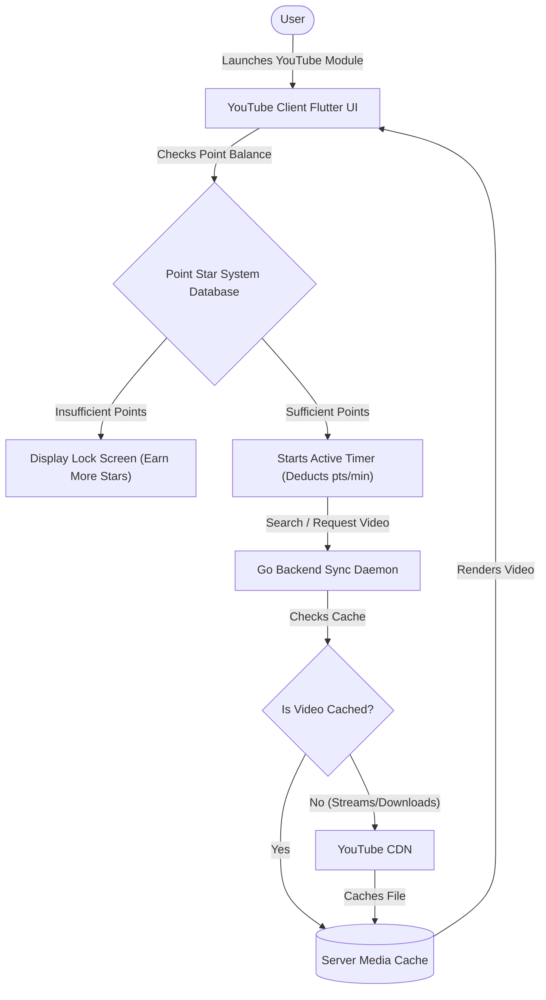

# YouTube Client | Module Documentation

> [!NOTE]
> **Status:** Conceptual Phase / Design Blueprint Under Review
> **Links:** [[Home]] | *Linked Modules: [[Preferences Setting Tab]], [[Point Star System]], [[Virtual Machine Management]]*

---

## Concept & Vision
The YouTube Client (and integrated social media gateway) is designed as a gamified entertainment portal within the LifeOS grid. Rather than acting as a standard ad-free viewer, the module serves as a gated sandbox wrapper for high-consumption apps (YouTube, Instagram, TikTok, and casual games), linking their usage directly to the user's active score in the [[Point Star System]].

### Core Features & Mechanics

1. **Gamified Screen Time Gating (Point Star Integration):**
   - Direct integration with the [[Point Star System]]'s active points ledger.
   - Using entertainment applications is "metered" and costs Star Points (e.g. 30 minutes of YouTube consumption costs 10 Star Points).
   - Users (especially children) must choose whether to spend their points on short-term entertainment or save them for larger real-world vouchers (e.g., gaming systems, vacations).

2. **Sandboxed App Wrapper:**
   - Entertainment feeds and games run nested inside the LifeOS application grid, avoiding standalone app installations on target devices.
   - Enables the system admin to enforce centralized screen time rules, content filtering, and usage tracking.

3. **Server-Side Video Downloader & Cache:**
   - The Go backend can parse and download YouTube streams (via CLI downloaders like yt-dlp) to the server cache.
   - This builds a permanent, ad-free local video repository that can be streamed without consuming external internet bandwidth.

---

## Work Done So Far
- **System Concept Mapped:** Core point-deduction loops, sandboxing parameters, and video caching specifications defined.
- **Design Philosophy:** Everforest Minimalist Flat-Line UI layout (grid of video search results, solid active playback containers, countdown session timer showing point cost, outline warning windows) mapped.

---

## Current Focus & Actions
- **Gated Session Timer:** Designing client-side timers in Flutter that check point balances and trigger lockouts when balances reach zero.
- **Backend Download Daemon:** Researching wrapper scripts in Go to interface with media downloader tools securely.

---

## Next Steps & Future Roadmap
- **ReVanced Engine Analysis:** Investigating the feasibility of forking or wrapping open-source ad-blocking player modules (like ReVanced API protocols) inside the Flutter view.
- **Social Media Sandbox Integration:** Reviewing webview sandboxing libraries to nest web versions of Instagram or TikTok inside safe, tracked mobile app partitions.
- **Device Lockout Automation:** Linking with [[Virtual Machine Management]] to lock child sandbox sessions once daily points limits are exceeded.

---

## Interaction Flows & Diagrams
*Session management, dynamic point deduction, and server-side video downloading loops.*

