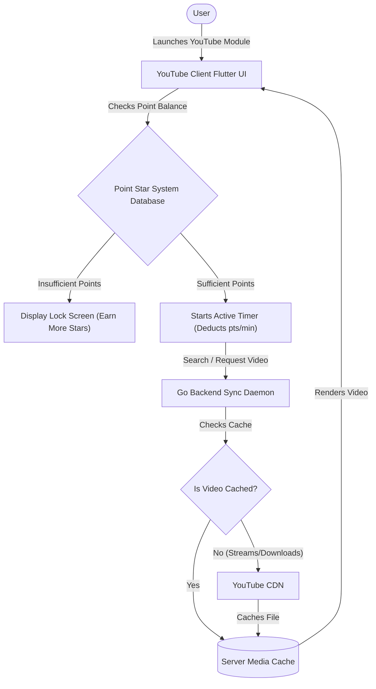

# YouTube Client | Module Documentation

> [!NOTE]
> **Status:** Implemented / Production Live
> **Links:** [[00 - System/Home|Home]] | *Linked Modules: [[Preferences Setting Tab]], [[Point Star System]], [[Virtual Machine Management]], [[Home Screen]]*

---

## Concept & Vision
The YouTube Client (and integrated social media gateway) is designed as a gamified entertainment portal within the LifeOS grid. Rather than acting as a standard ad-free viewer, the module serves as a gated sandbox wrapper for high-consumption apps (YouTube, Instagram, TikTok, and casual games), linking their usage directly to the user's active score in the [[Point Star System]].

### Core Features & Mechanics

1. **Gamified Screen Time Gating (Point Star Integration):**
   - Direct integration with the [[Point Star System]]'s active points ledger.
   - Using entertainment applications is "metered" and costs Star Points (e.g. 30 minutes of YouTube consumption costs 10 Star Points).
   - Users (especially children) must choose whether to spend their points on short-term entertainment or save them for larger real-world vouchers (e.g., gaming systems, vacations).

2. **Sandboxed App Wrapper:**
   - Entertainment feeds and games run nested inside the LifeOS application grid, avoiding standalone app installations on target devices.
   - Enables the system admin to enforce centralized screen time rules, content filtering, and usage tracking.

3. **Server-Side Video Downloader & Cache:**
   - The Go backend can parse and download YouTube streams (via CLI downloaders like yt-dlp) to the server cache.
   - This builds a permanent, ad-free local video repository that can be streamed without consuming external internet bandwidth.

---

## Work Done So Far
- **NewPipe-Bridge Metadata & Search:** Video metadata, search, and stream resolution powered by `newpipe-bridge.jar` served on `127.0.0.1:18785`, lazy-spawned by the Go daemon on first use.
- **Point-Costed Watch Sessions:** Active playback sessions deduct points from the [[Point Star System]] ledger (-10 points per 30 min) through the `POST /api/v1/youtube/sessions` daemon endpoint, wired to the session timer overlay.
- **Player & Downloads UI:** Dedicated player screen and downloaded-videos list shipped in the Flutter client, rendered in the Everforest Minimalist Flat-Line style.
- **Local Persistence:** `youtube.db` holds `videos` and `sessions` tables; client access goes through `youtube_dao`.

---

## Current Focus & Actions
- **Session & Timer Polish:** Refining the active session timer overlay, point-cost accounting, and lockout behaviour when balances reach zero.
- **Stream Resolution Tuning:** Maintaining the NewPipe bridge (spawn, restart, fallback) and downloader cache inside the daemon; offline tuning for cached playback.
- **Deeper Ecosystem Integration:** Continuing to tie playback events into the points ledger and exploring sandboxed webview wrapping for other high-consumption apps.

---

## Next Steps & Future Roadmap
- **(DONE) Gated Session Timer:** Client-side timers that check point balances and trigger lockouts are live; watch sessions deduct 10 points per 30 minutes via `/api/v1/youtube/sessions`.
- **(DONE) Download Pipeline:** Videos are resolved through the NewPipe bridge and listed in the downloaded-videos view with `youtube.db` persistence.
- **ReVanced Engine Analysis:** Investigating the feasibility of forking or wrapping open-source ad-blocking player modules (like ReVanced API protocols) inside the Flutter view.
- **Social Media Sandbox Integration:** Reviewing webview sandboxing libraries to nest web versions of Instagram or TikTok inside safe, tracked mobile app partitions.
- **Device Lockout Automation:** Linking with [[Virtual Machine Management]] to lock child sandbox sessions once daily points limits are exceeded.

---

## Interaction Flows & Diagrams
*Session management, dynamic point deduction, and server-side video downloading loops.*

```mermaid
graph TD
    %% User Requests Launch
    User([User]) -->|"Launches YouTube Module"| FlutterUI["YouTube Client Flutter UI"]
    
    %% Point System Check
    FlutterUI -->|"Checks Point Balance"| PointCheck{"Point Star System Database"}
    PointCheck -->|"Insufficient Points"| LockOut["Display Lock Screen (Earn More Stars)"]
    PointCheck -->|"Sufficient Points"| ActiveSession["Starts Active Timer (Deducts pts/min)"]
    
    %% Playback Pipeline
    ActiveSession -->|"Search / Request Video"| GoDaemon["Go Backend Sync Daemon"]
    GoDaemon -->|"Checks Cache"| VideoCache{Is Video Cached?}
    
    %% Cache Check
    VideoCache -->|"Yes"| LocalFile[(Server Media Cache)]
    VideoCache -->|"No (Streams/Downloads)"| ExternalYT["YouTube CDN"]
    ExternalYT -->|"Caches File"| LocalFile
    
    %% Output
    LocalFile -->|"Renders Video"| FlutterUI
```

## Technical Specs
- [[02 - Technical Specs/YouTube Client/What to Build|What to Build]]
- [[02 - Technical Specs/YouTube Client/How to Build|How to Build]]
- [[02 - Technical Specs/YouTube Client/What to Do|What to Do]]
