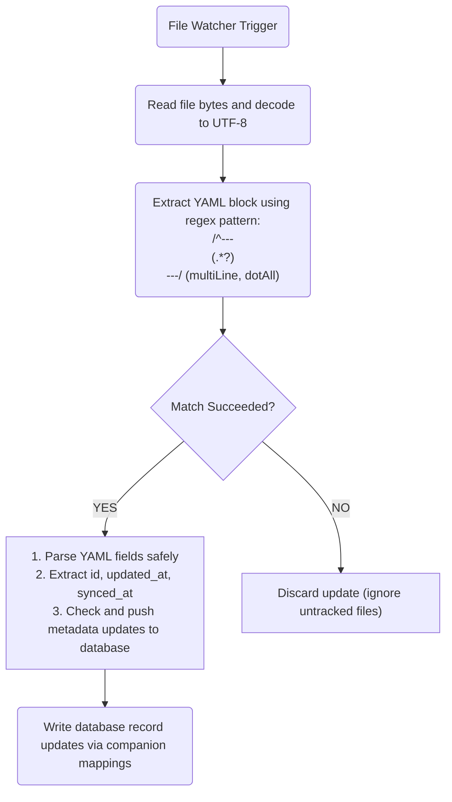

# Technical Specification: Split-Storage & Frontmatter Architecture

> [!NOTE]
> **Home:** [[04 - LifeOS DevDocs/Home|Home]] | **Related:** [[04 - LifeOS DevDocs/SYNC_PROTOCOL|Sync Protocol]] · [[04 - LifeOS DevDocs/EMBEDDED_NETWORK|Embedded Network]] · [[04 - LifeOS DevDocs/Architecture/Data_Binding|Data Binding]] · [[04 - LifeOS DevDocs/Schemas/Database_Specs|Database Specs]]


This document defines the physical data caching schema for the SQLite engine running on client runtimes (via Drift/Moor bindings) and specifies the structural formatting, cleaning, and parsing constraints for Markdown notes synced directly with the local Obsidian Vault.

---

## 1. SQLite Relational Schema Design

To ensure optimal performance on mobile (Android ARM64) and desktop (Windows x86_64), structured metrics are cached locally inside a reactive SQLite database. State propagation is managed using an offline-first strategy. 

### Mandatory State Tracking Fields
While Drift-managed relational tables inside the cache engine (such as `life_entities`) implement the full set of synchronization fields, custom SQL tables (such as `habits`, `notes`, and `NotesIndex`) utilize a simplified state tracking approach relying primarily on `is_dirty` flags and local timestamps.

#### Drift-Managed Synchronization Fields:
*   `id`: `TEXT` (UUID v4 string), Primary Key.
*   `created_at`: `INTEGER` (Unix epoch milliseconds), immutable creation timestamp.
*   `updated_at`: `INTEGER` (Unix epoch milliseconds), mutated upon local modification.
*   `synced_at`: `INTEGER` (Unix epoch milliseconds), tracks upstream synchronization receipt. MUST be `NULL` if local modifications are unsynced (dirty state).
*   `is_deleted`: `INTEGER` (boolean flag `0` or `1`), tracks soft deletion state to preserve local delete logs for upstream relay.

---

### Table Specifications

```sql
-- SQLite Table Definition: life_entities (Drift Managed)
CREATE TABLE life_entities (
    id TEXT PRIMARY KEY NOT NULL,
    title TEXT NOT NULL,
    description TEXT,
    created_at INTEGER NOT NULL,
    updated_at INTEGER NOT NULL,
    synced_at INTEGER,
    is_deleted INTEGER NOT NULL DEFAULT 0
);

-- SQLite Table Definition: sync_queue (Drift Managed)
CREATE TABLE sync_queue (
    id TEXT PRIMARY KEY NOT NULL,
    target_table TEXT NOT NULL,
    record_id TEXT NOT NULL,
    field_name TEXT NOT NULL,
    old_value TEXT,
    new_value TEXT,
    client_updated_at INTEGER NOT NULL,
    synced_state INTEGER NOT NULL DEFAULT 0
);

-- SQLite Table Definition: markdown_notes (Drift Managed)
CREATE TABLE markdown_notes (
    id TEXT PRIMARY KEY,
    file_path TEXT NOT NULL UNIQUE,
    frontmatter_json TEXT, -- JSON map of metadata tags
    last_modified INTEGER NOT NULL,
    hash TEXT NOT NULL,
    is_dirty INTEGER DEFAULT 0
);

-- SQLite Table Definition: habits (Raw Custom SQL)
CREATE TABLE habits (
    id TEXT PRIMARY KEY NOT NULL,
    name TEXT,
    streak INTEGER DEFAULT 0,
    done INTEGER DEFAULT 0,
    is_dirty INTEGER DEFAULT 0
);

-- SQLite Table Definition: notes_index (Drift Managed)
CREATE TABLE notes_index (
    id TEXT PRIMARY KEY,
    word_count INTEGER DEFAULT 0,
    references_list TEXT, -- COMMA separated links IDs
    is_dirty INTEGER DEFAULT 0,
    FOREIGN KEY(id) REFERENCES markdown_notes(id) ON DELETE CASCADE
);
-- SQLite Table Definition: books
CREATE TABLE books (
    id TEXT PRIMARY KEY,
    title TEXT NOT NULL,
    author TEXT,
    current_page INTEGER DEFAULT 0,
    total_pages INTEGER DEFAULT 0,
    file_path TEXT NOT NULL,
    updated_at INTEGER NOT NULL,
    is_dirty INTEGER DEFAULT 0
);

-- SQLite Table Definition: audiobooks
CREATE TABLE audiobooks (
    id TEXT PRIMARY KEY,
    book_id TEXT NOT NULL,
    file_path TEXT NOT NULL,
    duration_seconds INTEGER DEFAULT 0,
    current_seconds INTEGER DEFAULT 0,
    updated_at INTEGER NOT NULL,
    is_dirty INTEGER DEFAULT 0,
    FOREIGN KEY(book_id) REFERENCES books(id) ON DELETE CASCADE
);

-- SQLite Table Definition: reading_progress
CREATE TABLE reading_progress (
    book_id TEXT PRIMARY KEY,
    page INTEGER DEFAULT 0,
    seconds INTEGER DEFAULT 0,
    updated_at INTEGER NOT NULL,
    synced_at INTEGER,
    FOREIGN KEY(book_id) REFERENCES books(id) ON DELETE CASCADE
);

-- SQLite Table Definition: book_highlights
CREATE TABLE book_highlights (
    id TEXT PRIMARY KEY,
    book_id TEXT NOT NULL,
    text_content TEXT NOT NULL,
    note_content TEXT,
    page_number INTEGER,
    created_at INTEGER NOT NULL,
    is_dirty INTEGER DEFAULT 0,
    FOREIGN KEY(book_id) REFERENCES books(id) ON DELETE CASCADE
);
-- SQLite Table Definition: calendar_events
CREATE TABLE calendar_events (
    id TEXT PRIMARY KEY,
    title TEXT NOT NULL,
    start_time INTEGER NOT NULL,
    end_time INTEGER NOT NULL,
    color_code TEXT DEFAULT '#89B4FA',
    is_shared INTEGER DEFAULT 0,
    updated_at INTEGER NOT NULL,
    is_dirty INTEGER DEFAULT 0
);

-- SQLite Table Definition: user_tasks
CREATE TABLE user_tasks (
    id TEXT PRIMARY KEY,
    title TEXT NOT NULL,
    notes TEXT,
    priority INTEGER DEFAULT 1,
    status TEXT DEFAULT 'TODO',
    attribute TEXT,           -- (e.g. 'stamina', 'intelligence', 'focus')
    base_xp INTEGER DEFAULT 10,
    due_date INTEGER,
    completed_at INTEGER,
    updated_at INTEGER NOT NULL,
    is_dirty INTEGER DEFAULT 0
);

-- SQLite Table Definition: user_habits
CREATE TABLE user_habits (
    id TEXT PRIMARY KEY,
    name TEXT NOT NULL,
    frequency_cron TEXT NOT NULL,
    target_streak INTEGER DEFAULT 0,
    attribute TEXT,           -- (e.g. 'stamina', 'intelligence', 'focus')
    base_xp INTEGER DEFAULT 10,
    updated_at INTEGER NOT NULL,
    is_dirty INTEGER DEFAULT 0
);

-- SQLite Table Definition: habit_logs
CREATE TABLE habit_logs (
    id TEXT PRIMARY KEY,
    habit_id TEXT NOT NULL,
    checkin_date INTEGER NOT NULL,
    points_awarded INTEGER NOT NULL,
    is_dirty INTEGER DEFAULT 0,
    FOREIGN KEY(habit_id) REFERENCES user_habits(id) ON DELETE CASCADE
);
-- Schema for Device Backups
CREATE TABLE IF NOT EXISTS device_backups (
    id TEXT PRIMARY KEY,
    name TEXT NOT NULL,                -- e.g. 'Laptop-Panos'
    last_backup INTEGER NOT NULL,      -- Unix millisecond timestamp
    storage_path TEXT NOT NULL,        -- Relative local server backup path
    backup_status TEXT NOT NULL,       -- 'PENDING', 'ACTIVE', 'COMPLETED', 'FAILED'
    updated_at INTEGER NOT NULL,
    is_dirty INTEGER DEFAULT 0
);

-- Schema for Backup History Logs
CREATE TABLE IF NOT EXISTS backup_logs (
    log_id TEXT PRIMARY KEY,
    device_id TEXT NOT NULL,
    timestamp INTEGER NOT NULL,        -- Unix millisecond timestamp
    files_count INTEGER NOT NULL,
    bytes_transferred INTEGER NOT NULL,
    is_dirty INTEGER DEFAULT 0,
    FOREIGN KEY(device_id) REFERENCES device_backups(id) ON DELETE CASCADE
);

-- Schema for Quarantine Uploads
CREATE TABLE IF NOT EXISTS upload_quarantine (
    file_id TEXT PRIMARY KEY,
    file_name TEXT NOT NULL,
    file_size INTEGER NOT NULL,
    scan_status TEXT DEFAULT 'PENDING', -- 'PENDING', 'CLEAN', 'INFECTED'
    created_at INTEGER NOT NULL,
    is_dirty INTEGER DEFAULT 0
);
-- Schema for Torrent Catalog
CREATE TABLE IF NOT EXISTS torrents (
    id TEXT PRIMARY KEY,
    info_hash TEXT NOT NULL UNIQUE,
    name TEXT NOT NULL,
    size_bytes INTEGER NOT NULL,
    progress REAL DEFAULT 0.0,
    download_speed INTEGER DEFAULT 0,
    upload_speed INTEGER DEFAULT 0,
    status TEXT NOT NULL,
    updated_at INTEGER NOT NULL,
    is_dirty INTEGER DEFAULT 0
);

-- Schema for Torrent Active Peers
CREATE TABLE IF NOT EXISTS torrent_peers (
    id TEXT PRIMARY KEY,
    torrent_id TEXT NOT NULL,
    client_ip TEXT NOT NULL,
    bytes_exchanged INTEGER DEFAULT 0,
    is_dirty INTEGER DEFAULT 0,
    FOREIGN KEY(torrent_id) REFERENCES torrents(id) ON DELETE CASCADE
);

-- Schema for Shared and Quarantined Files
CREATE TABLE IF NOT EXISTS shared_files (
    id TEXT PRIMARY KEY,
    file_path TEXT NOT NULL,
    name TEXT NOT NULL,
    size_bytes INTEGER NOT NULL,
    status TEXT DEFAULT 'PENDING', -- 'PENDING', 'CLEAN', 'INFECTED'
    updated_at INTEGER NOT NULL,
    is_dirty INTEGER DEFAULT 0
);
-- Schema for Flashcard Decks
CREATE TABLE IF NOT EXISTS flashcard_decks (
    id TEXT PRIMARY KEY,
    name TEXT NOT NULL,
    created_at INTEGER NOT NULL,
    is_dirty INTEGER DEFAULT 0
);

-- Schema for Flashcards Items
CREATE TABLE IF NOT EXISTS flashcards (
    id TEXT PRIMARY KEY,
    deck_id TEXT NOT NULL,
    question TEXT NOT NULL,
    answer TEXT NOT NULL,
    interval_days INTEGER DEFAULT 0,
    repetitions INTEGER DEFAULT 0,
    ease_factor REAL DEFAULT 2.5,
    next_review INTEGER NOT NULL, -- Unix timestamp
    created_at INTEGER NOT NULL,
    is_dirty INTEGER DEFAULT 0,
    FOREIGN KEY(deck_id) REFERENCES flashcard_decks(id) ON DELETE CASCADE
);

-- Schema for Flashcard Review Logs
CREATE TABLE IF NOT EXISTS flashcard_reviews (
    id TEXT PRIMARY KEY,
    card_id TEXT NOT NULL,
    timestamp INTEGER NOT NULL,
    quality INTEGER NOT NULL, -- 0-5 user rating
    is_dirty INTEGER DEFAULT 0,
    FOREIGN KEY(card_id) REFERENCES flashcards(id) ON DELETE CASCADE
);
-- Schema for Smart Devices Registry
CREATE TABLE IF NOT EXISTS smart_devices (
    id TEXT PRIMARY KEY,
    name TEXT NOT NULL,
    type TEXT NOT NULL, -- 'LIGHT', 'SWITCH', 'THERMOSTAT', 'APPLIANCE'
    state TEXT NOT NULL, -- 'ON', 'OFF', 'UNKNOWN'
    room TEXT,
    last_updated INTEGER NOT NULL,
    is_dirty INTEGER DEFAULT 0
);

-- Schema for Environment Logs
CREATE TABLE IF NOT EXISTS environment_logs (
    id TEXT PRIMARY KEY,
    sensor_id TEXT NOT NULL,
    temperature REAL,
    humidity REAL,
    timestamp INTEGER NOT NULL,
    is_dirty INTEGER DEFAULT 0
);

-- Schema for Device Schedules
CREATE TABLE IF NOT EXISTS device_schedules (
    id TEXT PRIMARY KEY,
    device_id TEXT NOT NULL,
    action TEXT NOT NULL, -- 'TURN_ON', 'TURN_OFF'
    cron_expression TEXT NOT NULL,
    is_dirty INTEGER DEFAULT 0,
    FOREIGN KEY(device_id) REFERENCES smart_devices(id) ON DELETE CASCADE
);
-- Schema for System User Credentials
CREATE TABLE IF NOT EXISTS system_user (
    id TEXT PRIMARY KEY,
    username TEXT NOT NULL,
    password_hash TEXT NOT NULL,
    is_locked INTEGER DEFAULT 1,
    failed_attempts INTEGER DEFAULT 0,
    updated_at INTEGER NOT NULL,
    is_dirty INTEGER DEFAULT 0
);

-- Schema for System Notifications Feed
CREATE TABLE IF NOT EXISTS local_notifications (
    id TEXT PRIMARY KEY,
    title TEXT NOT NULL,
    message TEXT NOT NULL,
    category TEXT NOT NULL, -- 'SYSTEM', 'HABIT', 'SECURITY', 'FINANCIAL'
    read_at INTEGER, -- Timestamp or NULL
    created_at INTEGER NOT NULL,
    is_dirty INTEGER DEFAULT 0
);
-- Schema for Knowledge Topics
CREATE TABLE IF NOT EXISTS knowledge_topics (
    id TEXT PRIMARY KEY,
    title TEXT NOT NULL,
    category TEXT NOT NULL, -- 'TECH', 'SCIENCE', 'PHILOSOPHY', 'HISTORY'
    status TEXT NOT NULL, -- 'LEARNING', 'COMPLETED', 'BACKLOG'
    note_path TEXT NOT NULL UNIQUE,
    last_studied INTEGER NOT NULL, -- Unix timestamp
    is_dirty INTEGER DEFAULT 0
);

-- Schema for Topics Relationships
CREATE TABLE IF NOT EXISTS knowledge_relationships (
    id TEXT PRIMARY KEY,
    source_id TEXT NOT NULL,
    target_id TEXT NOT NULL,
    relation_type TEXT NOT NULL, -- 'REQUIRES', 'EXPANDS', 'CONTRADICTS'
    is_dirty INTEGER DEFAULT 0,
    FOREIGN KEY(source_id) REFERENCES knowledge_topics(id) ON DELETE CASCADE,
    FOREIGN KEY(target_id) REFERENCES knowledge_topics(id) ON DELETE CASCADE
);
-- Schema for Geofencing Regions
CREATE TABLE IF NOT EXISTS geofences (
    id TEXT PRIMARY KEY,
    name TEXT NOT NULL,
    latitude REAL NOT NULL,
    longitude REAL NOT NULL,
    radius REAL NOT NULL, -- radius in meters
    is_active INTEGER DEFAULT 1,
    updated_at INTEGER NOT NULL,
    is_dirty INTEGER DEFAULT 0
);

-- Schema for Telemetry Coordinates Logs
CREATE TABLE IF NOT EXISTS location_logs (
    id TEXT PRIMARY KEY,
    device_id TEXT NOT NULL,
    latitude REAL NOT NULL,
    longitude REAL NOT NULL,
    velocity REAL,
    altitude REAL,
    timestamp INTEGER NOT NULL,
    is_dirty INTEGER DEFAULT 0
);

-- Schema for Private Bookmarked Coordinates
CREATE TABLE IF NOT EXISTS bookmarks (
    id TEXT PRIMARY KEY,
    title TEXT NOT NULL,
    description TEXT,
    latitude REAL NOT NULL,
    longitude REAL NOT NULL,
    created_at INTEGER NOT NULL,
    is_dirty INTEGER DEFAULT 0
);

-- Schema for Movies Metadata Catalog
CREATE TABLE IF NOT EXISTS movies (
    id TEXT PRIMARY KEY,
    title TEXT NOT NULL,
    imdb_id TEXT,
    cover_path TEXT,
    file_path TEXT NOT NULL,
    status TEXT NOT NULL, -- 'AVAILABLE', 'DOWNLOADING', 'WATCHED'
    updated_at INTEGER NOT NULL,
    is_dirty INTEGER DEFAULT 0
);

-- Schema for Watchlist Queues
CREATE TABLE IF NOT EXISTS movie_watchlist (
    id TEXT PRIMARY KEY,
    movie_id TEXT NOT NULL,
    added_at INTEGER NOT NULL,
    priority INTEGER DEFAULT 0,
    is_dirty INTEGER DEFAULT 0,
    FOREIGN KEY(movie_id) REFERENCES movies(id) ON DELETE CASCADE
);

-- Schema for Personal Movie Reviews
CREATE TABLE IF NOT EXISTS movie_reviews (
    id TEXT PRIMARY KEY,
    movie_id TEXT NOT NULL,
    rating REAL DEFAULT 0.0,
    comment TEXT,
    is_dirty INTEGER DEFAULT 0,
    FOREIGN KEY(movie_id) REFERENCES movies(id) ON DELETE CASCADE
);

-- Schema for Music Tracks Metadata
CREATE TABLE IF NOT EXISTS music_tracks (
    id TEXT PRIMARY KEY,
    title TEXT NOT NULL,
    artist TEXT,
    album TEXT,
    track_number INTEGER,
    file_path TEXT NOT NULL,
    lyrics_path TEXT,
    updated_at INTEGER NOT NULL,
    is_dirty INTEGER DEFAULT 0
);

-- Schema for Music Playlists
CREATE TABLE IF NOT EXISTS playlists (
    id TEXT PRIMARY KEY,
    name TEXT NOT NULL,
    created_at INTEGER NOT NULL,
    is_dirty INTEGER DEFAULT 0
);

-- Schema for Playlist Tracks Reference
CREATE TABLE IF NOT EXISTS playlist_tracks (
    id TEXT PRIMARY KEY,
    playlist_id TEXT NOT NULL,
    track_id TEXT NOT NULL,
    is_dirty INTEGER DEFAULT 0,
    FOREIGN KEY(playlist_id) REFERENCES playlists(id) ON DELETE CASCADE,
    FOREIGN KEY(track_id) REFERENCES music_tracks(id) ON DELETE CASCADE
);

-- Schema for Markdown Notes Inventory
CREATE TABLE IF NOT EXISTS markdown_notes (
    id TEXT PRIMARY KEY,
    file_path TEXT NOT NULL UNIQUE,
    frontmatter_json TEXT,
    last_modified INTEGER NOT NULL,
    hash TEXT NOT NULL,
    is_dirty INTEGER DEFAULT 0
);

-- Schema for Notes Graph Index
CREATE TABLE IF NOT EXISTS notes_index (
    id TEXT PRIMARY KEY,
    word_count INTEGER DEFAULT 0,
    references_list TEXT,
    is_dirty INTEGER DEFAULT 0,
    FOREIGN KEY(id) REFERENCES markdown_notes(id) ON DELETE CASCADE
);

-- Schema for Media Assets Inventory
CREATE TABLE IF NOT EXISTS media_assets (
    id TEXT PRIMARY KEY,
    filename TEXT NOT NULL,
    file_path TEXT NOT NULL UNIQUE,
    file_size INTEGER NOT NULL,
    file_type TEXT NOT NULL,
    latitude REAL,
    longitude REAL,
    capture_time INTEGER NOT NULL,
    scan_status TEXT DEFAULT 'PENDING',
    updated_at INTEGER NOT NULL,
    is_dirty INTEGER DEFAULT 0
);

-- Schema for Assets Categories Tags
CREATE TABLE IF NOT EXISTS media_tags (
    id TEXT PRIMARY KEY,
    asset_id TEXT NOT NULL,
    tag_name TEXT NOT NULL,
    tag_type TEXT NOT NULL,
    confidence REAL DEFAULT 1.0,
    is_dirty INTEGER DEFAULT 0,
    FOREIGN KEY(asset_id) REFERENCES media_assets(id) ON DELETE CASCADE
);

-- Schema for Users Points Registry
CREATE TABLE IF NOT EXISTS system_users (
    id TEXT PRIMARY KEY,
    username TEXT NOT NULL,
    current_points INTEGER DEFAULT 0,
    updated_at INTEGER NOT NULL,
    is_dirty INTEGER DEFAULT 0
);

-- Schema for Points Rules Configuration
CREATE TABLE IF NOT EXISTS point_rules (
    id TEXT PRIMARY KEY,
    name TEXT NOT NULL,
    module TEXT NOT NULL,
    points_value INTEGER NOT NULL,
    is_dirty INTEGER DEFAULT 0
);

-- Schema for Points Ledger Logs
CREATE TABLE IF NOT EXISTS points_ledger (
    id TEXT PRIMARY KEY,
    user_id TEXT NOT NULL,
    event TEXT NOT NULL,
    points INTEGER NOT NULL,
    timestamp INTEGER NOT NULL,
    is_dirty INTEGER DEFAULT 0,
    FOREIGN KEY(user_id) REFERENCES system_users(id) ON DELETE CASCADE
);

-- Schema for Redeemable Vouchers Store
CREATE TABLE IF NOT EXISTS vouchers (
    id TEXT PRIMARY KEY,
    title TEXT NOT NULL,
    cost_points INTEGER NOT NULL,
    is_redeemed INTEGER DEFAULT 0,
    redeemed_by TEXT,
    is_dirty INTEGER DEFAULT 0
);

-- Schema for System Settings Key-Values
CREATE TABLE IF NOT EXISTS system_settings (
    key TEXT PRIMARY KEY,
    value TEXT NOT NULL,
    updated_at INTEGER NOT NULL,
    is_dirty INTEGER DEFAULT 0
);

-- Schema for System User Profiles
CREATE TABLE IF NOT EXISTS user_profiles (
    id TEXT PRIMARY KEY,
    username TEXT NOT NULL,
    role TEXT NOT NULL,
    daily_limit INTEGER DEFAULT 0,
    updated_at INTEGER NOT NULL,
    is_dirty INTEGER DEFAULT 0
);

-- Schema for Daily Vocabulary Words
CREATE TABLE IF NOT EXISTS daily_words (
    id TEXT PRIMARY KEY,
    greek_word TEXT NOT NULL,
    english_translation TEXT NOT NULL,
    greek_definition TEXT,
    english_definition TEXT,
    created_at INTEGER NOT NULL,
    updated_at INTEGER NOT NULL,
    is_dirty INTEGER DEFAULT 0
);

-- Schema for Daily Trivia Facts
CREATE TABLE IF NOT EXISTS daily_trivia (
    id TEXT PRIMARY KEY,
    fact_text TEXT NOT NULL,
    source_url TEXT,
    created_at INTEGER NOT NULL,
    is_dirty INTEGER DEFAULT 0
);

-- Schema for Virtual Machines List
CREATE TABLE IF NOT EXISTS virtual_machines (
    id TEXT PRIMARY KEY,
    name TEXT NOT NULL,
    type TEXT NOT NULL,
    state TEXT NOT NULL,
    cpu_limit INTEGER DEFAULT 1,
    ram_limit INTEGER DEFAULT 512,
    updated_at INTEGER NOT NULL,
    is_dirty INTEGER DEFAULT 0
);

-- Schema for Remote Streaming Sessions
CREATE TABLE IF NOT EXISTS remote_sessions (
    id TEXT PRIMARY KEY,
    host_device TEXT NOT NULL,
    client_device TEXT NOT NULL,
    stream_port INTEGER NOT NULL,
    is_active INTEGER DEFAULT 1,
    is_active INTEGER DEFAULT 1,
    is_dirty INTEGER DEFAULT 0
);

-- Schema for Screen Time Sessions Logs
CREATE TABLE IF NOT EXISTS youtube_sessions (
    id TEXT PRIMARY KEY,
    user_id TEXT NOT NULL,
    start_time INTEGER NOT NULL,
    duration_seconds INTEGER DEFAULT 0,
    cost_points INTEGER DEFAULT 0,
    is_dirty INTEGER DEFAULT 0
);

-- Schema for Downloaded Offline Videos
CREATE TABLE IF NOT EXISTS youtube_downloads (
    id TEXT PRIMARY KEY,
    video_id TEXT NOT NULL UNIQUE,
    title TEXT NOT NULL,
    file_path TEXT NOT NULL,
    size_bytes INTEGER NOT NULL,
    created_at INTEGER NOT NULL,
    is_dirty INTEGER DEFAULT 0
);
```

---

## 2. Obsidian YAML Frontmatter Architecture

Unstructured text assets and daily reflection logs reside inside a designated local Obsidian Vault. The app listens to directory updates via file watchers, automatically parsing and updating notes metadata via YAML frontmatter blocks.

### Rigid Frontmatter YAML Structure
Obsidian note files must begin with a valid, clean YAML block demarcated by triple dashes (`---`). No trailing spaces are permitted after the dashes.

```yaml
---
id: "4a6d71b3-4fe8-4447-b50a-e24c6e93149d"
updated_at: 1779951600000
synced_at: 1779951600000
---
# Note Title
Note markdown content begins here...
```

### Properties Definition Matrix

| Property Name | Data Type  | Allowed Values / Formats             | Description                                                   |
|:--------------|:-----------|:------------------------------------|:--------------------------------------------------------------|
| `id`          | String     | UUID v4 format (`^[0-9a-f]{8}-...`)  | Unique identifier linking the note to local/remote sync state |
| `updated_at`  | Integer    | Unix epoch milliseconds             | Tracks structural changes to prevent race conditions on write  |
| `synced_at`   | Integer    | Unix epoch milliseconds / null      | Denotes when the note was last successfully synced upstream    |

---

## 3. Obsidian Note Parsing and Cleaning Logic

When a file system change is detected by the directory watcher, the client engine MUST execute the following pipeline to read/write notes without corrupting Markdown bodies.



### Parsing Specifications

1.  **YAML Block Delimiter Integrity:** The regex parsing engine looks for standard `---` boundaries at the start of note files.
2.  **Property Parser Regex Patterns:**
    - `id` pattern: `id:\s*(.+)`
    - `updated_at` pattern: `updated_at:\s*(\d+)`
    - `synced_at` pattern: `synced_at:\s*(\d+)`
3.  **Frontmatter Cleaning Constraints:**
    *   No empty lines are allowed inside the frontmatter block.
    *   All YAML block updates must preserve the unmodified markdown body exactly, ensuring a single empty line separates the terminating `---` and the first header of the markdown text.

## 4. Star Points Integration Hooks

The database supports arbitrary gamification hooks across its models. Current rewarding rules include:
- `+5 points`: When a `UserHabits` row toggles `is_completed` to true.
- `+10 points`: When a `CalendarEvents` meeting is attended.
- `+2 points`: When an `EnvironmentLogs` telemetry sync succeeds.
- `+5 points`: When a `KnowledgeTopics` row toggles `status` to `COMPLETED`.
- `+2 points`: When a `Bookmarks` or `LocationLogs` custom track is logged.
- `+5 points`: When a `MovieReviews` detailed review is saved.
- `+2 points`: When completing lyrics translation study checks.
- `+5 points`: For every hour of active note editing in Obsidian Zen Editor.
- `+1 point`: For every 5 uploaded media assets in Photo Video Gallery.
- `+1 point`: For reviewing daily Project Infinity vocabulary words.
- `+2 points`: For completing Project Infinity daily trivia entry notes.
- `-10 points`: Deducted for every 30 minutes of YouTube video consumption.

### Server-Authoritative LWW Sync Rules
For Point Star System transactions, conflicts regarding user balance totals must be resolved using Server-Authoritative Last-Write-Wins (LWW). Specifically, the backend daemon is the ultimate source of truth for the ledger. Any client `is_dirty = 1` updates are queued as ledger deltas (e.g., `event: "habit_run", points: +10`), and the central server calculates the definitive `current_points` state during reconciliation.
For Preferences Setting Tab, Project Infinity, and Virtual Machine Management tables, changes are synced using standard timestamp-based Last-Write-Wins (LWW) resolution, with active VM states being strictly server-authoritative.
For YouTube Client downloads lists, conflicts are resolved using Client-driven Last-Write-Wins (LWW) resolution.

---

## RPG & Illness Systems Schema Definitions

```sql
-- SQLite Table Definition: player_stats (Drift Managed)
CREATE TABLE player_stats (
    id TEXT PRIMARY KEY NOT NULL,
    level INTEGER DEFAULT 1,
    lifetime_xp INTEGER DEFAULT 0,
    stamina INTEGER DEFAULT 1,
    intelligence INTEGER DEFAULT 1,
    focus INTEGER DEFAULT 1,
    charisma INTEGER DEFAULT 1,
    willpower INTEGER DEFAULT 1,
    updated_at INTEGER NOT NULL,
    synced_at INTEGER,
    is_dirty INTEGER DEFAULT 0
);

-- SQLite Table Definition: xp_ledger (Drift Managed)
CREATE TABLE xp_ledger (
    id TEXT PRIMARY KEY NOT NULL,
    task_id TEXT NOT NULL,
    amount INTEGER NOT NULL,
    attribute_type TEXT,
    timestamp INTEGER NOT NULL,
    synced_at INTEGER,
    is_dirty INTEGER DEFAULT 0
);

-- SQLite Table Definition: atrophy_log (Drift Managed)
CREATE TABLE atrophy_log (
    id TEXT PRIMARY KEY NOT NULL,
    attribute_type TEXT NOT NULL,
    points_lost INTEGER NOT NULL,
    timestamp INTEGER NOT NULL,
    synced_at INTEGER,
    is_dirty INTEGER DEFAULT 0
);

-- SQLite Table Definition: status_effects (Drift Managed)
CREATE TABLE status_effects (
    id TEXT PRIMARY KEY NOT NULL,
    type TEXT NOT NULL, -- 'STASIS', 'INJURY', 'ILLNESS'
    affected_attributes TEXT,
    start_time INTEGER NOT NULL,
    base_duration_days INTEGER NOT NULL,
    actual_duration_days INTEGER NOT NULL,
    is_active INTEGER DEFAULT 1,
    synced_at INTEGER,
    is_dirty INTEGER DEFAULT 0
);
```

---

## Related Specifications
*   [Embedded Network Protocol (tsnet)](EMBEDDED_NETWORK.md)


