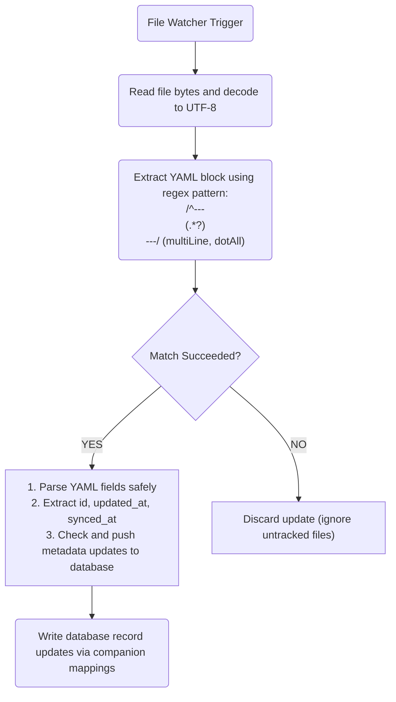

# Technical Specification: Split-Storage & Frontmatter Architecture

This document defines the physical data caching schema for the SQLite engine running on client runtimes (via Drift/Moor bindings) and specifies the structural formatting, cleaning, and parsing constraints for Markdown notes synced directly with the local Obsidian Vault.

---

## 1. SQLite Relational Schema Design

To ensure optimal performance on mobile (Android ARM64) and desktop (Windows x86_64), structured metrics are cached locally inside a reactive SQLite database. State propagation is managed using an offline-first strategy. 

### Mandatory State Tracking Fields
While Drift-managed relational tables inside the cache engine (such as `life_entities`) implement the full set of synchronization fields, custom SQL tables (such as `habits`, `notes`, and `NotesIndex`) utilize a simplified state tracking approach relying primarily on `is_dirty` flags and local timestamps.

#### Drift-Managed Synchronization Fields:
*   `id`: `TEXT` (UUID v4 string), Primary Key.
*   `created_at`: `INTEGER` (Unix epoch milliseconds), immutable creation timestamp.
*   `updated_at`: `INTEGER` (Unix epoch milliseconds), mutated upon local modification.
*   `synced_at`: `INTEGER` (Unix epoch milliseconds), tracks upstream synchronization receipt. MUST be `NULL` if local modifications are unsynced (dirty state).
*   `is_deleted`: `INTEGER` (boolean flag `0` or `1`), tracks soft deletion state to preserve local delete logs for upstream relay.

---

### Table Specifications

```sql
-- SQLite Table Definition: life_entities (Drift Managed)
CREATE TABLE life_entities (
    id TEXT PRIMARY KEY NOT NULL,
    title TEXT NOT NULL,
    description TEXT,
    created_at INTEGER NOT NULL,
    updated_at INTEGER NOT NULL,
    synced_at INTEGER,
    is_deleted INTEGER NOT NULL DEFAULT 0
);

-- SQLite Table Definition: sync_queue (Drift Managed)
CREATE TABLE sync_queue (
    id TEXT PRIMARY KEY NOT NULL,
    target_table TEXT NOT NULL,
    record_id TEXT NOT NULL,
    field_name TEXT NOT NULL,
    old_value TEXT,
    new_value TEXT,
    client_updated_at INTEGER NOT NULL,
    synced_state INTEGER NOT NULL DEFAULT 0
);

-- SQLite Table Definition: notes (Raw Custom SQL)
CREATE TABLE notes (
    id TEXT PRIMARY KEY NOT NULL,
    content TEXT,
    updated_at INTEGER,
    is_dirty INTEGER DEFAULT 0
);

-- SQLite Table Definition: habits (Raw Custom SQL)
CREATE TABLE habits (
    id TEXT PRIMARY KEY NOT NULL,
    name TEXT,
    streak INTEGER DEFAULT 0,
    done INTEGER DEFAULT 0,
    is_dirty INTEGER DEFAULT 0
);

-- SQLite Table Definition: NotesIndex (Raw Custom SQL)
CREATE TABLE NotesIndex (
    id TEXT PRIMARY KEY NOT NULL,
    title TEXT,
    file_path TEXT,
    last_modified INTEGER,
    is_dirty INTEGER DEFAULT 0
);
```

---

## 2. Obsidian YAML Frontmatter Architecture

Unstructured text assets and daily reflection logs reside inside a designated local Obsidian Vault. The app listens to directory updates via file watchers, automatically parsing and updating notes metadata via YAML frontmatter blocks.

### Rigid Frontmatter YAML Structure
Obsidian note files must begin with a valid, clean YAML block demarcated by triple dashes (`---`). No trailing spaces are permitted after the dashes.

```yaml
---
id: "4a6d71b3-4fe8-4447-b50a-e24c6e93149d"
updated_at: 1779951600000
synced_at: 1779951600000
---
# Note Title
Note markdown content begins here...
```

### Properties Definition Matrix

| Property Name | Data Type  | Allowed Values / Formats             | Description                                                   |
|:--------------|:-----------|:------------------------------------|:--------------------------------------------------------------|
| `id`          | String     | UUID v4 format (`^[0-9a-f]{8}-...`)  | Unique identifier linking the note to local/remote sync state |
| `updated_at`  | Integer    | Unix epoch milliseconds             | Tracks structural changes to prevent race conditions on write  |
| `synced_at`   | Integer    | Unix epoch milliseconds / null      | Denotes when the note was last successfully synced upstream    |

---

## 3. Obsidian Note Parsing and Cleaning Logic

When a file system change is detected by the directory watcher, the client engine MUST execute the following pipeline to read/write notes without corrupting Markdown bodies.



### Parsing Specifications

1.  **YAML Block Delimiter Integrity:** The regex parsing engine looks for standard `---` boundaries at the start of note files.
2.  **Property Parser Regex Patterns:**
    - `id` pattern: `id:\s*(.+)`
    - `updated_at` pattern: `updated_at:\s*(\d+)`
    - `synced_at` pattern: `synced_at:\s*(\d+)`
3.  **Frontmatter Cleaning Constraints:**
    *   No empty lines are allowed inside the frontmatter block.
    *   All YAML block updates must preserve the unmodified markdown body exactly, ensuring a single empty line separates the terminating `---` and the first header of the markdown text.
    *   Windows style line endings (`\r\n`) must be normalized to standard unix style (`\n`) within the frontmatter to avoid YAML compiler parsing crashes.

---

## Related Specifications
*   [Embedded Network Protocol (tsnet)](EMBEDDED_NETWORK.md)
*   [Transactional Sync Protocol & LWW](SYNC_PROTOCOL.md)


