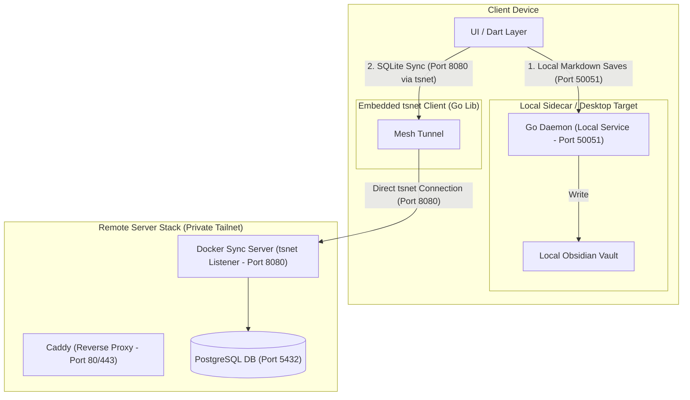
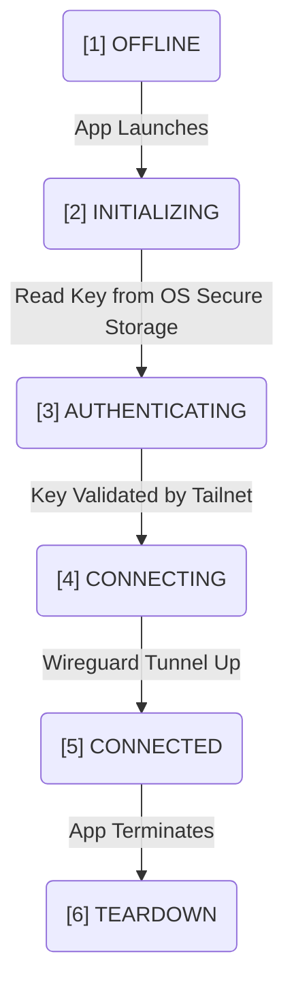

# Technical Specification: On-Demand User-Space Mesh (tsnet)

> [!NOTE]
> **Home:** [[04 - LifeOS DevDocs/Home|Home]] | **Related:** [[04 - LifeOS DevDocs/SYNC_PROTOCOL|Sync Protocol]] · [[04 - LifeOS DevDocs/DATA_SCHEMAS|Data Schemas]] · [[04 - LifeOS DevDocs/WEB_FAILSAFE|Web Failsafe]] · [[04 - LifeOS DevDocs/SECURITY_MODEL|Security Model]]


This specification details the lifecycle management, authentication flow, and integration rules of an embedded user-space Tailscale mesh node using the `tsnet` Go library. This establishes a zero-configuration overlay connection directly between native clients and the self-hosted backup infrastructure.

---

## 1. Process & Binding Architecture

To maintain cross-compatibility without requiring administrative system access, the Tailscale interface is run in **user-space** via the `tsnet` library. It does not create a virtual network interface card (TUN/TAP) on the host operating system. Instead, it exposes a local user-space network stack directly to the app.



### Compile-Target Specifications
*   **Windows 11 (x86_64):** Compiled as a C-archive dynamic-link library (`tsnet_client.dll` / `tsnet_client.h`) with Go's `__declspec(dllexport)` bindings. Integrated directly into the Flutter C++ runner CMake build process.
*   **Android (ARM64 Target API 34+):** Compiled as a Java Archive Package (`tsnet_client.aar`) via `gomobile bind`. Embedded directly inside the Gradle dependencies.

---

## 2. Zero-Click Network State Machine

The client application must seamlessly establish connections without requiring manual terminal setup or administrative privileges.



### Detailed State Specifications

#### State 1: OFFLINE
*   **Description:** The host application process is inactive or network functionality is explicitly disabled.
*   **System Action:** No virtual network processes exist.

#### State 2: INITIALIZING
*   **Description:** The application starts up and kicks off the background thread runner.
*   **System Action:**
    *   Initialize a directory in local application sandbox storage to cache `tsnet` state:
        *   **Windows:** `%APPDATA%\LifeOS\tsnet\`
        *   **Android:** `/data/user/0/com.lifeos.client/files/tsnet/`
    *   Set runtime configurations: `HostName = "lifeos-client"`, `Ephemeral = true`, `Logf = nil` (or routing to standard file loggers).

#### State 3: AUTHENTICATING
*   **Description:** The embedded client attempts to fetch credentials to join the target tailnet.
*   **Secure Storage Rules:**
    *   **Windows Target:** The C++ runner queries the **Windows Credential Manager** via the Win32 Security API (`CredReadW` function) using the target identifier `LifeOS:Tailscale:AuthKey`.
    *   **Android Target:** The Android runner utilizes the **Android Keystore System** to decrypt an encrypted `SharedPreference` containing the ephemeral Auth Key.
    *   **Fallback Sequence:** If no key exists in secure storage, the client transitions to a *Pending Setup* state, spawning a platform-native notification prompting the user to paste their tailnet configuration key.

#### State 4: CONNECTING
*   **Description:** The `tsnet` client calls `tsnet.Server.Start()`, initializing its local virtual network interfaces.
*   **System Action:**
    *   Construct standard Wireguard encapsulation sockets.
    *   Spin up background DNS listeners to resolve names inside the self-hosted Tailscale domain (e.g. `sync-relay.tailnet-xyz.ts.net`).

#### State 5: CONNECTED
*   **Description:** Successful handshake completed with the self-hosted backup stack endpoint.
*   **System Action:**
    *   Expose a secure Dial context (`tsnet.Server.Dial()`) to the client application.
    *   SQLite synchronization workers can now instantiate direct HTTP/gRPC channels to the backup relay without public internet exposure.

#### State 6: TEARDOWN
*   **Description:** Clean termination sequence during application shutdown or networking toggle-off.
*   **System Action:**
    *   Invoke `tsnet.Server.Close()` to release lock handles.
    *   Cleanly close active TCP sockets to prevent leakages and thread blocks on the host OS.

---

## 3. Secure Keychain API Specifications

### Windows Credential Manager Interop (C++)
To retrieve and write the Tailscale Auth Key, the Windows client C++ runner executes native interop via the Windows API:

```cpp
#include <windows.h>
#include <wincred.h>
#include <string>

std::wstring GetSecureAuthKey() {
    PCREDENTIALW credential;
    if (CredReadW(L"LifeOS:Tailscale:AuthKey", CRED_TYPE_GENERIC, 0, &credential)) {
        std::wstring key(reinterpret_cast<wchar_t*>(credential->CredentialBlob));
        CredFree(credential);
        return key;
    }
    return L"";
}
```

### Android Keystore & Encrypted Preferences (Kotlin)
The Android runner uses Jetpack Security to fetch keys from securely encrypted hardware:

```kotlin
import androidx.security.crypto.EncryptedSharedPreferences
import androidx.security.crypto.MasterKey

fun getSecureAuthKey(): String? {
    val masterKey = MasterKey.Builder(context)
        .setKeyScheme(MasterKey.KeyScheme.AES256_GCM)
        .build()

    val sharedPreferences = EncryptedSharedPreferences.create(
        context,
        "lifeos_secure_prefs",
        masterKey,
        EncryptedSharedPreferences.PrefKeyEncryptionScheme.AES256_SIV,
        EncryptedSharedPreferences.PrefValueEncryptionScheme.AES256_GCM
    )
    
    return sharedPreferences.getString("tailscale_auth_key", null)
}
```

---

## 4. Traffic Segregation & Port Map Reference

To prevent latency on heavy file operations and conserve mobile mesh bandwidth, the traffic routing paths are split cleanly:

### Port & Tunnel Architecture Map

| Service Name | Source Node | Destination Node | Network Path | Target Port | Protocol | Data Type |
|:---|:---|:---|:---|:---|:---|:---|
| **Host Daemon API & WebSocket** | Flutter UI Client | Go Daemon Host Service | Localhost Loopback | `50051` | HTTP / WS | Actions, Markdown Sync, Location radar WS, and Media streaming |
| **Relational Sync** | Flutter UI Client | Remote Docker Server | Embedded `tsnet` | `8080` | HTTP / JSON | SQLite `sync_queue` deltas |
| **Identity Proxy** | Inbound Gateway | OAuth2 Proxy | Docker Mesh | `4180` | HTTP | Authentication tokens |
| **RustDesk Relay** | RustDesk Client | Remote RustDesk | Embedded `tsnet` | `21115` - `21119`| TCP/UDP | Desktop stream relay |
| **Sunshine / Moonlight**| Moonlight Client | Host GPU Server | Embedded `tsnet` | `47989` - `47990`| TCP/UDP | High-performance video |
| **OTA Server** | Flutter UI Client | Go Daemon / GitHub | Localhost Loopback / WAN | `50051` / `443` | HTTP / HTTPS | Android APK binaries (uses port 50051 on daemon; client may query port 8081 for fallback) |
| **Web Fail-Safe Gateway (Caddy)** | Remote Web Browser | OAuth2 Proxy / Caddy | Public Inbound Tunnel | `80` / `443` | HTTP / HTTPS | Fail-safe web UI access (protected via forward_auth to port 4180) |

---

## Related Specifications
*   [Split-Storage & Frontmatter Architecture](DATA_SCHEMAS.md)
*   [Transactional Sync Protocol & LWW](SYNC_PROTOCOL.md)

