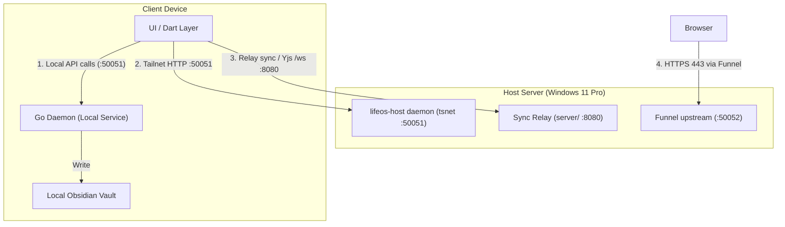
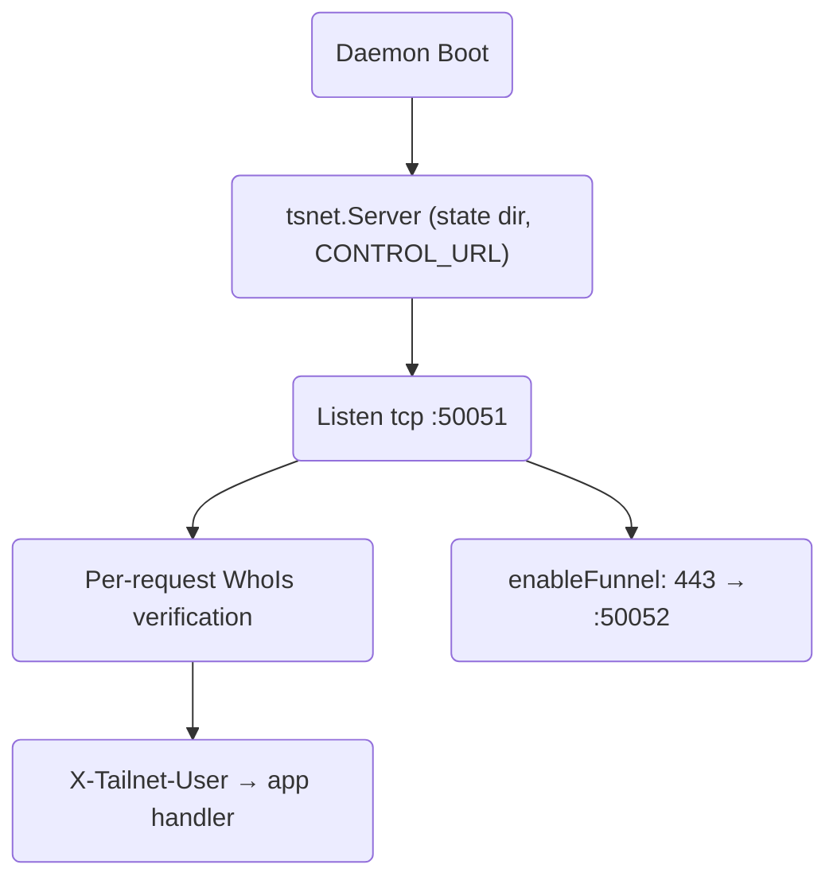

# Technical Specification: Embedded User-Space Mesh (tsnet)

> [!NOTE]
> **Home:** [[04 - LifeOS DevDocs/Home|Home]] | **Related:** [[04 - LifeOS DevDocs/SYNC_PROTOCOL|Sync Protocol]] · [[04 - LifeOS DevDocs/DATA_SCHEMAS|Data Schemas]] · [[04 - LifeOS DevDocs/WEB_FAILSAFE|Web Failsafe]] · [[04 - LifeOS DevDocs/BACKEND_ARCHITECTURE|Backend Architecture]]

This specification details the embedded user-space Tailscale mesh node used by the LifeOS host daemon via the `tsnet` Go library. It establishes a zero-configuration overlay connection between native clients, the web portal, and the self-hosted backup infrastructure, without requiring administrative privileges or a TUN/TAP adapter on the host.

---

## Current Status (August 2026)

*   **Standalone daemon:** the daemon is a standalone Go binary (`backend/host-daemon/`). The earlier model of embedding the mesh into the Flutter C++ runner / Gradle build (`tsnet_client.dll` / `.aar` via `tsnet_client.h`) is obsolete.
*   **tsnet facts (still true):** `tailnet.go` (`InitTailnet`) starts a `tsnet.Server` with hostname `lifeos-host`, state directory `./tsnet-state`, `CONTROL_URL` env (default `https://controlplane.tailscale.com`), listening on `:50051`; every request is verified via `LocalClient().WhoIs()` and the peer identity is forwarded as the `X-Tailnet-User` header.
*   **Funnel:** `enableFunnel` serves the web portal publicly (TCP 443 → `127.0.0.1:50052`) — see [[04 - LifeOS DevDocs/WEB_FAILSAFE|Web Failsafe]].
*   **Sync topology (changed):** the PostgreSQL relay-as-source-of-truth model is gone. Sync is now daemon-side per-module SQLite (`data/*.db`) plus client polling and the events WS bus (`/api/v1/events`). The repo-root `server/` relay (`:8080`) handles `POST /api/sync` → append to `generic_vault.jsonl` and `GET /ws` as a Yjs room relay with per-room ACL (`lifeos.db` permissions; allow-all when empty).

---

## 1. Process & Binding Architecture

The Tailscale interface runs in **user-space** via the `tsnet` library; it does not create a virtual network interface card (TUN/TAP) on the host operating system.

```mermaid
graph TD
    subgraph Client ["Client Device"]
        UI["UI / Dart Layer"]
        Daemon["Go Daemon (Local Service)"]
        LocalVault["Local Obsidian Vault"]
        UI -->|"1. Local API calls (:50051)"| Daemon
        Daemon -->|"Write"| LocalVault
    end

    subgraph Server ["Host Server (Windows 11 Pro)"]
        HostDaemon["lifeos-host daemon (tsnet :50051)"]
        Funnel["Funnel upstream (:50052)"]
        Relay["Sync Relay (server/ :8080)"]
    end

    UI -->|"2. Tailnet HTTP :50051"| HostDaemon
    UI -->|"3. Relay sync / Yjs /ws :8080"| Relay
    Browser -->|"4. HTTPS 443 via Funnel"| Funnel
```

### Node Configuration
*   **Hostname:** `lifeos-host` (init from `backend/host-daemon/main.go`).
*   **State:** `./tsnet-state` relative to the daemon working directory.
*   **Control Plane:** `CONTROL_URL` env (default `https://controlplane.tailscale.com`).
*   **Identity:** `X-Tailnet-User` header set from `WhoIs` before the app handler runs.
*   **Local-only mode:** `LIFEOS_LOCAL_ONLY=1` skips the tailnet listener and serves plain HTTP on `:50051`.

---

## 2. Zero-Click Network State Machine

The daemon establishes the mesh at boot and keeps it for its whole lifetime; no per-client key handling exists inside the daemon.

```mermaid
graph TD
    Start("Daemon Boot") --> Init("tsnet.Server (state dir, CONTROL_URL)")
    Init --> Listen("Listen tcp :50051")
    Listen --> Auth("Per-request WhoIs verification")
    Auth --> Serve("X-Tailnet-User → app handler")
    Listen --> Funnel("enableFunnel: 443 → :50052")
```

*   **Authentication:** clients join the tailnet independently (standard Tailscale login / auth keys at the control plane); the daemon identifies every peer per-request via `WhoIs`, so no shared secret is stored in the daemon.
*   **Teardown:** daemon shutdown closes the `tsnet.Server` and its listeners; no lock handles or virtual interfaces are left behind.

---

## 3. Traffic Segregation & Port Map Reference

| Service Name | Source Node | Destination Node | Network Path | Target Port | Protocol | Data Type |
|:---|:---|:---|:---|:---|:---|:---|
| **Host Daemon API & WebSocket** | Flutter UI Client | Go Daemon (`lifeos-host`) | Tailnet / Localhost | `50051` | HTTP / WS | Actions, Markdown sync, location radar WS, media streaming |
| **Funnel Upstream (Web Portal)** | Tailscale Funnel (TCP 443) | Go Daemon | Localhost Loopback | `50052` | HTTP | Web portal + OAuth (publicOnly gate) |
| **Sync Relay** | Flutter UI Client | `server/` relay | Tailnet | `8080` | HTTP / WS | `POST /api/sync` → `generic_vault.jsonl`; `GET /ws` Yjs room relay (per-room ACL) |
| **NewPipe Bridge** | Go Daemon | NewPipe bridge jar | Localhost Loopback | `18785` | HTTP | YouTube data extraction (`internal/youtube/bridge.go`) |
| **P2P File Transfer** | Flutter UI Client | Peer client | LAN direct | `4444` | TCP | Device-to-device file transfer (`client/lib/core/p2p_transfer_service.dart`) |
| **Identity Proxy (alt stack only)** | Inbound Gateway | oauth2-proxy container | Docker Mesh | `4180` | HTTP | Authentication tokens (dockerized alternative stack) |
| **RustDesk Relay** | RustDesk Client | Remote RustDesk (hbbs/hbbr) | Docker Compose | `21115` - `21119` | TCP/UDP | Desktop stream relay |
| **OTA Updates** | Flutter UI Client | Go Daemon | Tailnet / WAN | `50051` | HTTP | APK binaries via `/api/update/download` (daemon-served; port `8081` no longer used) |

> [!NOTE]
> Ports `21115`–`21119` and `4180` are bound only when the alternative dockerized stack (`backend/docker-compose.yml`) is running. OTA is served by the daemon from `/api/update/download` (`internal/sync/router.go`), replacing the old `8081` OTA server.

---

## Related Specifications
*   [[04 - LifeOS DevDocs/DATA_SCHEMAS|Split-Storage & Frontmatter Architecture]]
*   [[04 - LifeOS DevDocs/SYNC_PROTOCOL|Transactional Sync Protocol & LWW]]
*   [[04 - LifeOS DevDocs/WEB_FAILSAFE|Web Fail-Safe Layer]]