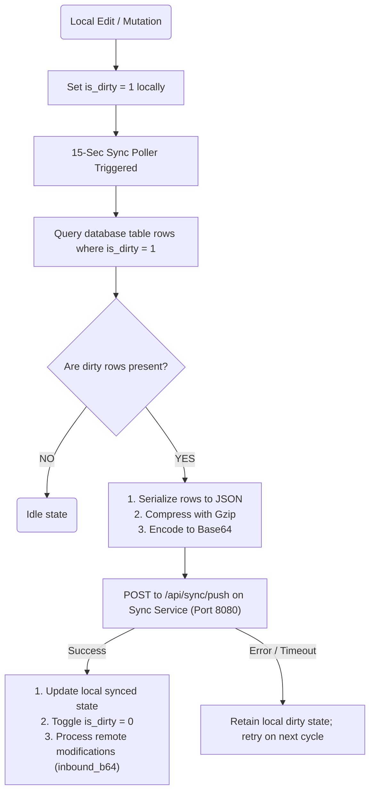

# Technical Specification: Relational and Document Synchronization

> [!NOTE]
> **Home:** [[04 - LifeOS DevDocs/Home|Home]] | **Related:** [[04 - LifeOS DevDocs/DATA_SCHEMAS|Data Schemas]] · [[04 - LifeOS DevDocs/EMBEDDED_NETWORK|Embedded Network]] · [[04 - LifeOS DevDocs/Architecture/Custom_Sync_Engine|Custom Sync Engine]] · [[04 - LifeOS DevDocs/Schemas/Sync_Protocols|Sync Protocols]]


This specification outlines the synchronization protocols implemented within the LifeOS codebase. While advanced field-level change logging (`sync_queue` tracking) and sequence CRDT note diffing are registered as long-term architectural targets, the active systems implement a simplified local-first dirty-flag synchronization engine for relational tables and a full-text document overwrite protocol for Markdown vault notes.

---

## 1. Architectural Strategy

To maintain high responsiveness and ensure reliability across local-first environments:
*   **Relational Caching:** Local SQLite databases (via Drift/Moor reactive bindings) maintain the primary offline state. Nodes track changed rows via boolean dirty indicators (`is_dirty`).
*   **Payload Encapsulation:** Changed datasets are batched, encoded to JSON, compressed using GZIP, and serialized as Base64 before transmission to the remote sync service.
*   **Markdown Synchronization:** Structured note directories are synced as entire documents. The client pushes whole-note strings to the Go Host Daemon which writes them directly to the local Obsidian directory.

---

## 2. Sync Payload & SQL Schema

### Local SQLite Schema Structure (Habits Sync Example)
Instead of utilizing interceptors to write to a secondary transactional change queue table, local SQLite tables (such as `habits`) include `is_dirty` flags directly in their structure:

```sql
CREATE TABLE habits (
    id TEXT PRIMARY KEY NOT NULL,
    name TEXT NOT NULL,
    streak INTEGER DEFAULT 0,
    done INTEGER DEFAULT 0,
    is_dirty INTEGER DEFAULT 0
);
```

### Sync Transaction Payload Structure
When a sync event is triggered, the client's `CustomSyncManager` serializes dirty records into a JSON envelope:

```json
{
  "client_ts": 1718005000000,
  "deltas": [
    {
      "id": "550e8400-e29b-41d4-a716-446655440000",
      "name": "Daily Exercise",
      "streak": 5,
      "done": 1,
      "is_dirty": 1
    }
  ]
}
```

*   **Compression Profile:** The string payload is compressed via standard GZIP, and then Base64 encoded:
    `Base64( Gzip( JSONString ) )`
*   **Relay Endpoint:** Pushed directly to the sync server via `POST /api/sync/push`.

---

## 3. Sync Lifecycle State Machine



---

## 4. Conflict Resolution & Merge Engines

### 4.1. Relational Data: Last-Write-Wins (LWW)
Relational convergence policy relies on entity-level Last-Write-Wins (LWW) evaluation during inbound payload processing:
*   Incoming payloads are evaluated inside a single atomic SQLite transaction block.
*   For each entity, the system ensures writes occur only if the inbound update timestamp is newer than the existing record's local modification timestamp.
*   **Query Model:**
    ```sql
    INSERT OR REPLACE INTO habits (id, name, done, streak, updated_at, is_dirty) 
    SELECT ?, ?, ?, ?, ?, 0 
    WHERE NOT EXISTS (
        SELECT 1 FROM habits 
        WHERE id = ? AND updated_at >= ?
    );
    ```
    *Note: The local habits table requires the `updated_at` column to be defined to safely execute timestamp-based comparisons.*

### 4.2. Unstructured Markdown Notes: Direct Overwrite
To maintain simplicity and prevent text parsing corruptions, Markdown documents (`.md` files) are handled via direct filesystem overrides:
1.  **Client Save:** The client saves notes locally via `MarkdownStorage.saveNote()`, writing the raw string content directly to local files.
2.  **Network Relay:** The client pushes the filename and full string content to the Go Host Daemon's `/api/markdown/sync` endpoint.
3.  **Host Execution:** The Host Daemon performs a full file overwrite in the Obsidian directory using `os.WriteFile`:
    ```go
    os.WriteFile(filepath.Join("./vault", filepath.Base(p.Filename)), []byte(p.Content), 0644)
    ```

### 4.3. Future Roadmap: Sequence CRDTs
For future iterations demanding concurrent offline multi-user document editing, the system architecture maps out a Sequence CRDT framework representing notes as distinct blocks (mapped to unique cryptographic hashes) that merge using logical logical clocks, preventing total document loss during editing collisions.

### 4.4. RPG & Illness Systems Sync Rules
To prevent cheating and ensure integrity in the RPG mechanics, the synchronization of `player_stats`, `xp_ledger`, `atrophy_log`, and `status_effects` tables utilizes a **Server-Authoritative LWW Sync** rule.
1. The client caches state transitions locally with `is_dirty = 1`.
2. Upon sync, the backend daemon performs a validation check against the `xp_ledger` to verify the calculated level and attributes.
3. The server pushes back the absolute source-of-truth state, resolving any conflicts in favor of the backend's calculations.

---

## Related Specifications
*   [Split-Storage & Frontmatter Architecture](DATA_SCHEMAS.md)
*   [Embedded Network Protocol (tsnet)](EMBEDDED_NETWORK.md)
*   [Web Fail-Safe Layer (Zero-Trust Proxy)](WEB_FAILSAFE.md)
