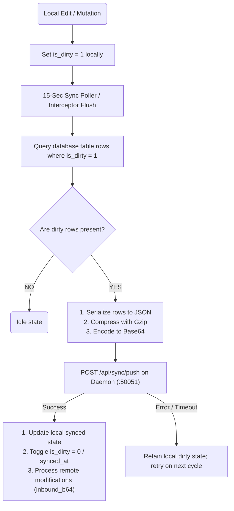

# Technical Specification: Relational and Document Synchronization

> [!NOTE]
> **Home:** [[04 - LifeOS DevDocs/Home|Home]] | **Related:** [[04 - LifeOS DevDocs/DATA_SCHEMAS|Data Schemas]] · [[04 - LifeOS DevDocs/EMBEDDED_NETWORK|Embedded Network]] · [[04 - LifeOS DevDocs/BACKEND_ARCHITECTURE|Backend Architecture]]

This specification outlines the synchronization protocols implemented within the LifeOS codebase as of August 2026. The active systems implement a local-first dirty-flag synchronization engine for relational tables, a full-text document overwrite protocol for Markdown vault notes, and a Yjs CRDT path for real-time collaborative editing.

---

## Current Status (August 2026)

*   **Client side:** the Drift database (60+ tables, 61 in `client/lib/database/schema/`) uses the `updatedAt` / `syncedAt` / `isDirty` / `id` sync quartet; `custom_sync_manager.dart` + `sync_interceptor.dart` collect dirty records, and `api_client.dart` flushes the queue every 15 seconds.
*   **Daemon side:** one SQLite `.db` per module under `data/` (gallery, movies, books, finance, rpg, knowledge, flashcards, media, home, infinity, backup, darkweb, vm, voice, youtube, system, sync, engine, sandbox, devsim, zen), plus JSON stores (`calendar.json`, `geofences.json`, `points.json`, `ledger.json`, `illness.json`).
*   **Real-time facts:** the events WebSocket bus at `/api/v1/events` pushes bus facts to connected clients (`internal/events`, token-auth).
*   **Collaborative editing:** Yjs CRDT rooms — relayed by the repo-root `server/` (`GET /ws`, `:8080`, per-room ACL) and by the daemon's `/api/markdown/collab` WS hubs (per-document, `?token=` auth).
*   **Zen notes:** LWW sync with tombstones — `POST /api/v1/zen/sync`; deletes recorded in the `zen_tombstones` table of `zen.db`.
*   **Vault watcher:** daemon-side fsnotify watcher streaming vault changes over `/api/sync/vault/stream` (WS).
*   **Long-term targets still open:** field-level `sync_queue` change logging and sequence CRDT note diffing remain on the roadmap.

---

## 1. Architectural Strategy

To maintain high responsiveness and ensure reliability across local-first environments:
*   **Relational Caching:** local SQLite databases (via Drift reactive bindings) maintain the primary offline state. Nodes track changed rows via boolean dirty indicators (`is_dirty`).
*   **Payload Encapsulation:** changed datasets are batched, encoded to JSON, compressed using GZIP, and serialized as Base64 before transmission to the remote sync service.
*   **Markdown Synchronization:** structured note directories are synced as entire documents. The client pushes whole-note strings to the Go Host Daemon which writes them directly to the local Obsidian directory.

---

## 2. Sync Payload & SQL Schema

### Local SQLite Schema Structure (Habits Sync Example)
Local SQLite tables (such as `habits`) include `is_dirty` flags directly in their structure:

```sql
CREATE TABLE habits (
    id TEXT PRIMARY KEY NOT NULL,
    name TEXT NOT NULL,
    streak INTEGER DEFAULT 0,
    done INTEGER DEFAULT 0,
    is_dirty INTEGER DEFAULT 0
);
```

### Sync Transaction Payload Structure
When a sync event is triggered, the client's `CustomSyncManager` serializes dirty records into a JSON envelope:

```json
{
  "client_ts": 1784500000000,
  "deltas": [
    {
      "id": "550e8400-e29b-41d4-a716-446655440000",
      "name": "Daily Exercise",
      "streak": 5,
      "done": 1,
      "is_dirty": 1
    }
  ]
}
```

*   **Compression Profile:** the string payload is compressed via standard GZIP, then Base64 encoded: `Base64( Gzip( JSONString ) )`.
*   **Relay Endpoint:** `POST /api/sync/push` on the daemon (`internal/sync/router.go`) — decodes Base64, gunzips, and acknowledges with `inbound_b64`.

---

## 3. Sync Lifecycle State Machine


```mermaid
graph TD
    Start("Local Edit / Mutation") --> Mark["Set is_dirty = 1 locally"]
    Mark --> PollTimer["15-Sec Sync Poller / Interceptor Flush"]
    
    PollTimer --> Extract["Query database table rows where is_dirty = 1"]
    Extract --> HasData{"Are dirty rows present?"}
    
    HasData -- NO --> Sleep("Idle state")
    
    HasData -- YES --> BuildPayload["1. Serialize rows to JSON<br>2. Compress with Gzip<br>3. Encode to Base64"]
    BuildPayload --> NetworkCall["POST /api/sync/push on Daemon (:50051)"]
    
    NetworkCall -- Success --> Acknowledge["1. Update local synced state<br>2. Toggle is_dirty = 0 / synced_at<br>3. Process remote modifications (inbound_b64)"]
    NetworkCall -- Error / Timeout --> Fail["Retain local dirty state; retry on next cycle"]
```

---

## 4. Conflict Resolution & Merge Engines

### 4.1. Relational Data: Last-Write-Wins (LWW)
Relational convergence policy relies on entity-level Last-Write-Wins (LWW) evaluation during inbound payload processing:
*   Incoming payloads are evaluated inside a single atomic SQLite transaction block.
*   For each entity, writes occur only if the inbound update timestamp is newer than the existing record's local modification timestamp.
*   Reconciliation events are recorded in the daemon's `conflict_logs` table (`internal/sync/db.go`, `sync.db`).
*   **Query Model:**
    ```sql
    INSERT OR REPLACE INTO habits (id, name, done, streak, updated_at, is_dirty) 
    SELECT ?, ?, ?, ?, ?, 0 
    WHERE NOT EXISTS (
        SELECT 1 FROM habits 
        WHERE id = ? AND updated_at >= ?
    );
    ```
    *Note: the local habits table requires the `updated_at` column to be defined to safely execute timestamp-based comparisons.*

### 4.2. Unstructured Markdown Notes: Direct Overwrite
Markdown documents (`.md` files) are handled via direct filesystem overwrites:
1.  **Client Save:** the client saves notes locally via `MarkdownStorage.saveNote()`, writing the raw string content directly to local files.
2.  **Network Relay:** the client pushes the filename and full string content to the Go Host Daemon's `/api/markdown/sync` endpoint (`internal/markdown/router.go`).
3.  **Host Execution:** the Host Daemon performs a full file overwrite in the vault directory using `os.WriteFile`.

### 4.3. Collaborative Editing: Yjs CRDT (active)
*   **Daemon:** `/api/markdown/collab` WebSocket hubs, one per document, token-authenticated via `?token=` (browsers cannot set WS headers).
*   **Relay:** `server/` `GET /ws` relays Yjs room updates with per-room ACL from `lifeos.db` (allow-all when empty).
*   **Client:** `zen_collab_service.dart` / `zen_collab_transport.dart` connect to the relay.

### 4.4. Zen Notes: LWW with Tombstones
*   `POST /api/v1/zen/sync` exchanges node/document deltas; deleted paths are recorded in `zen_tombstones` (`zen.db`) so clients converge on deletes.
*   The daemon has no disk for zen notes (web clients); `zen.db` is the authoritative store, with LWW resolved by millisecond timestamps.

### 4.5. RPG & Illness Systems Sync Rules
To prevent cheating and ensure integrity in the RPG mechanics, the synchronization of `player_stats`, `xp_ledger`, `atrophy_log`, and `status_effects` tables utilizes a **Server-Authoritative LWW Sync** rule:
1.  The client caches state transitions locally with `is_dirty = 1`.
2.  Upon sync, the backend daemon performs a validation check against the `xp_ledger` to verify the calculated level and attributes.
3.  The server pushes back the absolute source-of-truth state, resolving any conflicts in favor of the backend's calculations.

---

## Related Specifications
*   [[04 - LifeOS DevDocs/DATA_SCHEMAS|Split-Storage & Frontmatter Architecture]]
*   [[04 - LifeOS DevDocs/EMBEDDED_NETWORK|Embedded Network Protocol (tsnet)]]
*   [[04 - LifeOS DevDocs/WEB_FAILSAFE|Web Fail-Safe Layer]]
*   [[04 - LifeOS DevDocs/BACKEND_ARCHITECTURE|Backend Architecture]]