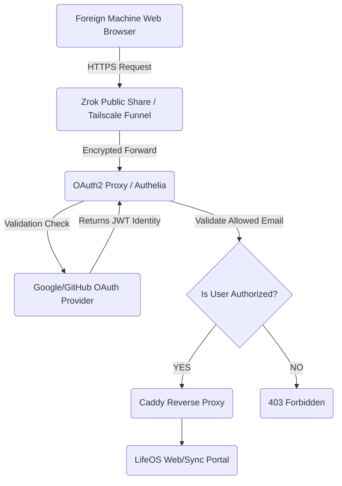

# Technical Specification: Web Fail-Safe Layer (Zero-Trust Proxy)

> [!NOTE]
> **Home:** [[04 - LifeOS DevDocs/Home|Home]] | **Related:** [[04 - LifeOS DevDocs/INFRASTRUCTURE_CONTROL|Infrastructure Control]] · [[04 - LifeOS DevDocs/EMBEDDED_NETWORK|Embedded Network]] · [[04 - LifeOS DevDocs/SECURITY_MODEL|Security Model]] · [[04 - LifeOS DevDocs/Architecture/Web_Failsafe|Web Failsafe Architecture]]

This document details the configuration for the LifeOS zero-exposure web fail-safe layer. This infrastructure provides secure, containerized web access to the LifeOS platform on restricted foreign machines (e.g., corporate laptops, public PCs) where installing the native client or embedding the `tsnet` daemon is prohibited.

---

## 1. Network Traffic Flow Architecture

The fail-safe layer leverages a secure inbound tunnel exposing a strictly controlled web gateway protected by an identity-aware proxy. The internal database or syncing API is never exposed directly.

---

## 2. Inbound Tunnel Options

To maintain 100% free infrastructure with zero open firewall ports on the host router, the system utilizes one of two ephemeral tunneling options:

### Option A: Tailscale Funnel
*   **Mechanism:** Routes public internet traffic directly onto the Tailnet via a secure Tailscale node.
*   **Deployment:** The host Tailscale daemon uses `tailscale serve` and `tailscale funnel` to expose the OAuth proxy port (`4180` or `9091`).
*   **Benefit:** Native integration if the node is already running Tailscale. Requires specific Tailnet ACL modifications.

### Option B: Zrok Public Share (OpenZiti)
*   **Mechanism:** Uses the Zrok network to create a secure, ephemeral or reserved public URL.
*   **Deployment:** The sidecar container runs `zrok share public http://proxy:80 --headless`, targeting Caddy directly.
*   **Benefit:** Highly isolated from the core Tailnet. Traffic is seamlessly authenticated upstream via Caddy's `forward_auth` integration querying the oauth2-proxy sidecar.

---

## 3. Zero-Trust Identity Wall (OAuth2 Proxy)

No inbound HTTP request reaches the application web server unless it carries a cryptographically signed cookie from the Identity Provider (IdP).

### Proxy Configuration (OAuth2-Proxy)
The `oauth2-proxy` container sits at the edge of the Docker network, directly behind the inbound tunnel.

*   **Provider:** Google Workspace or GitHub OAuth.
*   **Strict Whitelist (`authenticated_emails_file`):** A hardcoded text file containing ONLY the owner's explicit email address (e.g., `user@example.com`).
*   **Cookie Security:** 
    *   `cookie_secure=true`
    *   `cookie_httponly=true`
    *   `cookie_samesite=lax`
*   **Upstream Routing:** Authenticated traffic is proxied internally to `http://lifeos-proxy:80` (the Caddy relay).

---

## 4. Threat Modeling & Failsafe Guarantees

*   **Stolen URL:** If a bad actor discovers the Zrok or Funnel URL, they are immediately stopped by the Google/GitHub SSO redirect. No LifeOS server code is executed.
*   **Brute Force Immunity:** The authentication relies entirely on the IdP's infrastructure (Google/GitHub), leveraging their native 2FA, rate-limiting, and anomaly detection.
*   **Isolated Web Layer:** The Web portal exposed behind this proxy only has access to a bounded session context. It cannot execute administrative structural commands to the underlying server host.

---

## Related Specifications
*   [Split-Storage & Frontmatter Architecture](DATA_SCHEMAS.md)
*   [Embedded Network Protocol (tsnet)](EMBEDDED_NETWORK.md)
*   [Transactional Sync Protocol & LWW](SYNC_PROTOCOL.md)
