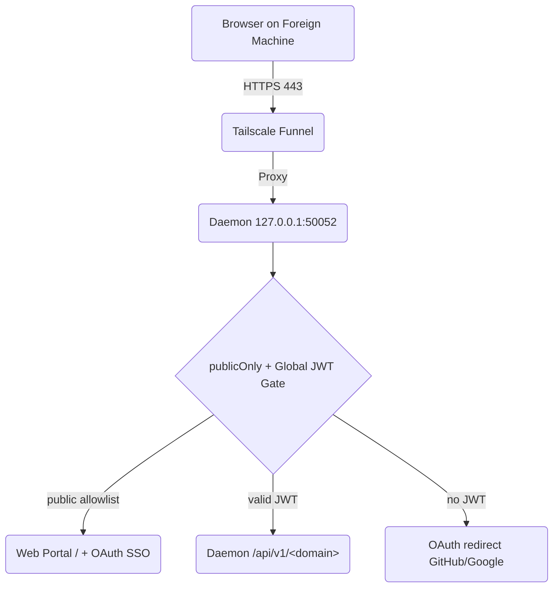

# Technical Specification: Web Fail-Safe Layer

> [!NOTE]
> **Home:** [[04 - LifeOS DevDocs/Home|Home]] | **Related:** [[04 - LifeOS DevDocs/INFRASTRUCTURE_CONTROL|Infrastructure Control]] · [[04 - LifeOS DevDocs/EMBEDDED_NETWORK|Embedded Network]] · [[04 - LifeOS DevDocs/SECURITY_MODEL|Security Model]] · [[04 - LifeOS DevDocs/BACKEND_ARCHITECTURE|Backend Architecture]]

This document describes the web access layer that exposes the LifeOS Flutter web portal on restricted foreign machines (e.g., corporate laptops, public PCs) where installing the native client is prohibited. As of August 2026 the host daemon itself performs OAuth and serves the web portal; the dockerized zero-trust proxy stack remains available as an alternative deployment.

---

## Current Status (August 2026)

The daemon (`backend/host-daemon/`) serves the Flutter web build directly:

*   **Web portal at `/`:** `http.FileServer(http.Dir("./web"))` in `main.go`, wrapped by the global JWT auth gate (`internal/auth/middleware/jwt.go`, HS256, 24h expiry).
*   **Tailscale Funnel:** `tailnet.go` → `enableFunnel` configures `ipn.ServeConfig` with TCP 443 (HTTPS) proxying `/` to `http://127.0.0.1:50052/`. Public URL: `https://lifeos-host.husky-forel.ts.net` (also set as `OAUTH_BASE_URL` in `backend/host-daemon/start.ps1`). Requires "HTTPS Certificates" enabled in the tailnet admin console.
*   **Global JWT auth gate with public allowlist:** login, register, `oauth providers/start/callback`, `/api/markdown/collab`, `/api/v1/events`, `/api/v1/radar/live`, `/api/v1/music/*`. All other `/api/` routes require a valid JWT (stored in `localStorage('lifeos_token')` on the web portal).
*   **`publicOnly` handler:** the `:50052` Funnel upstream denies `POST /api/v1/auth/register` and `POST /api/v1/auth/login`. Registration is invite-only via OAuth — GitHub (`read:user`) or Google (`openid email profile`) — with accounts mapped in `data/oauth_users.json`; password login is disabled on the public path.
*   **No-cache + purged service worker:** static assets are served with `Cache-Control: no-cache, no-store, must-revalidate`; `flutter_service_worker.js` is stripped at deploy time.
*   **Deploys:** `deploy_server.ps1` (repo root) — `flutter build web` → strip service worker → cross-compile daemon → push via tailscale ssh → systemd restart, with MD5 checksum verification of transferred files.

```mermaid
graph TD
    User(Browser on Foreign Machine) -->|"HTTPS 443"| Funnel(Tailscale Funnel)
    Funnel -->|"Proxy"| Upstream(Daemon 127.0.0.1:50052)
    Upstream --> Gate{publicOnly + Global JWT Gate}
    Gate -- "public allowlist" --> Web(Web Portal / + OAuth SSO)
    Gate -- "valid JWT" --> Api(Daemon /api/v1/&lt;domain&gt;)
    Gate -- "no JWT" --> Login(OAuth redirect GitHub/Google)
```

---

## 1. Inbound Exposure Options

To maintain 100% free infrastructure with zero open firewall ports on the host router, the system uses one of two inbound tunneling options:

### Option A: Tailscale Funnel (primary)
*   **Mechanism:** `enableFunnel` in `backend/host-daemon/tailnet.go` — waits for the tailnet backend to reach `Running`, then sets `AllowFunnel` with TCP 443 → HTTPS → `/` proxied to `127.0.0.1:50052`.
*   **Deployment:** automatic at daemon boot; no manual `tailscale serve`/`funnel` commands.
*   **Benefit:** native integration with the already-running tailnet node (`lifeos-host`); no extra containers.

### Option B: Dockerized Zrok + Caddy + oauth2-proxy stack (alternative)
*   **Mechanism:** `backend/docker-compose.yml` runs `zrok-tunnel` (`zrok share public http://proxy:80 --headless`), the `lifeos-proxy` Caddy container (ports `80`/`443`), and the `lifeos-auth-proxy` oauth2-proxy container (port `4180`).
*   **Benefit:** highly isolated from the core tailnet; traffic is authenticated upstream via oauth2-proxy before reaching Caddy.
*   The same compose file hosts the PostgreSQL-backed `sync-service` and the RustDesk (hbbs/hbbr) containers — see [[04 - LifeOS DevDocs/INFRASTRUCTURE_CONTROL|Infrastructure Control]].

---

## 2. Zero-Trust Identity Wall

No inbound HTTP request reaches the application API unless it carries a valid identity.

### Primary deployment: daemon-native auth
*   **Global JWT gate:** every `/api/` route except the public allowlist requires a JWT; `JWT_SECRET` env → `data/jwt_secret` file → random fallback.
*   **OAuth SSO:** `internal/oauth` — GitHub `read:user`, Google `openid email profile`; state-cookie CSRF (10 min); `data/oauth_users.json` maps OAuth identities to daemon accounts; roles `ADMIN` / `USER` / `CHILD`.
*   **Invite-only registration:** the `publicOnly` middleware (main.go) rejects register/login on the Funnel path; admin creates accounts.

### Alternative deployment: oauth2-proxy container
*   **Provider:** Google Workspace or GitHub OAuth.
*   **Strict Whitelist (`authenticated_emails_file`):** `backend/proxy/emails.txt` — only the owner's explicit email addresses.
*   **Cookie Security:** `cookie_secure=true`, `cookie_httponly=true`, `cookie_samesite=lax`.
*   **Upstream Routing:** authenticated traffic is proxied to `http://lifeos-proxy:80` (Caddy relay).

---

## 3. Threat Modeling & Failsafe Guarantees

*   **Stolen URL:** if a bad actor discovers the Funnel or Zrok URL, they are stopped at the OAuth redirect (or JWT gate); no LifeOS API executes without a valid token.
*   **Brute Force Immunity:** password login is disabled on the public path; authentication relies on the IdP's (Google/GitHub) infrastructure — 2FA, rate-limiting, anomaly detection.
*   **No Admin Execution:** the web portal exposes only the daemon's bounded `/api/v1/<domain>` surface behind the JWT gate; it cannot execute structural commands on the underlying host outside that gate.

---

## Related Specifications
*   [[04 - LifeOS DevDocs/DATA_SCHEMAS|Split-Storage & Frontmatter Architecture]]
*   [[04 - LifeOS DevDocs/EMBEDDED_NETWORK|Embedded Network Protocol (tsnet)]]
*   [[04 - LifeOS DevDocs/SYNC_PROTOCOL|Transactional Sync Protocol & LWW]]
*   [[04 - LifeOS DevDocs/BACKEND_ARCHITECTURE|Backend Architecture]]