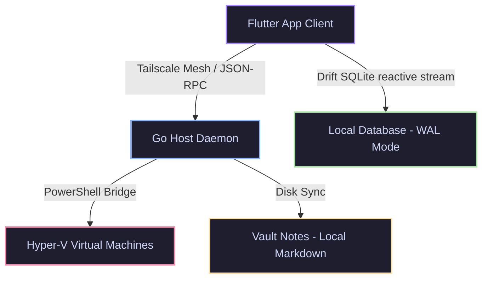

# LifeOS Application Architecture & Settings Analysis

Analysis of the LifeOS client-daemon topology, subsystem integration vectors, and the interactive settings views corresponding to each core component.

## Core System Architecture

The client application and host daemon are securely bridged together over a virtual Tailscale Mesh Network, facilitating low-latency RPC telemetry, binary delta updates, and file synchronization.

---

## Dedicated Settings & Configuration Components

The primary configuration surfaces in LifeOS manage general device preference parameters, layout alignment, and telemetry diagnostic routines:

### Spatial Settings Tab (`settings`)
* **File Path**: [settings_tab.dart](file:///c:/Users/PDS_Dev/1_Production/Projects/LifeOS/client/lib/presentation/widgets/settings_tab.dart)
* **Settings Controlled**:
  * **Enable Tailnet Sync**: Toggles background data replication routines (`_syncEnabled`).
  * **OLED Deep Black Canvas**: Configures deep black backgrounds in place of standard dark-grey properties (`_darkMode`).
  * **System Metrics**: Visual tracking of active workspace node name (`pds-desktop`), local node IP (`192.168.1.7`), and Sync Status (`Nominal`).

### Legacy Plugin Settings View
* **File Path**: [settings_view.dart](file:///c:/Users/PDS_Dev/1_Production/Projects/LifeOS/client/lib/plugins/settings/settings_view.dart)
* **Settings Controlled**:
  * **OTA Updates**: Direct update triggers using the `UpdateManager` payload installer.
  * **Diagnostics Panel**: Embeds system verification lists.

### Spatial Grid Settings Panel
* **File Path**: [settings_panel.dart](file:///c:/Users/PDS_Dev/1_Production/Projects/LifeOS/client/lib/presentation/widgets/settings_panel.dart)
* **Settings Controlled**:
  * **Rotate Spatial Grid**: Invokes `FeatureRegistry.rotateLayout()` to dynamically rotate the active 3x3 layout matrix.
  * **Hardware specs**: Displays P2P Client Node credentials ("MOTOROLA EDGE 50 FUSION • Android 14 OS").

### System Diagnostics Panel
* **File Path**: [diagnostics_panel.dart](file:///c:/Users/PDS_Dev/1_Production/Projects/LifeOS/client/lib/diagnostics_panel.dart)
* **Settings Controlled**:
  * **Navigation Profile Selection**: Interactive switches defining user routing patterns:
    * **`Swipe`**: Traditional screen-swipe layout navigation.
    * **`Dial`**: Cyberpunk-style circular radial menu quadrant navigation.
    * **`Classic`**: Standard navigation bar indicators.
  * **Subsystem Rescan**: Refreshes DB connectivity, network latency, and binary parity status.
  * **Backend Service Binding**: Backed by the persistent [PreferencesService](file:///c:/Users/PDS_Dev/1_Production/Projects/LifeOS/client/lib/database/preferences_service.dart).

---

## App-Specific Module Configurations

Below is the settings profile for the individual apps/modules inside the spatial layout registry:

### Zen Workspace / Markdown Editor (`obsidian`)
* **File Path**: [zen_workspace.dart](file:///c:/Users/PDS_Dev/1_Production/Projects/LifeOS/client/lib/presentation/widgets/zen_workspace.dart) & [zen_editor.dart](file:///c:/Users/PDS_Dev/1_Production/Projects/LifeOS/client/lib/plugins/markdown/zen_editor.dart)
* **Settings Details**:
  * **Auto-Save Frequency**: Debounced at 500ms. Intercepts local document edits and automatically dispatches compressed synchronization vectors upstream to `/api/markdown/sync`.
  * No standalone setting panel; functions invisibly as a core utility.

### Nexus Dashboard (`nexus`)
* **File Path**: [nexus_dashboard.dart](file:///c:/Users/PDS_Dev/1_Production/Projects/LifeOS/client/lib/presentation/widgets/nexus_dashboard.dart)
* **Settings Details**:
  * Displays the synchronization queue length and database task health.
  * Houses interactive triggers communicating with the Go Daemon REST API (e.g., node control toggles).

### Tasks Grid (`tasks`)
* **File Path**: [tasks_grid.dart](file:///c:/Users/PDS_Dev/1_Production/Projects/LifeOS/client/lib/presentation/widgets/tasks_grid.dart)
* **Settings Details**:
  * Checkbox toggle directly updates Drift database rows (`is_dirty = 1`) and issues synchronization flags.
  * List dismissal triggers dynamic target deletion scripts.

### Dark Radar (`maps`)
* **File Path**: [dark_radar.dart](file:///c:/Users/PDS_Dev/1_Production/Projects/LifeOS/client/lib/plugins/map_view/dark_radar.dart) & [maps_view.dart](file:///c:/Users/PDS_Dev/1_Production/Projects/LifeOS/client/lib/presentation/widgets/maps_view.dart)
* **Settings Details**:
  * Connects to a WebSocket locator node (`ws://localhost:50051/ws/location` or Tailnet).
  * Dynamic pulse animation updates based on WebSocket ready state (300ms disconnected pulse / 2000ms active connection pulse).

### Media Gallery (`gallery`)
* **File Path**: [gallery_view.dart](file:///c:/Users/PDS_Dev/1_Production/Projects/LifeOS/client/lib/plugins/gallery/gallery_view.dart) & [media_gallery.dart](file:///c:/Users/PDS_Dev/1_Production/Projects/LifeOS/client/lib/presentation/widgets/media_gallery.dart)
* **Settings Details**:
  * Automatically fetches assets dynamically from `/api/gallery/assets`. Contains no custom configurations.

### Server Hub (`server`), Camera Viewport (`camera`), System Logs (`logs`)
* **File Paths**: [server_hub.dart](file:///c:/Users/PDS_Dev/1_Production/Projects/LifeOS/client/lib/presentation/widgets/server_hub.dart), [camera_viewport.dart](file:///c:/Users/PDS_Dev/1_Production/Projects/LifeOS/client/lib/presentation/widgets/camera_viewport.dart), and [system_logs.dart](file:///c:/Users/PDS_Dev/1_Production/Projects/LifeOS/client/lib/presentation/widgets/system_logs.dart)
* **Settings Details**:
  * Display read-only parameters and diagnostics statistics. Do not contain custom user-facing configuration views.
